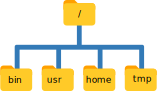

:::note

These materials are based on the [Carpentries Shell Lesson](https://swcarpentry.github.io/shell-novice/) with credit to their authors and contributors.

<a href="https://creativecommons.org/licenses/by/4.0/legalcode"></a>

Gabriel A. Devenyi (Ed.), Gerard Capes (Ed.), Colin Morris (Ed.), Will Pitchers (Ed.),
Greg Wilson, Gerard Capes, Gabriel A. Devenyi, Christina Koch, Raniere Silva, Ashwin Srinath, … Vikram Chhatre.
(2019, July). swcarpentry/shell-novice: Software Carpentry: the UNIX shell, June 2019 (Version v2019.06.1).
Zenodo. http://doi.org/10.5281/zenodo.3266823

:::

# The Unix Shell: Basic Commands

:::highlight

**Questions**

- How can I move around on my computer?
- How can I see my files and directories?
- How can I specify the location of a file or directory on my computer?
- How can I create, copy, and delete files and directories?
- How can I edit files?

**Learning Objectives**

- Explain the similarities and differences between a file and a directory.
- Translate an absolute path into a relative path and vice versa.
- Construct absolute and relative paths that identify specific files and directories.
- Demonstrate the use of tab completion, and explain its advantages.
- Create a directory hierarchy that matches a given diagram.
- Create files in that hierarchy using an editor or by copying and renaming existing files.
- Delete, copy and move specified files and/or directories.

:::

The part of the operating system responsible for managing files and directories is called the **file system**. 
It organizes our data into files, which hold information, and directories (also called "folders"), which hold files or other directories.

Several commands are frequently used to create, inspect, rename, and delete files and directories. 
To start exploring them, we'll go to our open shell window.

First let's find out where we are by running a command called `pwd` (which stands for "print working directory"). 
Directories are like *places* - at any time while we are using the shell we are in exactly one place, called our **current working directory**. 
Commands mostly read and write files in the current working directory, i.e. "here", so knowing where you are before running a command is important. 
`pwd` shows you where you are:

```console
$ pwd
```

```
/home/participant01
```

Here, the computer's response is `/home/participant`, which is your **home directory**:

:::note
**Home Directory Variation**

The home directory path will look different on different operating systems. 
On Mac it may look like `/Users/participant`, and on Windows it will be similar to `C:\Users\participant`.

(Note that it may look slightly different for different versions of Windows.) 
In future examples, we use Linux output as the default - Mac and Windows output may differ slightly, but should be generally similar.
:::

To understand what a "home directory" is, let's have a look at how the file system as a whole is organized. 
For the sake of this example, we'll be illustrating the filesystem on a typical Linux computer. 
After this illustration, you'll be learning commands to explore your own filesystem, which will be constructed in a similar way, but not be exactly identical.

On a typical Linux computer, the filesystem looks like this:



At the top is the **root directory** that holds everything else. 
We refer to it using a slash character, `/`, on its own; this is the leading slash in `/home/participant`.

Inside that directory are several other directories, for example:

- `bin` (which is where some built-in programs are stored),
- `usr` (for miscellaneous user files),
- `home` (where users' personal directories are located such as _Documents_ and _Desktop_),
- `tmp` (for temporary files that don't need to be stored long-term), 
- and so on...

We know that our current working directory `/home/participant` is stored inside `/home` because `/home` is the first part of its name. 
Similarly, we know that `/home` is stored inside the root directory `/` because its name begins with `/`.


:::note
**Slashes**

Notice that there are two meanings for the `/` character. 
When it appears at the beginning of a file or directory name, it refers to the root directory. 
When it appears *inside* a name, it's a separator.
:::

Underneath `/home`, we find one directory for each user with an account on the machine, in the example shown in the figure below we have *imhotep*, *larry*, and "participant" (you).


The user *imhotep*'s files are stored in `/home/imhotep`, user *larry*'s in `/home/larry`, and yours in `/home/participant`.  
Because you are the current user in our examples here, this is why we get `/home/participant` as our home directory. 
Typically, when you open a new command prompt you will be in your home directory to start.

Now let's learn the command that will let us see the contents of our own filesystem. 
We can see what's in our home directory by running `ls`, which stands for "listing":

```console
$ ls
```

```
Documents    Downloads    Music        Public
Desktop      Movies       Pictures     Templates
```

(Again, your results may be slightly different depending on your operating system and how you have customized your filesystem.)

`ls` prints the names of the files and directories in the current directory. 
We can make its output more comprehensible by using the `-F` **option** (also known as a **switch** or a **flag**), which tells `ls` to classify the output by adding a marker to file and directory names to indicate what they are: 

- a trailing `/` indicates that this is a directory
- `@` indicates a link
- `*` indicates an executable

Depending on your default options, the shell might also use colors to indicate whether each entry is a file or directory.

```console
$ ls -F
```

```
Documents/    Downloads/    Music/        Public/
Desktop/      Movies/       Pictures/     Templates/
```

Here, we can see that our home directory contains mostly **sub-directories**. 
Any names in your output that don't have a classification symbol, are plain old **files**.


## General syntax of a shell command

Consider the command below as a general example of a command, which we will dissect into its component parts:

```console
$ ls -F /
```

`ls` is the **command**, with an **option** `-F` and an **argument** `/`. 
Options (also called **switches** or **flags**) either start with a single dash (`-`) or two dashes (`--`), and they change the behaviour of a command. 
Arguments tell the command what to operate on (e.g. files and directories). 
Sometimes options and arguments are referred to as **parameters**. 
A command can be called with more than one option and more than one argument: but a command doesn't always require an argument or an option.

Each part is separated by spaces: if you omit the space between `ls` and `-F` the shell will look for a command called `ls-F`, which doesn't exist. 
Also, capitalisation can be important: `ls -r` is different to `ls -R`.

Putting all that together, our command above gives us a listing of files and directories in the root directory `/`. 
An example of the output you might get from the above command is given below:

```console
$ ls -F /
```

```
bin/  boot/  cdrom/  core  dev/  etc/  home/  home2/  initrd.img@  initrd.img.old@  lib/  lib32/  lib64/  lost+found/  media/  mnt/  opt/  proc/  root/  run/  sbin/  snap/  srv/  sys/  tmp/  usr/  var/
```


### Getting help

`ls` has lots of other **options**. There are two common ways to find out how to use a command and what options it accepts:

1. We can pass a `--help` option to the command, such as:
  ```console
  $ ls --help
  ```

2. We can read its manual with `man`, such as:
  ```console
  $ man ls
  ```

#### The `--help` option

Many bash commands, and programs that people have written that can be run from within bash, support a `--help` option to display more information on how to use the command or program.

```console
$ ls --help
```

```
Usage: ls [OPTION]... [FILE]...
List information about the FILEs (the current directory by default).
Sort entries alphabetically if none of -cftuvSUX nor --sort is specified.

Mandatory arguments to long options are mandatory for short options too.
  -a, --all                  do not ignore entries starting with .
  -A, --almost-all           do not list implied . and ..
      --author               with -l, print the author of each file
  -b, --escape               print C-style escapes for nongraphic characters
      --block-size=SIZE      scale sizes by SIZE before printing them; e.g.,
                               '--block-size=M' prints sizes in units of
                               1,048,576 bytes; see SIZE format below
  -B, --ignore-backups       do not list implied entries ending with ~
  -c                         with -lt: sort by, and show, ctime (time of last
                               modification of file status information);
                               with -l: show ctime and sort by name;
                               otherwise: sort by ctime, newest first
  -C                         list entries by columns
      --color[=WHEN]         colorize the output; WHEN can be 'always' (default
                               if omitted), 'auto', or 'never'; more info below
  -d, --directory            list directories themselves, not their contents
  -D, --dired                generate output designed for Emacs' dired mode
  -f                         do not sort, enable -aU, disable -ls --color
  -F, --classify             append indicator (one of */=>@|) to entries
      --file-type            likewise, except do not append '*'
      --format=WORD          across -x, commas -m, horizontal -x, long -l,
                               single-column -1, verbose -l, vertical -C
      --full-time            like -l --time-style=full-iso
  -g                         like -l, but do not list owner
      --group-directories-first
                             group directories before files;
                               can be augmented with a --sort option, but any
                               use of --sort=none (-U) disables grouping
  -G, --no-group             in a long listing, don't print group names
  -h, --human-readable       with -l and/or -s, print human readable sizes
                               (e.g., 1K 234M 2G)
      --si                   likewise, but use powers of 1000 not 1024
  -H, --dereference-command-line
                             follow symbolic links listed on the command line
      --dereference-command-line-symlink-to-dir
                             follow each command line symbolic link
                               that points to a directory
      --hide=PATTERN         do not list implied entries matching shell PATTERN
                               (overridden by -a or -A)
      --indicator-style=WORD  append indicator with style WORD to entry names:
                               none (default), slash (-p),
                               file-type (--file-type), classify (-F)
  -i, --inode                print the index number of each file
  -I, --ignore=PATTERN       do not list implied entries matching shell PATTERN
  -k, --kibibytes            default to 1024-byte blocks for disk usage
  -l                         use a long listing format
  -L, --dereference          when showing file information for a symbolic
                               link, show information for the file the link
                               references rather than for the link itself
  -m                         fill width with a comma separated list of entries
  -n, --numeric-uid-gid      like -l, but list numeric user and group IDs
  -N, --literal              print raw entry names (don't treat e.g. control
                               characters specially)
  -o                         like -l, but do not list group information
  -p, --indicator-style=slash
                             append / indicator to directories
  -q, --hide-control-chars   print ? instead of nongraphic characters
      --show-control-chars   show nongraphic characters as-is (the default,
                               unless program is 'ls' and output is a terminal)
  -Q, --quote-name           enclose entry names in double quotes
      --quoting-style=WORD   use quoting style WORD for entry names:
                               literal, locale, shell, shell-always,
                               shell-escape, shell-escape-always, c, escape
  -r, --reverse              reverse order while sorting
  -R, --recursive            list subdirectories recursively
  -s, --size                 print the allocated size of each file, in blocks
  -S                         sort by file size, largest first
      --sort=WORD            sort by WORD instead of name: none (-U), size (-S),
                               time (-t), version (-v), extension (-X)
      --time=WORD            with -l, show time as WORD instead of default
                               modification time: atime or access or use (-u);
                               ctime or status (-c); also use specified time
                               as sort key if --sort=time (newest first)
      --time-style=STYLE     with -l, show times using style STYLE:
                               full-iso, long-iso, iso, locale, or +FORMAT;
                               FORMAT is interpreted like in 'date'; if FORMAT
                               is FORMAT1<newline>FORMAT2, then FORMAT1 applies
                               to non-recent files and FORMAT2 to recent files;
                               if STYLE is prefixed with 'posix-', STYLE
                               takes effect only outside the POSIX locale
  -t                         sort by modification time, newest first
  -T, --tabsize=COLS         assume tab stops at each COLS instead of 8
  -u                         with -lt: sort by, and show, access time;
                               with -l: show access time and sort by name;
                               otherwise: sort by access time, newest first
  -U                         do not sort; list entries in directory order
  -v                         natural sort of (version) numbers within text
  -w, --width=COLS           set output width to COLS.  0 means no limit
  -x                         list entries by lines instead of by columns
  -X                         sort alphabetically by entry extension
  -Z, --context              print any security context of each file
  -1                         list one file per line.  Avoid '\n' with -q or -b
      --help     display this help and exit
      --version  output version information and exit

The SIZE argument is an integer and optional unit (example: 10K is 10*1024).
Units are K,M,G,T,P,E,Z,Y (powers of 1024) or KB,MB,... (powers of 1000).

Using color to distinguish file types is disabled both by default and
with --color=never.  With --color=auto, ls emits color codes only when
standard output is connected to a terminal.  The LS_COLORS environment
variable can change the settings.  Use the dircolors command to set it.

Exit status:
 0  if OK,
 1  if minor problems (e.g., cannot access subdirectory),
 2  if serious trouble (e.g., cannot access command-line argument).

GNU coreutils online help: <http://www.gnu.org/software/coreutils/>
Full documentation at: <http://www.gnu.org/software/coreutils/ls>
or available locally via: info '(coreutils) ls invocation'
```

:::note
**Unsupported command-line options**

If you try to use an option (flag) that is not supported, `ls` and other commands will usually print an error message similar to:

```console
$ ls -j
```

```
ls: invalid option -- 'j'
Try 'ls --help' for more information.
 ```
:::

#### The `man` command

The other way to learn about `ls` is to type

```console
$ man ls
```

This will turn your terminal into a page with a description of the `ls` command and its options and, if you're lucky, some examples of how to use it.

To navigate through the `man` pages, you may use <kbd>↑</kbd> and <kbd>↓</kbd> to move line-by-line, or try <kbd>B</kbd> and <kbd>Spacebar</kbd> to skip up and down by a full page. 
To search for a character or word in the `man` pages, use <kbd>/</kbd> followed by the character or word you are searching for. 
Sometimes a search will result in multiple hits. 
If so, you can move between hits using <kbd>N</kbd> (for moving next) and <kbd>Shift</kbd>+<kbd>N</kbd> (for moving backward).

To **quit** the `man` pages, press <kbd>Q</kbd>.

:::note
The man page is not always available for every software. 
For example, specialist software (such as bioinformatics packages) only have the documentation available through the `--help` option. 
:::

:::exercise
**Exploring More `ls` Flags**

You can also use two options at the same time. What does the command `ls` do when used with the `-l` option? What about if you use both the `-l` and the `-h` option? 
Some of its output is about properties that we do not cover in this lesson (such as file permissions and ownership), but the rest should be useful nevertheless.

<details>
<summary>Answer</summary>

```console
$ ls -l -h
```

The `-l` option makes `ls` use a **l**ong listing format, showing not only the file/directory names but also additional information such as the file size and the time of its last modification. 
If you use both the `-h` option and the `-l` option, this makes the file size "**h**uman readable", i.e. displaying something like `5.3K` instead of `5369`.

</details>
:::

:::exercise
**Listing Recursively and By Time**

The command `ls -R` lists the contents of directories recursively, i.e., lists their sub-directories, sub-sub-directories, and so on at each level. The command `ls -t` lists things by time of last change, with most recently changed files or directories first. In what order does `ls -R -t` display things? Hint: `ls -l` uses a long listing format to view timestamps.

<details>
<summary>Answer</summary>

The files/directories in each directory are sorted by time of last change.

</details>
:::


## Navigating the File System

As you may now see, using a bash shell is strongly dependent on the idea that your files are organized in a hierarchical file system. 
Organizing things hierarchically in this way helps us keep track of our work: it's possible to put hundreds of files in our home directory, just as it's possible to pile hundreds of printed papers on our desk, but it's a self-defeating strategy.

The `Course_Materials` directory, containing the data that we will use in these sessions, is located on our home directory.
We can look at its contents passing a directory name as an argument to `ls`:

```console
$ ls -F /home/participant/Course_Materials
```

```console
creatures/          molecules/          notes.txt           solar.pdf
data/               north-pacific-gyre/ pizza.cfg           writing/
```

We can also change our location to that directory, so we are no longer located in our home directory.

The command to change locations is `cd` followed by a directory name to change our working directory. 
`cd` stands for "change directory", which is a bit misleading: the command doesn't change the directory, it changes the shell's idea of what directory we are in.

Let's say we want to move to the `data` directory we saw above.  
We can use the following series of commands to get there:

```console
$ cd Desktop
$ cd data-shell
$ cd data
```

These commands will move us from our home directory onto our Desktop, then into the `data-shell` directory, then into the `data` directory. 
You will notice that `cd` doesn't print anything. This is normal. 
Many shell commands will not output anything to the screen when successfully executed. 
But if we run `pwd` after it, we can see that we are now in `/home/participant/Desktop/data-shell/data`. 
If we run `ls` without arguments now, it lists the contents of `/home/participant/Desktop/data-shell/data`, because that's where we now are:

```console
$ pwd
```

```
/home/participant/Desktop/data-shell/data
```

```console
$ ls -F
```

```
amino-acids.txt   elements/     pdb/	        salmon.txt
animals.txt       morse.txt     planets.txt     sunspot.txt
```

We now know how to go down the directory tree, but how do we go up?  We might try the following:

```console
$ cd data-shell
```

```
-bash: cd: data-shell: No such file or directory
```

But we get an error! Why is this?

With our methods so far, `cd` can only see sub-directories inside your current directory. 
There are different ways to see directories above your current location; we'll start with the simplest.

There is a shortcut in the shell to move up one directory level that looks like this:

```console
$ cd ..
```

`..` is a special directory name meaning "the directory containing this one", or more succinctly, the **parent** of the current directory. Sure enough, if we run `pwd` after running `cd ..`, we're back in `/home/participant/Desktop/data-shell`:

```console
$ pwd
```

```console
/home/participant/Desktop/data-shell
```

The special directory `..` doesn't usually show up when we run `ls`.  If we want to display it, we can give `ls` the `-a` option:

```console
$ ls -F -a
```

```console
./   .bash_profile  data/       north-pacific-gyre/  pizza.cfg  thesis/
../  creatures/     molecules/  notes.txt            solar.pdf  writing/
```

`-a` stands for "show all"; it forces `ls` to show us file and directory names that begin with `.`, such as `..` (which, if we're in `/home/participant`, refers to the `/home` directory).
As you can see, it also displays another special directory that's just called `.`, which means "the current working directory". 
It may seem redundant to have a name for it, but we'll see some uses for it soon.

Note that in most command line tools, multiple options can be combined with a single `-` and no spaces between the options: `ls -F -a` is equivalent to `ls -Fa`.

:::note
**Other Hidden Files**

In addition to the hidden directories `..` and `.`, you may also see a file called `.bashrc`. This file usually contains shell configuration settings. You may also see other files and directories beginning with `.`. These are usually files and directories that are used to configure different programs on your computer. The prefix `.` is used to prevent these configuration files from cluttering the terminal when a standard `ls` command is used.
:::

These then, are the basic commands for navigating the filesystem on your computer: `pwd`, `ls` and `cd`. 
Let's explore some variations on those commands.

Let's try returning to the `data` directory from before.
Last time, we used three commands, but we can actually string together the list of directories to move to `data` in one step:

```console
$ cd Desktop/data-shell/data
```

Check that we've moved to the right place by running `pwd` and `ls -F`

If we want to move up one level from the data directory, we could use `cd ..`.  
But there is another way to move to any directory, regardless of your current location.

So far, when specifying directory names, or even a directory path (as above), we have been using **relative paths**.
When you use a relative path with a command like `ls` or `cd`, it tries to find that location from where we are, rather than from the root of the file system.

However, it is possible to specify the **absolute path** to a directory by including its entire path from the root directory, which is indicated by a leading slash. 
The leading `/` tells the computer to follow the path from the root of the file system, so it always refers to exactly one directory, no matter where we are when we run the command.

This allows us to move to our `data-shell` directory from anywhere on the filesystem (including from inside `data`). 
To find the absolute path we're looking for, we can use `pwd` and then extract the piece we need to move to `data-shell`.

```console
$ pwd
```

```
/home/participant/Desktop/data-shell/data
```

```console
$ cd /home/participant/Desktop/data-shell
```

Run `pwd` and `ls -F` to ensure that we're in the directory we expect.

:::note
**Another Shortcut**

The shell interprets the character `~` (tilde) at the start of a path to mean "the current user's home directory". 
For example, for your home directory,`/home/participant`, then `~/data` is equivalent to `/home/participant/data`. 
This only works if it is the first character in the path: `here/there/~/elsewhere` is *not* `here/there/home/participant/elsewhere`.
:::

:::note
**Tab completion**

Sometimes file and directory names get too long and it's tedious to have to
type the full name for example when moving with `cd`.  We can let the shell do most 
of the work > through what is called **tab completion**. 
Let's say we are in the `/home/participant/Desktop/data-shell/` and we type:

```console
$ ls nor
```

and then press <kbd>Tab</kbd> (the tab key on the keyboard),
the shell automatically completes the directory name:

```console
$ ls north-pacific-gyre/
```

If we press <kbd>Tab</kbd> again,
Bash will add `2012-07-03/` to the command, since it's the only possible completion.
Pressing <kbd>Tab</kbd> again does nothing, since there are 19 possibilities; pressing <kbd>Tab</kbd> twice brings up a list of all the files, and so on. 
This is very useful in practise and we will see more of it later.
:::

:::exercise
**Absolute vs Relative Paths**

Starting from `/home/amanda/data`, which of the following commands could Amanda use to navigate to her home directory (`/home/amanda`)?

1. `cd .`
2. `cd /`
3. `cd /home/amanda`
4. `cd ../..`
5. `cd ~`
6. `cd home`
7. `cd ~/data/..`
8. `cd`
9. `cd ..`

<details>
<summary>Answer</summary>

1. No: `.` stands for the current directory.
2. No: `/` stands for the root directory.
3. Yes: This is an example of using the full absolute path.
4. No: this goes up two levels, i.e. ends in `/home`.
5. Yes: `~` stands for the user's home directory, in this case `/home/amanda`.
6. No: this would navigate into a directory `home` in the current directory if it exists.
7. Yes: unnecessarily complicated, but correct.
8. Yes: shortcut to go back to the user's home directory.
9. Yes: goes up one level.

</details>

:::

:::exercise

**Relative Path Resolution**

Using the filesystem diagram below, if `pwd` displays `/Users/thing`,
what will `ls -F ../backup` display?

1.  `../backup: No such file or directory`
2.  `2012-12-01 2013-01-08 2013-01-27`
3.  `2012-12-01/ 2013-01-08/ 2013-01-27/`
4.  `original/ pnas_final/ pnas_sub/`


<details>
<summary>Answer</summary>
  1. No: there *is* a directory `backup` in `/Users`.
  2. No: this is the content of `Users/thing/backup`, but with `..` we asked for one level further up.
  3. No: see previous explanation.
  4. Yes: `../backup/` refers to `/Users/backup/`.
</details>
:::

:::exercise
**`ls` Reading Comprehension**

Using the filesystem diagram below,
if `pwd` displays `/Users/backup`,
and `-r` tells `ls` to display things in reverse order,
what command(s) will result in the following output:

```console
pnas_sub/ pnas_final/ original/
```


1.  `ls pwd`
2.  `ls -r -F`
3.  `ls -r -F /Users/backup`

<details>
<summary>Answer</summary>

 1. No: `pwd` is not the name of a directory.
 2. Yes: `ls` without directory argument lists files and directories
    in the current directory.
 3. Yes: uses the absolute path explicitly.

</details>

:::


## Creating directories

We now know how to explore files and directories, but how do we create them in the first place?

**First, we should see where we are and what we already have.**
Let's go back to our `data-shell` directory on the Desktop and use `ls -F` to see what it contains:

```console
$ pwd
```

```
/home/participant/Desktop/data-shell
```

```console
$ ls -F
```

```
creatures/  data/  molecules/  north-pacific-gyre/  notes.txt  pizza.cfg  solar.pdf  writing/
```

Now, let's **create a new directory** called `thesis` using the command `mkdir thesis`:

```console
$ mkdir thesis
```

As you might guess from its name, `mkdir` means "make directory".
Since `thesis` is a relative path (i.e., does not have a leading slash, like `/what/ever/thesis`), the new directory is created in the current working directory:

```console
$ ls -F
```

```console
creatures/  data/  molecules/  north-pacific-gyre/  notes.txt  pizza.cfg  solar.pdf  thesis/  writing/
```

:::note
**Two ways of doing the same thing**

Using the shell to create a directory is no different than using a file explorer.
If you open the current directory using your operating system's graphical file explorer, the `thesis` directory will appear there too.
While the shell and the file explorer are two different ways of interacting with the files, the files and directories themselves are the same.
:::

:::note
**Good names for files and directories**

Complicated names of files and directories can make your life painful when working on the command line. 
Here we provide a few useful tips for the names of your files.

1. Don't use spaces.

   Spaces can make a name more meaningful,
   but since spaces are used to separate arguments on the command line
   it is better to avoid them in names of files and directories.
   You can use `-` or `_` instead (e.g. `north-pacific-gyre/` rather than `north pacific gyre/`).

2. Don't begin the name with `-` (dash).

   Commands treat names starting with `-` as options.

3. Stick with letters, numbers, `.` (period or 'full stop'), `-` (dash) and `_` (underscore).

   Many other characters have special meanings on the command line.
   We will learn about some of these during this lesson.
   There are special characters that can cause your command to not work as expected and can even result in data loss.

If you need to refer to names of files or directories that have spaces or other special characters, you should surround the name in quotes (`""`).
:::

Since we've just created the `thesis` directory, there's nothing in it yet:

```console
$ ls -F thesis
```

Let's **create a text file** using a command-line text editor called Nano.
First, change the working directory to `thesis` using `cd`, then run `nano` to create a file called `draft.txt`:

```console
$ cd thesis
$ nano draft.txt
```

:::note
**Which Editor?**

When we say, "`nano` is a text editor," we really do mean "text": it can only work with plain character data, not tables, images, or any other human-friendly media. 
We use it in examples because it is one of the least complex text editors. 
However, because of this trait, it may not be powerful enough or flexible enough for the work you need to do after this workshop. 
On Unix systems (such as Linux and Mac OS X), many programmers use [Emacs](http://www.gnu.org/software/emacs/) or [Vim](http://www.vim.org/) (both of which require more time to learn), or a graphical editor such as [Visual Studio Code](https://code.visualstudio.com/). 

No matter what editor you use, you will need to know where it searches for and saves files. 
If you start it from the shell, it will (probably) use your current working directory as its default location. 
If you use your computer's start menu, it may want to save files in your desktop or documents directory instead. 
You can change this by navigating to another directory the first time you "Save As..."
:::

Let's type in a few lines of text.
Once we're happy with our text, we can press <kbd>Ctrl</kbd>+<kbd>O</kbd> (press the Ctrl or Control key and, while holding it down, press the O key) to write our data to disk (we'll be asked what file we want to save this to: press <kbd>Return</kbd> to accept the suggested default of `draft.txt`).

<div style="width:80%; margin: auto;"></div>

Once our file is saved, we can use `Ctrl-X` to quit the editor and return to the shell.

:::note
**Control, Ctrl, or ^ Key**

The Control key is also called the "Ctrl" key. 
There are various ways in which using the Control key may be described. 
For example, you may see an instruction to press the Control key and, while holding it down, press the X key, described as any of:

* `Control-X`
* `Control+X`
* `Ctrl-X`
* `Ctrl+X`
* `^X`
* `C-x`

In nano, along the bottom of the screen you'll see `^G Get Help ^O WriteOut`.
This means that you can use `Control-G` to get help and `Control-O` to save your file.
:::

`nano` doesn't leave any output on the screen after it exits, but `ls` now shows that we have created a file called `draft.txt`:

```console
$ ls
```

```console
draft.txt
```

:::exercise
**Creating Files a Different Way**

We have seen how to create text files using the `nano` editor.
Now, try the following command:

```console
$ touch my_file.txt
```

1.  What did the `touch` command do?
    When you look at your current directory using the GUI file explorer,
    does the file show up?

2.  Use `ls -l` to inspect the files.  How large is `my_file.txt`?

3.  When might you want to create a file this way?

<details>
<summary>Answer</summary>

1.  The `touch` command generates a new file called `my_file.txt` in
    your current directory.  You
    can observe this newly generated file by typing `ls` at the 
    command line prompt.  `my_file.txt` can also be viewed in your
    GUI file explorer.

2.  When you inspect the file with `ls -l`, note that the size of
    `my_file.txt` is 0 bytes.  In other words, it contains no data.
    If you open `my_file.txt` using your text editor it is blank.

3.  Some programs do not generate output files themselves, but
    instead require that empty files have already been generated.
    When the program is run, it searches for an existing file to
    populate with its output.  The touch command allows you to
    efficiently generate a blank text file to be used by such
    programs.

</details>
:::

:::note
**What's In A Name?**

You may have noticed that all of the files in our data directory are named "something dot something", and in this part of the lesson, we always used the extension `.txt`. 
This is just a convention: we can call a file `mythesis` or almost anything else we want. 
However, most people use two-part names most of the time to help them (and their programs) tell different kinds of files apart. 
The second part of such a name is called the **filename extension**, and indicates what type of data the file holds: `.txt` signals a plain text file, `.pdf` indicates a PDF document, `.cfg` is a configuration file full of parameters for some program or other, `.png` is a PNG image, and so on.

This is just a convention, albeit an important one. 
Files contain bytes: it's up to us and our programs to interpret those bytes according to the rules for plain text files, PDF documents, configuration
files, images, and so on.

Naming a PNG image of a whale as `whale.mp3` doesn't somehow magically turn it into a recording of whalesong, though it *might* cause the operating system to try to open it with a music player when someone double-clicks it.
:::


## Moving files and directories

Returning to the `data-shell` directory,

```console
cd ~/Desktop/data-shell/
```

In our `thesis` directory we have a file `draft.txt` which isn't a particularly informative name, so let's change the file's name using `mv`, which is short for "move":

```console
$ mv thesis/draft.txt thesis/quotes.txt
```

The first argument tells `mv` what we're "moving", while the second is where it's to go. 
In this case, we're moving `thesis/draft.txt` to `thesis/quotes.txt`, which has the same effect as renaming the file. 
Sure enough, `ls` shows us that `thesis` now contains one file called `quotes.txt`:

```console
$ ls thesis
```

```
quotes.txt
```

One has to be careful when specifying the target file name, since `mv` will silently overwrite any existing file with the same name, which could lead to data loss. 
An additional option, `mv -i` (or `mv --interactive`), can be used to make `mv` ask you for confirmation before overwriting.

Note that `mv` also works on directories.

Let's move `quotes.txt` into the current working directory.
We use `mv` once again, but this time we'll just use the name of a directory as the second argument
to tell `mv` that we want to keep the filename, but put the file somewhere new.
(This is why the command is called "move".)
In this case, the directory name we use is the special directory name `.` that we mentioned earlier.

```console
$ mv thesis/quotes.txt .
```

The effect is to move the file from the directory it was in to the current working directory.
`ls` now shows us that `thesis` is empty:

```console
$ ls thesis
```

Further, `ls` with a filename or directory name as an argument only lists that file or directory.
We can use this to see that `quotes.txt` is still in our current directory:

```console
$ ls quotes.txt
```

```
quotes.txt
```

## Copying files and directories

The `cp` command works very much like `mv`, except it copies a file instead of moving it.
We can check that it did the right thing using `ls` with two paths as arguments --- like most Unix commands, `ls` can be given multiple paths at once:

```console
$ cp quotes.txt thesis/quotations.txt
$ ls quotes.txt thesis/quotations.txt
```


```
quotes.txt   thesis/quotations.txt
```


We can also copy a directory and all its contents by using the [recursive](https://en.wikipedia.org/wiki/Recursion) option `-r`, e.g. to back up a directory:

```console
$ cp -r thesis thesis_backup
```

We can check the result by listing the contents of both the `thesis` and `thesis_backup` directory:

```console
$ ls thesis thesis_backup
```

```
thesis:
quotations.txt

thesis_backup:
quotations.txt
```


:::exercise
**Renaming Files**

Suppose that you created a plain-text file in your current directory to contain a list of the
statistical tests you will need to do to analyze your data, and named it: `statstics.txt`

After creating and saving this file you realize you misspelled the filename! 
You want to correct the mistake, which command could you use to do so?

1. `cp statstics.txt statistics.txt`
2. `mv statstics.txt statistics.txt`
3. `mv statstics.txt .`
4. `cp statstics.txt .`

<details>
<summary>Answer</summary>

1. No.  While this would create a file with the correct name, the incorrectly named file still exists in the directory and would need to be deleted.
2. Yes, this would work to rename the file.
3. No, the period (`.`) indicates where to move the file, but does not provide a new file name; identical file names cannot be created.
4. No, the period (`.`) indicates where to copy the file, but does not provide a new file name; identical file names cannot be created.

</details>
:::

:::exercise
**Moving and Copying**

What is the output of the closing `ls` command in the sequence shown below?
You can try the commands starting from `/home/participant/Desktop/data-shell/protein-data`.

```console
$ pwd
```

```console
/home/participant/Desktop/data-shell/protein-data
```


```console
$ ls
```

```console
proteins.dat
```

```console
$ mkdir recombine
$ mv proteins.dat recombine/
$ cp recombine/proteins.dat ../proteins-saved.dat
$ ls
```

1.   `proteins-saved.dat recombine`
2.   `recombine`
3.   `proteins.dat recombine`
4.   `proteins-saved.dat`

<details>
<summary>Answer</summary>

We start in the `/home/participant/protein-data` directory, and create a new folder called `recombine`.
The second line moves (`mv`) the file `proteins.dat` to the new folder (`recombine`).
The third line makes a copy of the file we just moved.  The tricky part here is where the file was
copied to.  Recall that `..` means "go up a level", so the copied file is now in `/home/participant/Desktop/data-shell`.
Notice that `..` is interpreted with respect to the current working
directory, **not** with respect to the location of the file being copied.
So, the only thing that will show using ls (in `/home/participant/Desktop/data-shell/protein-data`) is the recombine folder.

1. No, see explanation above.  `proteins-saved.dat` is located at `/home/participant/Desktop/data-shell`
2. Yes
3. No, see explanation above.  `proteins.dat` is located at `/home/participant/Desktop/data-shell/protein-data/recombine`
4. No, see explanation above.  `proteins-saved.dat` is located at `/home/participant/Desktop/data-shell`

</details>

:::


## Removing files and directories

Returning to the `data-shell` directory, let's tidy up this directory by removing the `quotes.txt` file we created.
The Unix command we'll use for this is `rm` (short for 'remove'):

```console
$ rm quotes.txt
```

We can confirm the file has gone using `ls`:

```console
$ ls quotes.txt
```

```console
ls: cannot access 'quotes.txt': No such file or directory
```

:::note
**Deleting Is Forever**

The Unix shell doesn't have a trash bin that we can recover deleted files from (though most graphical interfaces to Unix do).  
Instead, when we delete files, they are unlinked from the file system so that their storage space on disk can be recycled. 
Tools for finding and recovering deleted files do exist, but there's no guarantee they'll work in any particular situation, since the computer may recycle the file's disk space right away.
:::


:::exercise
**Using `rm` Safely**

What happens when we execute `rm -i thesis_backup/quotations.txt`?
Why would we want this protection when using `rm`?

<details>
<summary>Answer</summary>

```console
$ rm: remove regular file 'thesis_backup/quotations.txt'? y
```

The `-i` option will prompt before (every) removal (use <kbd>Y</kbd> to confirm deletion or <kbd>N</kbd> to keep the file).
The Unix shell doesn't have a trash bin, so all the files removed will disappear forever.
By using the `-i` option, we have the chance to check that we are deleting only the files that we want to remove.

</details>
:::


If we try to remove the `thesis` directory using `rm thesis`, we get an error message:

```console
$ rm thesis
```

```
rm: cannot remove `thesis': Is a directory
```


This happens because `rm` by default only works on files, not directories.

`rm` can remove a directory *and all its contents* if we use the 
recursive option `-r`, and it will do so *without any confirmation prompts*:

```console
$ rm -r thesis
```

Given that there is no way to retrieve files deleted using the shell, `rm -r` *should be used with great caution* (you might consider adding the interactive option `rm -r -i`).


## Operations with multiple files and directories

Oftentimes one needs to copy or move several files at once. 
This can be done by providing a list of individual filenames, or specifying a naming pattern using wildcards.  

:::exercise
**Copy with Multiple Filenames**

For this exercise, you can test the commands in the `data-shell/data` directory.

In the example below, what does `cp` do when given several filenames and a directory name?

```console
$ mkdir backup
$ cp amino-acids.txt animals.txt backup/
```

In the example below, what does `cp` do when given three or more file names?

```console
$ ls -F
```

```
amino-acids.txt  animals.txt  backup/  elements/  morse.txt  pdb/  planets.txt  salmon.txt  sunspot.txt
```

```console
$ cp amino-acids.txt animals.txt morse.txt 
```


<details>
<summary>Answer</summary>

If given more than one file name followed by a directory name (i.e. the destination directory must 
be the last argument), `cp` copies the files to the named directory.

If given three file names, `cp` throws an error such as the one below, because it is expecting a directory name as the last argument.

```console
cp: target ‘morse.txt’ is not a directory
```

</details>
:::


### Using wildcards for accessing multiple files at once

:::note
**Wildcards**

`*` is a **wildcard**, which matches zero or more  characters.
Let's consider the `data-shell/molecules` directory: `*.pdb` matches `ethane.pdb`, `propane.pdb`, and every file that ends with '.pdb'. 
On the other hand, `p*.pdb` only matches `pentane.pdb` and `propane.pdb`, because the 'p' at the front only matches filenames that begin with the letter 'p'.

`?` is also a wildcard, but it matches exactly one character.
So `?ethane.pdb` would match `methane.pdb` whereas `*ethane.pdb` matches both `ethane.pdb`, and `methane.pdb`.

Wildcards can be used in combination with each other e.g. `???ane.pdb` matches three characters followed by `ane.pdb`, giving `cubane.pdb  ethane.pdb  octane.pdb`.

When the shell sees a wildcard, it expands the wildcard to create a list of matching filenames *before* running the command that was asked for. 
As an exception, if a wildcard expression does not match any file, Bash will pass the expression as an argument to the command as it is. 
For example typing `ls *.pdf` in the `molecules` directory (which contains only files with names ending with `.pdb`) results in an error message that there is no file called `*.pdf`.
However, generally commands like `wc` and `ls` see the lists of file names matching these expressions, but not the wildcards themselves. 
It is the shell, not the other programs, that deals with expanding wildcards, and this is another example of orthogonal design.
:::

:::exercise
**List filenames matching a pattern**

When run in the `molecules` directory, which `ls` command(s) will produce this output?

`ethane.pdb   methane.pdb`

1. `ls *t*ane.pdb`
2. `ls *t?ne.*`
3. `ls *t??ne.pdb`
4. `ls ethane.*`

<details>
<summary>Answer</summary>

The solution is 3.

1. No: shows all files whose names contain zero or more characters (`*`) followed by the letter `t`, then zero or more characters (`*`) followed by `ane.pdb`. This gives `ethane.pdb  methane.pdb  octane.pdb  pentane.pdb`. 
2. No: shows all files whose names start with zero or more characters (`*`) followed by the letter `t`, then a single character (`?`), then `ne.` followed by zero or more characters (`*`). This will give us `octane.pdb` and `pentane.pdb` but doesn't match anything which ends in `thane.pdb`.
3. Yes: fixes the problems of option 2 by matching two characters (`??`) between `t` and `ne`.
4. No: only shows files starting with `ethane.`.

</details>

:::

:::exercise
**More on Wildcards**

Look into the `exp` directory in `~/Desktop/data-shell/data/exp` that has the following structure:

```
exp
├── 2015-10-23-calibration.txt
├── 2015-10-23-dataset1.txt
├── 2015-10-23-dataset2.txt
├── 2015-10-23-dataset_overview.txt
├── 2015-10-26-calibration.txt
├── 2015-10-26-dataset1.txt
├── 2015-10-26-dataset2.txt
├── 2015-10-26-dataset_overview.txt
├── 2015-11-23-calibration.txt
├── 2015-11-23-dataset1.txt
├── 2015-11-23-dataset2.txt
├── 2015-11-23-dataset_overview.txt
```

Suppose you want to:

1. backup all dataset file to `backup/datasets`  and all calibration files to `backup/calibration`
2. copy all the dataset files created on the 23rd to `send_to_bob/all_datasets_created_on_a_23rd` and all November files (calibration) and dataset) to `send_to_bob/all_november_files` so you can send to a colleague.

Which commands would you use to do that? 

The resulting directory structure should look like this

```
exp
├── 2015-10-23-calibration.txt
├── 2015-10-23-dataset1.txt
├── 2015-10-23-dataset2.txt
├── 2015-10-23-dataset_overview.txt
├── 2015-10-26-calibration.txt
├── 2015-10-26-dataset1.txt
├── 2015-10-26-dataset2.txt
├── 2015-10-26-dataset_overview.txt
├── 2015-11-23-calibration.txt
├── 2015-11-23-dataset1.txt
├── 2015-11-23-dataset2.txt
├── 2015-11-23-dataset_overview.txt
├── backup
│   ├── calibration
│   │   ├── 2015-10-23-calibration.txt
│   │   ├── 2015-10-26-calibration.txt
│   │   └── 2015-11-23-calibration.txt
│   └── datasets
│       ├── 2015-10-23-dataset1.txt
│       ├── 2015-10-23-dataset2.txt
│       ├── 2015-10-23-dataset_overview.txt
│       ├── 2015-10-26-dataset1.txt
│       ├── 2015-10-26-dataset2.txt
│       ├── 2015-10-26-dataset_overview.txt
│       ├── 2015-11-23-dataset1.txt
│       ├── 2015-11-23-dataset2.txt
│       └── 2015-11-23-dataset_overview.txt
└── send_to_bob
    ├── all_datasets_created_on_a_23rd
    │   ├── 2015-10-23-dataset1.txt
    │   ├── 2015-10-23-dataset2.txt
    │   ├── 2015-10-23-dataset_overview.txt
    │   ├── 2015-11-23-dataset1.txt
    │   ├── 2015-11-23-dataset2.txt
    │   └── 2015-11-23-dataset_overview.txt
    └── all_november_files
        ├── 2015-11-23-calibration.txt
        ├── 2015-11-23-dataset1.txt
        ├── 2015-11-23-dataset2.txt
        └── 2015-11-23-dataset_overview.txt
```

<details>
<summary>Answer</summary>

 ```console
 $ mkdir backup
 $ mkdir backup/calibration
 $ mkdir backup/datasets
 $ mkdir send_to_bob
 $ mkdir send_to_bob/all_datasets_created_on_a_23rd
 $ mkdir send_to_bob/all_november_files
 $ cp *dataset*.txt backup/datasets
 $ cp *calibration.txt backup/calibration
 $ cp 2015-11-* send_to_bob/all_november_files/
 $ cp *-23-dataset* send_to_bob/all_datasets_created_on_a_23rd/
 ```
 
</details>
:::


:::exercise
**Reproduce a folder structure**

You're starting a new experiment, and would like to duplicate the directory
structure from your previous experiment so you can add new data.

Assume that the previous experiment is in a folder called '2016-05-18',
which contains a `data` folder that in turn contains folders named `raw` and
`processed` that contain data files.  The goal is to copy the folder structure
of the `2016-05-18-data` folder into a folder called `2016-05-20`
so that your final directory structure looks like this:

2016-05-20/
└── data
    ├── processed
    └── raw

Which of the following set of commands would achieve this objective? What would the other commands do? Try them out in the `data-shell` directory.

```console
$ mkdir 2016-05-20
$ mkdir 2016-05-20/data
$ mkdir 2016-05-20/data/processed
$ mkdir 2016-05-20/data/raw
```

```console
$ mkdir 2016-05-20
$ cd 2016-05-20
$ mkdir data
$ cd data
$ mkdir raw processed
```

```console
$ mkdir 2016-05-20/data/raw
$ mkdir 2016-05-20/data/processed
```

```console
$ mkdir 2016-05-20
$ cd 2016-05-20
$ mkdir data
$ mkdir raw processed
```

<details>
<summary>Answer</summary>

The first two sets of commands achieve this objective.
The first set uses relative paths to create the top level directory before
the subdirectories.

The third set of commands will give an error because `mkdir` won't create a subdirectory
of a non-existant directory: the intermediate level folders must be created first.

The final set of commands generates the 'raw' and 'processed' directories at the same level
as the 'data' directory.

</details>
:::

:::highlight

**Key Points**

- The file system is responsible for managing information on the disk.
- Information is stored in files, which are stored in directories (folders).
- Directories can also store other directories, which forms a directory tree.
- `cd path` changes the current working directory.
- `ls path` prints a listing of a specific file or directory; `ls` on its own lists the current working directory.
- `pwd` prints the user's current working directory.
- `/` on its own is the root directory of the whole file system.
- A relative path specifies a location starting from the current location.
- An absolute path specifies a location from the root of the file system.
- Directory names in a path are separated with `/` on Unix, but `\\` on Windows.
- `..` means 'the directory above the current one'; `.` on its own means 'the current directory'.
- `cp old new` copies a file.
- `mkdir path` creates a new directory.
- `mv old new` moves (renames) a file or directory.
- `rm path` removes (deletes) a file.
- `*` matches zero or more characters in a filename, so `*.txt` matches all files ending in `.txt`.
- `?` matches any single character in a filename, so `?.txt` matches `a.txt` but not `any.txt`.
- The shell does not have a trash bin: once something is deleted, it's really gone.
- Most files' names are `something.extension`. The extension isn't required, and doesn't guarantee anything, but is normally used to indicate the type of data in the file.

:::
