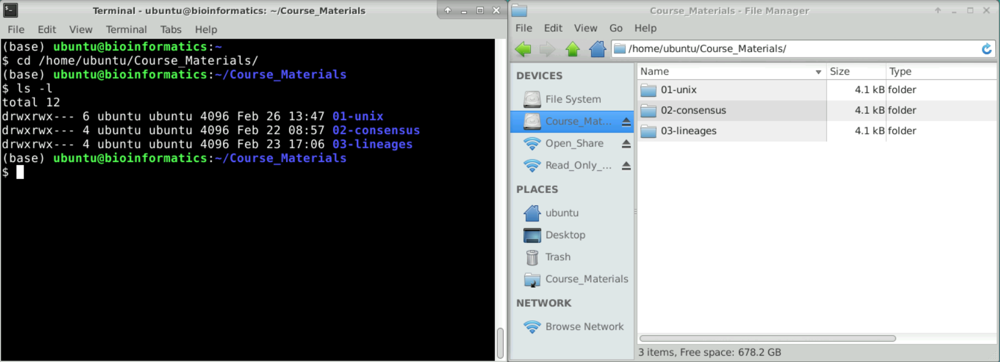

:::note
These materials are based on the [Carpentries Shell Lesson](https://swcarpentry.github.io/shell-novice/) with credit to their authors and contributors.

<a href="https://creativecommons.org/licenses/by/4.0/legalcode"></a>

Gabriel A. Devenyi (Ed.), Gerard Capes (Ed.), Colin Morris (Ed.), Will Pitchers (Ed.),
Greg Wilson, Gerard Capes, Gabriel A. Devenyi, Christina Koch, Raniere Silva, Ashwin Srinath, … Vikram Chhatre.
(2019, July). swcarpentry/shell-novice: Software Carpentry: the UNIX shell, June 2019 (Version v2019.06.1).
Zenodo. http://doi.org/10.5281/zenodo.3266823
:::

:::note
This section has an accompanying <a href="https://docs.google.com/presentation/d/1DJFWHu9sbJx3CmexGFxhb6gbK5gOmuXpPMEH8Mj-Sk4/edit?usp=sharing" target="_blank">slide deck</a>.
:::

# The Unix Shell: Introduction

:::highlight

**Questions**

- Why is the Unix command line useful for bioinformatics? 
- What is the general structure and usage of a command?

**Learning Objectives**

- List some advantages of using the Unix command line, compared to graphical user interfaces.
- Run and modify the behaviour of a simple command.

:::

## Overview

In these lessons we will give a brief introduction to the Unix Command Line. 
But what is the Command Line?

Humans and computers commonly interact in many different ways, such as through a keyboard and mouse,
touch screen interfaces, or using speech recognition systems.
The most widely used way to interact with personal computers is called a
**graphical user interface** (GUI).
With a GUI, we give instructions by clicking a mouse and using menu-driven interactions.

While the visual aid of a GUI makes it intuitive to learn, this way of delivering instructions to a computer scales very poorly.
Imagine the following task: for a literature search, you have to copy the third line of one thousand text files in one thousand different directories and paste it into a single file.

Using a GUI, you would not only be clicking at your desk for several hours, but you could potentially also commit an error in the process of completing this repetitive task.
This is where we take advantage of the Unix shell.
The Unix shell is both a **command-line interface** (CLI) and a scripting language, allowing such repetitive tasks to be done automatically and fast.
With the proper commands, the shell can repeat tasks with or without some modification as many times as we want.
Using the shell, the task in the literature example can be accomplished in seconds.



## The Shell

The shell is a program where users can type commands.
With the shell, it's possible to invoke complicated programs like bioinformatics software or simple commands that create an empty directory with only one line of code.
The most popular Unix shell is Bash.
Bash is the default shell on most modern implementations of Unix and in most packages that provide
Unix-like tools for Windows.

Using the shell will take some effort and some time to learn.
While a GUI presents you with choices to select, CLI choices are not automatically presented to you, so you must learn a few commands like new vocabulary in a language you're studying.
However, unlike a spoken language, a small number of "words" (i.e. commands) gets you a long way, and we'll cover those essential few today.

The grammar of a shell allows you to combine existing tools into powerful pipelines and handle large volumes of data automatically. 
Sequences of commands can be written into a *script*, improving the reproducibility of workflows.

In addition, the command line is often the easiest way to interact with remote machines and supercomputers.
Familiarity with the shell is near essential to run a variety of specialized tools and resources including high-performance computing systems.
As clusters and cloud computing systems become more popular for scientific data crunching, being able to interact with the shell is becoming a necessary skill.
We can build on the command-line skills covered here to tackle a wide range of scientific questions and computational challenges.


## Running Commands

When the shell is first opened, you are presented with a **prompt**,
indicating that the shell is waiting for input.

```console
$
```

The shell typically uses `$ ` as the prompt, but may use a different symbol.
In the examples for this lesson, we'll show the prompt as `$ `.
Most importantly: when typing commands, either from these lessons or from other sources, *do not type the prompt*, only the commands that follow it.
Also note that after you type a command, you have to press the <kbd>Enter</kbd> key to execute it.

The prompt is followed by a **text cursor**, a character that indicates the position where your typing will appear.
The cursor is usually a flashing or solid block, but it can also be an underscore or a pipe.
You may have seen it in a text editor program, for example.

So let's try our first command, `ls` which is short for "listing".
This command will list the contents of the current directory:

```console
$ ls
```
```
01-unix  02-consensus  03-lineages
```

:::note
**Command not found**

If the shell can't find a program whose name is the command you typed, it will print an error message such as:

```console
$ ks
```
```
ks: command not found
```

This might happen if the command was mis-typed or if the program corresponding to that command is not installed.
:::


## Command Options

Commands can often change their behaviour with additional options.
Consider the command below as a general example of a command, which we will dissect into its component parts:

```console
$ ls -F /home/ubuntu/
```

- `ls` is the **command**.
- `-F` is an **option**, also called **switch** or **flag**. Options either start with a single dash (`-`) or two dashes (`--`).
- `/home/ubuntu/` is an **argument**. Arguments tell the command what to operate on (e.g. files and directories). 

A command can be called with more than one option and more than one argument: but a command doesn't always require an argument or an option.

Each part is separated by spaces: if you omit the space between `ls` and `-F` the shell will look for a command called `ls-F`, which doesn't exist. 
Also, capitalisation can be important: `ls -r` is different to `ls -R`.

So, our command above gives us a listing of files and directories in the directory `/home/ubuntu`. 
An example of the output of the command is:

```console
$ ls -F /home/ubuntu/
```

```
Applications/ Documents/    Library/      Music/        Public/
Desktop/      Downloads/    Movies/       Pictures/
```

### Getting help

`ls` has lots of other **options**. There are two common ways to find out how to use a command and what options it accepts:

1. We can pass a `--help` option to the command, such as:
  ```console
  $ ls --help
  ```

2. We can read its manual with `man`, such as:
  ```console
  $ man ls
  ```


:::note
**Unsupported command-line options**

If you try to use an option (flag) that is not supported, `ls` and other commands will usually print an error message similar to:

```console
$ ls -j
```

```
ls: invalid option -- 'j'
Try 'ls --help' for more information.
 ```
:::

:::note
**Manual Page**

The `man` page is not available for every software. 
For example, specialist software (such as bioinformatics packages) only have the documentation available through the `--help` option. 
We will see several examples of this during the course.
:::

:::exercise
**Exploring More `ls` Flags**

- What does the command `ls` do when used with the `-l` option? 
- What about if you use both the `-l` and the `-h` option? (You can use more than one option at once).

Some of its output is about properties that we do not cover in this lesson (such as file permissions and ownership), but the rest should be useful nevertheless.

<details>
<summary>Answer</summary>

```console
$ ls -l -h
```

The `-l` option makes `ls` use a **l**ong listing format, showing not only the file/directory names but also additional information such as the file size and the time of its last modification. 
If you use both the `-h` option and the `-l` option, this makes the file size "**h**uman readable", i.e. displaying something like `5.3K` instead of `5369`.

</details>
:::


## Summary

:::highlight

**Key Points**

- The Unix Command Line can allow running complex operations with a few commands.
- Many specialist software in bioinformatics is only written for Linux and runs from the command line.
- The basic syntax of a command is: `command -options argument`. For example, `ls -l /home/ubuntu/` would **l**ist the contents of the `/home/ubuntu/` directory in a **l**ong format.

:::

