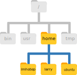

# The Unix Shell: Navigating the File System

:::highlight

**Questions**

- How is a filesystem typically organised?
- How can I navigate a filesystem and work with files from the command line?

**Learning Objectives**

- Recognise the hierarchical structure of a filesystem.
- Navigate the filesystem and create or remove files and directories (`pwd`, `ls`, `cd`, `mkdir`, `rmdir`, `rm`, `cp`, `mv`).

:::

:::note
This section has an accompanying <a href="https://docs.google.com/presentation/d/1DJFWHu9sbJx3CmexGFxhb6gbK5gOmuXpPMEH8Mj-Sk4/edit?usp=sharing" target="_blank">slide deck</a>.
:::

## Working Directory

The part of the operating system responsible for managing files and directories is called the **file system**. 
It organizes our data into files, which hold information, and directories (also called "folders"), which hold files or other directories.

Several commands are frequently used to create, inspect, rename, and delete files and directories. 
To start exploring them, we'll go to our open shell window.

First let's find out where we are by running a command called `pwd` (which stands for "print working directory"). 
Directories are like *places* - at any time while we are using the shell we are in exactly one place, called our **current working directory**. 
Commands mostly read and write files in the current working directory, so knowing where you are before running a command is important. 
`pwd` shows you where you are:

```console
$ pwd
```

```
/home/ubuntu/Course_Materials
```

Here, the computer's response is `/home/ubuntu/Course_Materials`, which is the default starting directory on our training machines. 
Normally, the default directory would be `/home/ubuntu`, which is called the **home directory**. 
The name "ubuntu" is our _username_. 
If you were using your own computer, it would look different, for example `/home/larry`.

:::note
**Home Directory Variation**

The home directory path will look different on different operating systems. 
For a user named "larry", on a Mac it would look like `/Users/larry`, and on Windows `C:\Users\larry`.
:::

:::note
**Slashes**

Notice that there are two meanings for the `/` character. 
When it appears at the beginning of a file or directory name, it refers to the root directory. 
When it appears *inside* a name, it's a separator.
:::

Underneath `/home`, we find one directory for each user with an account on the machine, in the example shown in the figure below we have *imhotep*, *larry*, and "ubuntu" (you).



The user *imhotep*'s files are stored in `/home/imhotep`, user *larry*'s in `/home/larry`, and yours in `/home/ubuntu`.  
Because you are the current user in our examples here, this is why we get `/home/ubuntu` as our home directory. 
Typically, when you open a new command prompt you will be in your home directory to start.


## Listing Files

Now let's learn the command that will let us see the contents of our own filesystem. 
We can see what's in our current directory by running `ls`, which stands for "listing":

```console
$ ls
```

```
01-unix  02-consensus  03-lineages
```

The `/home/ubuntu/Course_Materials/01-unix` directory contains the data that we will use in this tutorial.
We can look at its contents passing a directory name as an argument to `ls`:

```console
$ ls /home/ubuntu/Course_Materials/01-unix
```

```
artic_primers_pool1.bed  artic_primers_pool2.bed  
data  metadata  output.tsv
```


## Changing Directory

So far, we have been working from the `/home/ubuntu/Course_Materials/`. 
However, we can change our location to the `01-unix` directory to do our work.

The command to change locations is `cd` ("change directory") followed by a directory name to change our working directory. 

```console
$ cd /home/ubuntu/Course_Materials/01-unix/
```

We can check with `pwd` that we are in the correct directory.
We can also run `ls` again to see the files within our current directory.

What if we now wanted to go to the `data` directory? 
We could do:

```console
$ cd /home/ubuntu/Course_Materials/01-unix/data/
```

However, that's a lot of typing!
Instead, we can move to that directory by specifying its location _relative_ to our current directory. 
So, if our current directory was `/home/ubuntu/Course_Materials/01-unix/` we could just do:

```console
$ cd data
```

In conclusion, there are two ways to specify directory names:

- An **absolute path** includes the entire path (or location) from the root directory, which is indicated by a leading slash. The leading `/` tells the computer to follow the path from the root of the file system, so it always refers to exactly one directory, no matter where we are when we run the command.
- A **relative path** tries to find that location from where we are (our current directory), rather than from the root of the file system.

We now know how to go _down_ the directory tree, but how do we go _up_? 
We might try the following:

```console
$ cd 01-unix
```

```
-bash: cd: 01-unix: No such file or directory
```

But we get an error! Why is this?
With our methods so far, `cd` can only see sub-directories _inside_ your current directory. 
To move up one directory we need to use the special shortcut `..` like this:

```console
$ cd ../
```

`..` is a special directory name meaning "the directory containing this one", or more succinctly, the **parent** of the current directory. 
Sure enough, if we run `pwd` after running `cd ..`, we're back in `/home/ubuntu/Course_Materials/01-unix`.


:::note
**Another Shortcut**

The shell interprets the character `~` (tilde) at the start of a path to mean "the current user's home directory". 
For example, for your home directory,`/home/ubuntu`, then `~/Course_Materials` is equivalent to `/home/ubuntu/Course_Materials`. 
This only works if it is the first character in the path: `here/there/~/elsewhere` is *not* `here/there/home/ubuntu/elsewhere`.
:::


:::note
**Tab completion**

Sometimes file and directory names get too long and it's tedious to have to
type the full name for example when moving with `cd`.  
We can let the shell do most of the work > through what is called **tab completion**. 
Let's say we are in the `/home/ubuntu/Course_Materials/01-unix/` and we type:

```console
$ ls met
```

and then press the <kbd>Tab ↹</kbd> key on the keyboard, the shell automatically completes the directory name:

```console
$ ls metadata/
```

If we press <kbd>Tab ↹</kbd> again it does nothing, since there are 3 possibilities.
In this case, pressing <kbd>Tab</kbd> twice brings up a list of all the files. 
:::

:::exercise

Using the filesystem diagram below, if `pwd` displays `/Users/thing`, what will `ls ../backup` display?

1. `../backup: No such file or directory`
2. `2012-12-01 2013-01-08 2013-01-27`
3. `original pnas_final pnas_sub`


<details>
<summary>Answer</summary>
  1. No: from the diagram, we can see that there *is* a directory `backup` in `/Users`.
  2. No: this is the content of `Users/thing/backup`, but with `..` we asked for one level further up.
  3. **Yes:** `../backup/` refers to `/Users/backup/`.
</details>
:::


## Creating directories

We now know how to explore files and directories, but how do we create them in the first place?

**First, we should see where we are and what we already have.**
Let's go back to our `01-unix` directory and use `ls` to see what it contains:

```console
$ cd /home/ubuntu/Course_Materials/01-unix
$ ls
```

```
artic_primers_pool1.bed  artic_primers_pool2.bed  data/  metadata/  output.tsv
```

Now, let's **create a new directory** called `results` using the command `mkdir results`:

```console
$ mkdir results
```

As you might guess from its name, `mkdir` means "make directory".
Since `results` is a relative path (i.e., does not have a leading slash, like `/what/ever/results`), the new directory is created in the current working directory:

```console
$ ls
```

```console
artic_primers_pool1.bed  data/      output.tsv
artic_primers_pool2.bed  metadata/  results/
```

:::note
**Two ways of doing the same thing**

Using the shell to create a directory is no different than using a file explorer.
If you open the current directory using your operating system's graphical file explorer <i class="fa-solid fa-folder"></i>, the `results` directory will appear there too.
While the shell and the file explorer are two different ways of interacting with the files, the files and directories themselves are the same.
:::

:::note
**Good names for files and directories**

Complicated names of files and directories can make your life painful when working on the command line. 

<details><summary>Click Here to see some useful tips for naming your files.</summary>

1. Don't use spaces.

   Spaces can make a name more meaningful, but since spaces are used to separate arguments on the command line it is better to avoid them in names of files and directories.
   You can use `-` or `_` instead (e.g. `consensus_sequences/` rather than `consensus sequences/`).

2. Don't begin the name with `-` (dash).

   Commands treat names starting with `-` as options.

3. Stick with letters, numbers, `.` (period or 'full stop'), `-` (dash) and `_` (underscore).

   Many other characters have special meanings on the command line.
   We will learn about some of these during this lesson.
   There are special characters that can cause your command to not work as expected and can even result in data loss.

If you need to refer to names of files or directories that have spaces or other special characters, you should surround the name in quotes (`""`).
</details>
:::

Since we've just created the `results` directory, there's nothing in it yet:

```console
$ ls results
```

:::note
**What's In A Name?**

You may have noticed that all of the files in our data directory are named "something dot something". 
For example `output.tsv`, which indicates this is a "tab-delimited values" file. 

The second part of such a name is called the **filename extension**, and indicates what type of data the file holds. 
Here are some common examples:

- `.txt` signals a plain text file.
- `.csv` is a text file with tabular data where each column is separated by a comma. 
- `.tsv` is like a CSV but values are separated by a tab.
- `.log` is a text file containing messages produced by a software while it runs.
- `.pdf` indicates a PDF document.
- `.png` is a PNG image.

This is just a convention: we can call a file `mydocument` or almost anything else we want. 
However, most people use two-part names most of the time to help them (and their programs) tell different kinds of files apart. 

This is just a convention, albeit an important one. 
Files contain bytes: it's up to us and our programs to interpret those bytes according to the rules for plain text files, PDF documents, configuration
files, images, and so on.

Naming a PNG image of a whale as `whale.mp3` doesn't somehow magically turn it into a recording of whalesong, though it *might* cause the operating system to try to open it with a music player when someone double-clicks it.
:::


## Moving & Renaming Files

In our `01-unix` directory we have a file `output.tsv`, which contains the results of an analysis of SARS-CoV-2 variants for different samples. 
Let's move this file to the `results` directory we created earlier, using the command `mv`, which is short for "move":

```console
$ mv output.tsv results/
```

The first argument tells `mv` what we're "moving", while the second is where it's to go. 
In this case, we're moving `output.tsv` to `results/`. 
We can check the file has moved there:

```console
$ ls results
```

```
output.tsv
```

This isn't a particularly informative name for our file, so let's change it!
Interestingly, we also use the `mv` command to change a file's name.
Here's how we would do it:

```console
$ mv results/output.tsv results/variants.tsv
```

In this case, we are "moving" the file to the same place but with a different name.
One has to be careful when specifying the target file name, since `mv` will silently overwrite any existing file with the same name, which could lead to data loss. 

The command `mv` also works with directories, and you can use it to move/rename an entire directory just as you use it to move an individual file.


## Copying Files and Directories

The `cp` command works very much like `mv`, except it copies a file instead of moving it.
For example:

```console
$ cp data/envelope_protein.fa protein_copy.fa
$ ls
```

```
artic_primers_pool1.bed  data      protein_copy.fa
artic_primers_pool2.bed  metadata  results
```

:::exercise

Make a copy of the `results` directory named `backup`.
When copying an entire directory, you will need to use the option `-r` with the `cp` command (`-r` means "recursive"). 

<details><summary>Answer</summary>

If we run the command without the `-r` option, this is what happens:

```console
$ cp results backup
```

```
cp: -r not specified; omitting directory 'results'
```

This message is already indicating what the problem is.
By default, directories (and their contents) are not copied unless we specify the option `-r`.

This would work:

```console
$ cp -r results backup
```

Running `ls` we can see a new folder called `backup`:

```console
$ ls
```

```
artic_primers_pool1.bed  artic_primers_pool2.bed  
backup  data  metadata  results
```

</details>
:::


## Removing Files and Directories

Let's tidy up our `01-unix` directory by removing the `protein_copy.fa` file we created earlier.
The Unix command we'll use for this is `rm` (short for 'remove'):

```console
$ rm protein_copy.fa
```

We can confirm the file has gone using `ls`.

:::note
**Deleting Is Forever**

The Unix shell doesn't have a trash bin that we can recover deleted files from (though most graphical interfaces to Unix do).  
Instead, when we delete files, they are unlinked from the file system so that their storage space on disk can be recycled. 
Tools for finding and recovering deleted files do exist, but there's no guarantee they'll work in any particular situation, since the computer may recycle the file's disk space right away.
:::

If we try to remove the `backup` directory we created in the exercise:

```console
$ rm backup
```

```
rm: cannot remove `backup': Is a directory
```

This happens because `rm` by default only works on files, not directories.

`rm` can remove a directory *and all its contents* if we use the 
recursive option `-r`, and it will do so *without any confirmation prompts*:

```console
$ rm -r backup
```

Given that there is no way to retrieve files deleted using the shell, `rm -r` *should be used with great caution* (you might consider adding the interactive option `rm -r -i`).

To remove _empty_ directories, we can also use the `rmdir` command. 
This is a safer option than `rm -r`, because it will never delete the directory if it contains files, giving us a chance to check whether we really want to delete all its contents.


## Operations with multiple files and directories

Oftentimes one needs to copy several files at once. 
This can be done by providing a list of individual filenames, or specifying a naming pattern using wildcards.  

:::exercise
**Copy with Multiple Filenames**

Working from the `01-unix` directory, run the following code. 
What does `cp` do when given several filenames and a directory name?

```console
$ mkdir backup
$ cp metadata/run1_samples.csv metadata/run2_samples.csv backup/
```

In the example below, what does `cp` do when given three or more file names?

```console
$ cp metadata/run1_samples.csv  metadata/run2_samples.csv  metadata/run3_samples.csv
```


<details>
<summary>Answer</summary>

If given more than one file name followed by a directory name (i.e. the destination directory must 
be the last argument), `cp` copies the files to the named directory.

If given three file names, `cp` throws an error such as the one below, because it is expecting a directory name as the last argument.

```console
cp: target 'run3_samples.csv' is not a directory
```

</details>
:::


### Wildcards

Wildcards are special characters that can be used to access multiple files at once. 
The most commonly-used wildcard is `*`, which is used to match zero or more characters. 

Let's consider the `data` directory:

```console
$ ls data/
```

```
envelope_protein.fa  sequencing_run1  spike_protein.fa
reference_genome.fa  sequencing_run2

```

In this case, `*.fa` would match every file that ends with that word. 

```console
$ ls data/*.fa
```

```
data/envelope_protein.fa  data/reference_genome.fa  data/spike_protein.fa
```


:::exercise

Use the `*` wildcard together with the copy command to copy all the protein files in the `data` folder to the `backup` folder that we created earlier. 

<details><summary>Hint</summary>Remember the "**c**o**p**y" command is `cp`.</details>

<details><summary>Answer</summary>

First, make sure you are in the correct directory: `cd ~/Course_Materials/01-unix`.

Now, we can use the `cp` command together with the `*` wildcard:

```console
$ cp data/*protein.fa backup/
```

We can check the files are all there with `ls backup/*protein.fa`.

</details>

:::


## Summary

:::highlight

**Key Points**

- The file system is organised in a hierarchical way.
- Every user has a home directory, which on Linux is typically `/home/username/`.
- Locations in the filesystem are represented by a **path**:
  - The `/` used at the _start_ of a path means the "root" directory (the start of the filesystem). 
  - `/` used in the _middle_ of the path separates different directories. 
- Some of the commands used to navigate the filesystem are:
  - `pwd` to print the working directory (or the current directory)
  - `ls` to list files and directories
  - `cd` to change directory
- Directories can be created with the `mkdir` command.
- Files can be moved and/or renamed using the `mv` command.
- Files can be copied with the `cp` command. To copy an entire directory (and its contents) we need to use `cp -r` (the `-r` option will copy files **r**ecursively).
- Files can be removed with the `rm` command. To remove an entire directory (and its contents) we need to use `rm -r`  (the `-r` option will remove files **r**ecursively).
  - Deleting files from the command line is _permanent_.
- We can operate on multiple files using the `*` wildcard, which matches "zero or more characters". For example `ls *.txt` would list all files that have a `.txt` file extension.
:::

