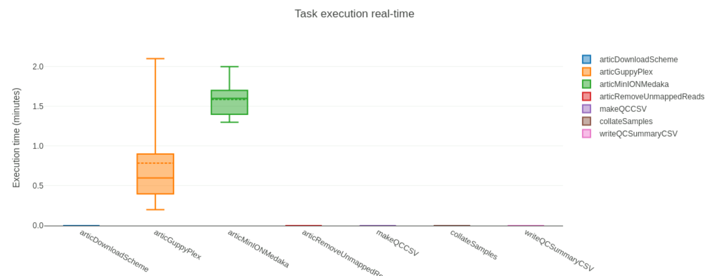
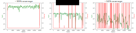

# Consensus Assembly

::: highlight

**Questions**

- What are the steps involved in assembling SARS-CoV-2 genome from amplicon sequencing (Illumina and Nanopore)?
- How can I do reference-based assembly of SARS-CoV-2 genomes?

**Learning Objectives**

- Recognise what the main steps are in processing raw sequencing data to generate consensus genome sequences, including sequence alignment, primer trimming and consensus generation. 
- Recognise the differences between Illumina and Nanopore pipelines.
- Apply the `connor-lab/ncov2019-artic-nf` _Nextflow_ pipeline to generate a consensus sequence from Illumina and Nanopore data.
- Troubleshoot issues when running a _Nextflow_ pipeline and resume the pipeline in case of a failure.
- Check basic data quality metrics on the assembled sequences and identify sequences for downstream analyses.

:::

:::note
This section has an accompanying <a href="https://docs.google.com/presentation/d/1EbuH6KjK3oW5BUfSU43rVH_b-tPTKtubDWl86eAH47U/edit?usp=sharing" target="_blank">slide deck</a>.
:::


## SARS-CoV-2 Consensus Assembly

As we discussed [earlier in the course](01-intro.html), the starting material for sequencing SARS-CoV-2 samples from infected patients is PCR-amplified DNA generated with a panel of primers that covers the whole SARS-CoV-2 genome (for example, the primers developed and updated by the ARTIC network). 
This material can then be sequenced using either _Illumina_ or _Nanopore_ platforms. 

Although different sotware tools are used depending on which kind of sequencing platform was used, the main goal is the same: to align the sequencing reads to the reference genome, and identify any DNA changes (SNPs or Indels) relative to the reference genome (_Wuhan-Hu-1_).
This is called **consensus assembly**, since we are _assembling_ the genome of our sample from the PCR-amplified fragments and generating a _consensus_ sequence based on changes present in several reads covering a particular position of the genome. 

The general data processing steps are:

- Filter high-quality sequencing reads.
- Map the reads to the _Wuhan-Hu-1_ reference genome.
- Trim the primers from the aligned reads based on the primer location file (BED file).
- Perform variant calling (SNPs and indels) to identify changes relative to the reference sequence.
- Generate a consensus sequence for the sample based on those variants.
- "Mask" low-quality positions to avoid mis-identifying variants.


:::note
**Primer trimming** is a key step of the data processing, otherwise SNPs might be missed at the primer sites, on the final consensus sequence.
This is because the primer sequence is retained during PCR instead of the original sequence of the sample. 
Because the PCR amplicons overlap with each other, we can trim the primers from each read and do variant calling after trimming. 
An example of this is shown in the Figure above.

<!--
Consider adding some notes about sequence length (for Illumina), whether it spans the whole amplicon or not, whether reads without primers can be retained.

Depends on the library prep method:
- Ligation-based (e.g. Kappa kit from [this paper](https://www.biorxiv.org/content/10.1101/2020.06.16.154286v1.full)). See this [ligation illustration](https://sfvideo.blob.core.windows.net/sitefinity/images/default-source/default-album/decoded-temp-image-storage/19_ng_lib-prep-frag.png?sfvrsn=9e0a1b07_4).
- Tagmentation-based (e.g. Nextera kits from the same paper). See this [tagmentation illustration](https://upcvmda-pl480.weebly.com/uploads/8/3/9/0/83900706/tagmentation_1_orig.png).

As I understand it, with ligation-based method there is no fragmentation, adapters are ligated directly to the amplicon.
With tagmentation-based methods the fragment may sometimes not contain the primer, if the transposome cuts the amplicon in half or something like that. 

-->
:::


## Bioinformatic Workflows/Pipelines

As can already be seen from the brief description above, bioinformatic analyses always involve multiple steps where data is gathered, cleaned and integrated to give a final set of processed files of interest to the user. 
These sequences of steps are called a **workflow** or **pipeline**. 
As analyses become more complex, workflows may include the use of many different software tools, each requiring a specific set of inputs and options to be defined. 
Furthermore, as we want to chain multiple tools together, the inputs of one tool may be the output of another, which can become challenging to manage. 

Although it is possible to code such workflows using _shell_ scripts, these often don't scale well across different users and compute setups. 
To overcome these limitations, dedicated [_workflow management software_](https://en.wikipedia.org/wiki/Workflow_management_system) packages have been developed to help standardise workflows and make it easier for the user to process their data. 


Two of the most popular _workflow software_ packages are [_Snakemake_](https://snakemake.readthedocs.io/en/stable/) and [_Nextflow_](https://www.nextflow.io/). 
We will not cover how to develop workflows with these packages, but rather how to use an existing workflow to generate consensus sequences from SARS-CoV-2 data.

### Why Use a Standardised Workflow? {.unlisted .unnumbered}

These are some of the key advantages of using a standardised workflow for our analysis:

- Fewer errors - because the workflow automates the process of managing input/output files, there are less chances for errors or bugs in the code to occur.
- Consistency and reproducibility - analysis ran by different people should result in the same output, regardless of their computational setup.
- Software installation - all software dependencies are automatically installed for the user using solutions such as _Conda_, _Docker_ and _Singularity_ (more about these in a later section of the course).
- Scalability - workflows can run on a local desktop or scale up to run on _high performance compute clusters_.
- Checkpoint and resume - if a workflow fails in one of the tasks, it can be resumed at a later time.


## SARS-CoV-2 Workflow {.tabset}

For this section, we will be working from the following directory:

```console
$ cd ~/Course_Materials/02-consensus
```

This directory contains two sets of sequencing data, from Illumina and Nanopore platforms. 
These data were generated using the ARTIC protocol with V3 primer scheme.

To generate consensus SARS-CoV-2 genomes from these data, we will use a _Nextflow_ workflow that was developed by the [Connor Lab](https://github.com/connor-lab/ncov2019-artic-nf). 
Its objective was to harmonise the assembly of SARS-CoV-2 genomes from both Illumina and Nanopore amplicon sequencing data.
This workflow therefore includes different sub-workflows, which are launched depending on the type of sequence data we have.

To see all the options available with this workflow, we run: 

```console
$ nextflow run ncov2019-artic-nf --help
```

```
Usage:
  nextflow run connor-lab/ncov2019-artic-nf -profile (singularity,docker,conda) ( --illumina | --nanpolish | --medaka ) --prefix [prefix] [workflow-options]

Description:
  Turn Nanopore or Illumina SARS-CoV2 sequencing reads generated by ARTIC tiling amplification protocols into consensus sequences.
    - Nanopore: ARTIC (https://github.com/artic-network/fieldbioinformatics)
    - Illumina: iVar (https://github.com/andersen-lab/ivar)

  All options set via CLI can be set in conf directory

Nextflow arguments (single DASH):
  -profile                  Allowed values: conda, singularity, docker, [COG-UK institutional profile]

Mandatory workflow arguments (mutually exclusive):
  --illumina                Run the Illumina workflow
  --nanopolish              Run the Nanopore/Nanopolish workflow (https://github.com/jts/nanopolish)
  --medaka                  Run the Nanopore/Medaka workflow (https://github.com/nanoporetech/medaka)

[...further output omitted...]
```

From the help output printed above, we can see that there are three mandatory workflow arguments named `--illumina`, `--nanopolish` and `--medaka`. 
These are the options used to launch each of the sub-workflows available to us, which we detail below.

:::note
The _Wuhan-Hu-1_ reference genome sequence and the amplicon primer locations (in BED file format) can all be found on the ARTIC [Primer Schemes repository](https://github.com/artic-network/primer-schemes/tree/master/nCoV-2019). 
The workflow we will use takes care of downloading these files for us automatically, however it can be useful to know where to find them, in case you want to use other tools that require these files. 
:::


### Illumina (FASTQ)

The Illumina sub-workflow is based on several standard bioinformatic tools and, importantly, on the [iVar](https://andersen-lab.github.io/ivar/html/) software, which was developed for analysing amplicon-based sequencing data.


<details><summary>Click to see more details about this sub-workflow</summary>

In summary, the steps performed by the `--illumina` sub-workflow are:

- Adapter trimming with [`trim_galore`](https://www.bioinformatics.babraham.ac.uk/projects/trim_galore/).
- Trimmed sequences are mapped to the _Wuhan-Hu-1_ reference genome using `bwa mem`.
  - The reference genome is "indexed" to be ready for mapping using `bwa index`.
  - The mapped files are sorted by coordinate (using `samtools sort`).
  - Unmapped reads are removed using `samtools view -F4`.
- Primers are removed from the aligned reads using `ivar trim` (using the primer BED file).
  - Reads are retained if they are at least 30bp after clipping the primers.
  - Reads are also clipped if they fall below a Phred-quality score of 20.
  - These defaults (30bp minimum length and Phred-score threshold) can be adjusted with the `--illuminaKeepLen` and `--illuminaQualThreshold` options on the nextflow pipeline. Keeping the default options is advised.
  - There is an option to retain reads even if no primer is detected on them (`--allowNoprimer`). This should be set depending on the protocol used: ligation = false, tagmentation = true (default: true).
- Variant calling is done using `ivar variants`.
  - Only positions with at least 10x depth are called. Generally it is advised not to go below this threshold.
- Consensus sequences are called using `ivar consensus`. 
  - Only positions with a minimum depth of 10x are called. Otherwise, they are marked as an ambiguous base 'N'. 

</details>

To run the pipeline on Illumina data, we use the following general command:

```console
nextflow run ncov2019-artic-nf \
  -with-report -with-dag \
  -profile conda \
  --outdir OUTPUT_DIRECTORY \
  --prefix NAME_OF_YOUR_ANALYSIS_RUN \
  --schemeVersion V3 \
  --directory DIRECTORY_WITH_FASTQ_FILES \
  --illumina
```

The key option here is `--illumina`, which makes sure that the correct sub-workflow will be used. 

### Nanopore (basecalled FASTQ)

The nanopore sub-workflow is based on the [ARTIC bioinformatics protocol](https://artic.network/ncov-2019/ncov2019-bioinformatics-sop.html) and uses several of the tools from the accompanying [`artic` software package](https://artic.readthedocs.io/en/latest/). 

This sub-workflow is similar to the other nanopore sub-workflow, the main difference is the software used for generating a consensus sequence (`medata` instead of `nanopolish`).


<details><summary>Click to see more details about this sub-workflow</summary>

In summary, the steps performed by the `--medaka` sub-workflow are:

- Aggregate and filter reads to ensure they pass minimum read length thresholds using `artic guppyplex`:
  - minimum length 400bp (can be changed with `--min_length` option)
  - maximum length 700bp (can be changed with `--max_length` option)
- Run the `artic minion` tool, which internally does:
  - Read mapping to reference genome using `minimap2` (can be changed to use `bwa mem` with the `--bwa` option).
  - Trim primers from the aligned reads based on the known primer positions in the BED file (using a custom python script called `align_trim.py`).
  - Call consensus sequences and variants using `medaka consensus` and `medaka variant`:
  - Positions with less than 20x depth are "masked" by assigning the ambiguous base 'N'. It is not advised to go below this threshold as the models used to call variants do not perform as well.

</details>

To run our pipeline on basecalled data (FASTQ files), we use the following command:

```console
nextflow run ncov2019-artic-nf \
  -with-report -with-dag \
  -profile conda \
  --outdir OUTPUT_DIRECTORY \
  --prefix NAME_OF_YOUR_ANALYSIS_RUN \
  --schemeVersion V3 \
  --basecalled_fastq DIRECTORY_WITH_FASTQ_FILES \
  --medaka
```

The key option here is `--medaka`, which makes sure that the correct sub-workflow will be used. 
We also specify the directory containing our basecalled FASTQ files with `--basecalled_fastq`.
This should contain sub-directories for each barcoded sample following the naming convention `barcodeXXXX` (where X is a number between 0 and 9). 
By default, `guppy_basecaller` generates such a folder structure. 

:::warning
For this workflow to work, you should not use compressed FASTQ files (`fastq.gz`) but rather uncompressed files. 
Otherwise the workflow will fail with an error "Couldn't detect whether your Nanopore run was barcoded or not."
:::

### Nanopore (signal-level FAST5)

The nanopore sub-workflow is based on the [ARTIC bioinformatics protocol](https://artic.network/ncov-2019/ncov2019-bioinformatics-sop.html) and uses several of the tools from the accompanying [`artic` software package](https://artic.readthedocs.io/en/latest/). 

This sub-workflow is similar to the other nanopore sub-workflow, the main difference is the software used for generating a consensus sequence (`nanopolish` instead of `medaka`).


<details><summary>Click to see more details about this sub-workflow</summary>

In summary, the steps performed by the `--nanopolish` sub-workflow are:

- Filter reads to ensure they pass minimum read length thresholds:
  - minimum length 400bp (can be changed with `--min_length` option)
  - maximum length 700bp (can be changed with `--max_length` option)
- Run the `artic minion` tool, which internally does:
  - Read alignment to reference genome using `minimap2` (can be changed to use `bwa mem` with the `--bwa` option).
  - Trim primers from the aligned reads (based on the known primer positions in the BED file).
  - Call consensus sequences and variants using `nanopolish variants` if using signal-level FAST5 files.
    - Positions with less than 20x depth are assigned the ambiguous base 'N'. It is not advised to go below this threshold as the models used to call variants do not perform as well.
- Unmapped reads are removed using `samtools view -F4`.

</details>

To run our pipeline on signal-level data (FAST5 files), we use the following command: 

```console
nextflow run ncov2019-artic-nf \
  -with-report -with-dag \
  -profile conda \
  --outdir OUTPUT_DIRECTORY \
  --prefix NAME_OF_YOUR_ANALYSIS_RUN \
  --schemeVersion V3 \
  --fast5_pass DIRECTORY_WITH_FAST5_FILES \
  --sequencing_summary SEQUENCING_SUMMARY_FILE \
  --nanopolish
```

The key option here is `--nanopolish`, which makes sure the correct sub-workflow is used.
We also need to specify a directory containing our FAST5 files with `--fast5_pass` and a path to the `sequencing_summary.txt` file that is standard output from the `guppy` software.

## {.unlisted .unnumbered}

The first few arguments used in the above commands are generic options for Nextflow (they can be used with any workflow, not just specifically with our SARS-CoV-2 workflow):

- `-with-report` generates a report about the resources used at different steps in the pipeline (e.g. how long each step took to run, how many CPUs and memory was used, etc.). These will be found in a sub-directory called `pipeline_info`.
- `-with-dag` produces a "directed acyclic graph", which shows how the different steps of the pipeline link to each other. This will be saved in the same `pipeline_info` directory.
- `-profile conda` uses the _Conda_ package manager to automatically install all the necessary software used by this pipeline (we will talk more about _Conda_ later in the course).

The following arguments are specific to our workflow:

- `--illumina`, `--medaka` or `--nanopolish` indicates whether want to use the pipeline steps developed for Illumina or Nanopore data.
- `--outdir results/consensus` indicates that we want the results of the pipeline to be saved in the directory `results/consensus` (the directory will be created if it does not exist).
- `--prefix run_name` is a prefix that Nextflow will use to name some of the output files. This is useful if we had multiple runs in the same project and wanted to run the pipeline on each run. 
- `--schemeVersion V3` indicates the Artic primer version used when preparing the sequencing libraries (V1, V2, V3 or V4). 
- `--directory`, `--basecalled_fastq` or `--fast5_pass`  is the directory where all the sequencing data is stored. For Illumina, the workflow will automatically recognise files with suffix "_1.fastq.gz" or "_2.fastq.gz" as being paired-end data.


:::note
The term **masking** is often used to refer to the process of converting sequence bases to the ambiguous character 'N'. 
You may come across this term in the documentation of certain tools, for example: 
"Positions with less than 20x depth of sequencing are masked."

Masks are not limited to depth of sequencing. For example, [reference genomes from ENSEMBL](https://ensemblgenomes.org/) are available with masked repeat or low-complexity sequences (e.g. around centromeres, transposon-rich regions, etc.). 

The term **soft masking** is also used to refer to cases where, instead of using the ambiguous character 'N', sequences are masked with a lowercase. 
For example:

```
>seq_with_soft_masking
ACAGACTGACGCTGTcatgtatgtcgacGATAGGCTGATGGCGAGTGACTCGAG
>seq_with_hard_masking
ACAGACTGACGCTGTNNNNNNNNNNNNNGATAGGCTGATGGCGAGTGACTCGAG
```
:::

### Running the Workflow

Let's see an example in action by using some example data.
If you go to the directory `02-consensus/uk_illumina/` in the course materials, you will find several FASTQ files in the `data` directory. 
There is also a _shell script_ (in `scripts/run_illumina_workflow.sh`) that contains the commands we will use to run the workflow on these data.

<!--
- Open _VS Code_.
- Go to _File > Open Folder..._ and navigate to the directory called `02-consensus/`.
- Open a terminal by going to _Terminal > New Terminal_.
- From the file explorer panel (on the left) open the shell script found in `uk_illumina/scripts/run_illumina_workflow.sh`.
- On the terminal window, change directory to `cd uk_illumina` and take some time to explore the files found in there (in particular look at the `data` directory).

(Note: if you need a reminder on how to use _VS Code_, check our [VS Code overview](105-vs_code.html))
-->

Opening the script, we can see the following commands: 

```bash
# create output directory
mkdir results

# run the workflow
nextflow run ncov2019-artic-nf -with-report -with-dag -profile conda --outdir results/consensus/ --prefix uk --schemeVersion V3 --directory data/reads/ --illumina
```

It first creates a results directory (to store our output files) and then runs the `nextflow` command using the `--illumina` sub-workflow.
We could run these commands one at a time by copy/pasting them to the terminal. 
Or alternatively, we can run the entire script using `bash scripts/run_illumina_workflow.sh`

When you start running the workflow, you will get a list of the workflow steps and their progress. 
Once the workflow is complete, you should see something similar to the following:

```console
[94/4d963f] process > ncovIllumina:prepareReferenceFiles:articDownloadScheme (https://github.com/artic-network/p... [100%] 1 of 1 ✔  
[c1/5147e1] process > ncovIllumina:prepareReferenceFiles:indexReference (nCoV-2019.reference.fasta)                 [100%] 1 of 1 ✔  
[62/7f03b3] process > ncovIllumina:sequenceAnalysis:readTrimming (ERR5921612)                                       [100%] 7 of 7 ✔  
[e8/e7df33] process > ncovIllumina:sequenceAnalysis:readMapping (ERR5932418)                                        [100%] 7 of 7 ✔  
[fe/71e5df] process > ncovIllumina:sequenceAnalysis:trimPrimerSequences (ERR5932418)                                [100%] 7 of 7 ✔  
[08/302b91] process > ncovIllumina:sequenceAnalysis:callVariants (ERR5932418)                                       [100%] 7 of 7 ✔  
[6b/ff2d9d] process > ncovIllumina:sequenceAnalysis:makeConsensus (ERR5932418)                                      [100%] 7 of 7 ✔  
[83/2dcd07] process > ncovIllumina:sequenceAnalysis:makeQCCSV (ERR5932418)                                          [100%] 7 of 7 ✔  
[90/2aa165] process > ncovIllumina:sequenceAnalysis:writeQCSummaryCSV (uk)                                          [100%] 1 of 1 ✔  
[b3/d57d1f] process > ncovIllumina:sequenceAnalysis:collateSamples (ERR5932418)                                     [100%] 7 of 7 ✔  
Completed at: 22-Feb-2022 17:00:04
Duration    : 12m 5s
CPU hours   : 0.9
Succeeded   : 52
```

You should also get several output files in the results folder specified with our `nextflow` command. 
We will detail what these files are in the following section. 

:::exercise

Go to the course materials directory `02-consensus/india_nanopore` (on our training machines `cd ~/Course_Materials/02-consensus/india_nanopore`). 
This contains Nanopore sequencing data for several samples collected in India. 
Nanopore data is organised in directories named according to the convention `barcodeXX` where `XX` is a number. 
The `--medaka` workflow expects to be given as an input a directory containing several sub-directories named in that way (this is a standard output from the program used to generate FASTQ files from Nanopore data). 

- Using `nano`, open the script found in `scripts/run_medaka_workflow.sh`.
- Fix the code in the script where you see the word "_FIXME_". Output the results to a directory called `results/consensus/`.
- Run the nextflow command on the terminal. This may take ~5 minutes to complete.
- Once complete, use the file explorer <i class="fa-solid fa-folder"></i> and go to the results folder to open the file in `pipeline_info/execution_report.html`.
  - How long did the workflow take to run?
  - Which step of the pipeline took the longest to run?

<details><summary>Answer</summary>

The fixed code is:

```bash
# create output directory
mkdir -p results

# run the workflow
nextflow run ncov2019-artic-nf -with-report -with-dag -profile conda --outdir results/consensus/ --prefix india --schemeVersion V3 --basecalled_fastq data/reads/ --medaka
```

What we did to fix it was:

- Set the output directory to `results/consensus/`
- Provide the path to the directory containing the FASTQ files for each sample, within their respective `barcodeXX` sub-directories. 

After the workflow was complete, we get the following message:

```
Completed at: 22-Feb-2022 17:23:54
Duration    : 5m 30s
CPU hours   : 0.3
Succeeded   : 37
```

From this we can already answer that it took around 5 minutes to run. 
To know which step of the workflow took the longest time to run, we open the workflow report file. 
In the section "Job Duration" we can see a graph that looks like this:



This indicates that the step running the `artic minion` tool takes the longest. 
This is not surprising as this is the step where most of the work is happening (mapping, primer trimming and making a consensus sequence). 
You can revise the steps of the workflow in the [respective section above](04-artic_nextflow.html#SARS-CoV-2_Workflow)


</details>

:::

## Output Files {.tabset}

After running our pipeline, we will get several output directories. 
Again, the directories we get will depend on which version of the workflow was used. 

### Illumina

The output directory will contain the following folders:

| Directory | Description |
| :- | :- |
| `ncovIllumina_sequenceAnalysis_readTrimming` | FASTQ files with Illumina adapters trimmed. | 
| `ncovIllumina_sequenceAnalysis_readMapping` | BAM files with reads mapped to the reference genome. |
| `ncovIllumina_sequenceAnalysis_trimPrimerSequences` | same BAM files but with primers trimmed from the reads. |
| `ncovIllumina_sequenceAnalysis_makeConsensus` | FASTA files with consensus sequences for each sample. |
| `ncovIllumina_sequenceAnalysis_callVariants` | TSV files with variants identified in each sample. |
| `qc_plots` | PNG files with coverage plots (detailed below). |
| `qc_pass_climb_upload` | FASTA and BAM files for samples passing default QC thresholds. |

We also get a file in the output directory that compiles several quality metrics called `PREFIX.qc.csv` (where "PREFIX" is what was defined with the `--prefix` option when running the workflow).


### Nanopore (medaka)

| Directory | Description |
| :- | :- |
| `articNcovNanopore_sequenceAnalysisMedaka_articGuppyPlex` | FASTQ files with filtered reads. | 
| `articNcovNanopore_sequenceAnalysisMedaka_articMinIONMedaka` | Output files from the "medaka" sub-workflow (see next table). |
| `qc_plots` | PNG files with coverage plots (detailed below). |
| `qc_pass_climb_upload` | FASTA and BAM files for samples passing default QC thresholds. |

The "medaka" sub-workflow outputs several files for each sample. 
Some of the more relevant ones being:

| File Name | Description |
| :- | :- |
| `*.consensus.fasta` | Consensus FASTA file. |
| `*.pass.vcf.gz` | VCF file with identified variants (relative to the Wuhan reference) that pass quality thresholds. |
| `*.primertrimmed.rg.sorted.bam` | BAM file with mapped reads (with primers trimmed). |

Finally, we also get a file in the output directory that compiles several quality metrics called `PREFIX.qc.csv` (where "PREFIX" is what was defined with the `--prefix` option when running the workflow).

## {.unlisted .unnumbered}


## Quality Control 

The first file we want to look at in terms of quality control is the CSV in our workflow output directory.
This file can be open in any spreadsheet software (e.g. Excel or LibreOffice). 

For each sequence, it contains information about: 

- `sample_name` The name of the sample.
- `pct_N_bases` The percentage of bases in the consensus sequence that were marked as ambiguous ('N'). These are bases that didn't pass the minimum sequencing depth threshold (10x for Illumina or 20x for Nanopore).
- `pct_covered_bases` The percentage of bases that were called (i.e. above the sequencing depth threshold).
- `longest_no_N_run` The maximum length of consecutive ambiguous 'N' bases in the consensus sequence.
- `num_aligned_reads` Total number of reads aligned to the reference genome.
- `fasta` Name of the FASTA file.
- `bam` Name of the BAM file.
- `qc_pass` Contains TRUE or FALSE depending on whether the sample passed default quality thresholds.

The **default quality thresholds are very permissive** (and unfortunately cannot be changed). 
A sample "passes" as high quality if at least 50% of the genome is covered. 
This is not a very high threshold, and typical recommendations are to only use samples in downstream analysis if at they have at least 90% coverage. 

Therefore, it is always good to open this file and sort the samples by each of these quality metrics to identify any problematic samples (and exclude them from downstream analysis). 

Another helpful quality control output are the plots found in the `qc_plots` folder.




For the nanopore sub-workflow you also get coverage barplots for individual primer pairs, which is useful to identify any particular fragments that did not get amplified.


These may be particularly useful to identify if there is a systematic "dropout" of particular amplicons. 
This may occur, for example, if a common variant has mutations that affect the primer hybridization during PCR. 

:::exercise

Use the file browser <i class="fa-solid fa-folder"></i> to navigate to the results folder generated in the previous exercise (`india_nanopore/results/consensus`).

Open the `india.qc.csv` file containing quality control metrics.

- How many samples passed the default quality control filters?
- Which of these samples would you consider uploading to GISAID?
- Go to the `qc_plots` folder and compare the results in these plots with the summary in the QC file.
- Can you think of possible reasons why the coverage of some samples is lower than for others?

<details><summary>Answer</summary>

The `india.qc.csv` can be opened in a regular spreadsheet software (in our training environment we are using the open-source LibreOffice, but Excel would also work). 
When we open the file, we can see the last column indicating that all 7 samples passed the QC thresholds. 

However, examining the column named "pct_covered_bases" we can see that some samples have very low coverage, as low as 51.58% (the sample with "barcode01"). 

For the purposes of uploading data to public databases such as GISAID, we should probably only consider those samples with coverage > 90%. 
In our case, this would be samples barcode18, barcode16, barcode34 and barcode31.

Looking at the QC plots for some of these samples, we can see that there is an overall low coverage across the genome, with several regions below the coverage threshold of 20 reads.
The four samples we would consider for GISAID have substantially better coverage, with only a few regions falling below the threshold. 

Two possible reasons that some samples had poor coverage are:

- The sample had very low viral load. This could be confirmed by looking at the Ct value from a qPCR (unfortunately this information was not given to us in the metadata sheet). If the Ct value is above 30 then there is no point re-sequencing the sample. 
- The sample had Ct < 30 but was not sequenced enough. If this was the case, we could consider sequencing it again. 

</details>

:::


## Cleaning FASTA Files

To proceed with our analysis, we need a FASTA file containing _all_ of our consensus sequences.
However, our `ncov2019-artic-nf` Nextflow workflow outputs _separate_ FASTA files for each sample and in individual directories. 
We can see this by running (from within the `02-consensus/uk_illumina/` directory): 

```console
$ ls results/consensus/qc_pass_climb_upload/uk/
```

Also, the workflow modifies our original sample names in the FASTA file, by adding information about the steps used in the analysis. 
For example:

```console
$ head -n 1 results/consensus/qc_pass_climb_upload/uk/ERR5761182/ERR5761182.primertrimmed.consensus.fa
```

```
>Consensus_ERR5761182.primertrimmed.consensus_threshold_0.75_quality_20
```

What we want to do is clean these sample names, so that we end up with:

```
>ERR5761182
```

We also want to make sure to combine all the samples into a single FASTA file. 

We can the command-line skills we acquired so far, in particular the use of the `cat` command to combine (or _concatenate_) the individual files and the `sed` command to replace text and clean our sample names. 
Let's do this step by step.

First, we can use the `*` _wildcard_ to combine all the FASTA files with the `cat` command:

```console
$ cat results/consensus/qc_pass_climb_upload/uk/*/*.fa
```

Running this command will print all of the sequences on the screen!
To see what happened a little better, we could _pipe_ this command to `less` to browse up-and-down through the file:

```console
$ cat results/consensus/qc_pass_climb_upload/uk/*/*.fa | less
```

We could also check that we now have all our samples combined, we could pass the results to `grep` and search for the word `>`, which in the FASTA format indicates the sequence name:

```console
$ cat results/consensus/qc_pass_climb_upload/uk/*/*.fa | grep ">" | wc -l
```

This should give us 7 as the result (which makes sense, since we have 7 samples). 

We can now proceed with cleaning the names of the sequences, by using `sed`:

```bash
cat results/consensus/qc_pass_climb_upload/uk/*/*.fa | sed 's/Consensus_//' | sed 's/.primertrimmed.consensus_threshold_0.75_quality_20//' > results/consensus/clean_sequences.fa
```

Notice how we use two rounds of text replacement, first we replace the word `Consensus_` by an empty string, and then again `.primertrimmed.consensus_threshold_0.75_quality_20` with nothing. 

We also make sure to redirect the result to a new file.


:::exercise

In this exercise we will create a clean FASTA file for the samples collected in India. 
These are found in the `02-consensus/india_nanopore` directory, so make sure to change to that directory first (on our training machines you can do: `cd ~/Course_Materials/02-consensus/india_nanopore`)

If we look at one of the files

```console
$ head -n 1 results/consensus/qc_pass_climb_upload/india/india_barcode01/india_barcode01.consensus.fasta
```

```
>india_barcode01/ARTIC/medaka MN908947.3
```

We want to clean the name of the sequences so that the result is:

```
>barcode01
```

- Use the tools `cat` and `sed` to construct a command that generates a new file called `results/consensus/clean_sequences.fa` containing all the sequences with "clean" sequence names. 

<details><summary>Hint</summary>Remember the syntax for pattern replacement with `sed` is: `sed 's/replace this/with that/'`. Also remember that if you want to replace the character "/", you need to use the special _escape character_, for example: `sed 's/replace \/ slash//'`</details>

<details><summary>Answer</summary>

The complete code to achieve the desired outcome is:

```bash
cat results/consensus/qc_pass_climb_upload/india/*/*.fasta | sed 's/india_//' | sed 's/\/ARTIC\/medaka MN908947.3//' > results/consensus/clean_sequences.fa
```

Note that in order to replace the pattern `/ARTIC/medaka MN908947.3`, we needed to "_escape_" the `/` symbol by using `\/`.
This is because `/` alone is used by `sed` to separate different parts of the command. 

Look at the [section about pattern replacement](02-unix-sed.html) for a reminder of how the `sed` command works.

</details>

:::


## Summary

:::highlight

**Key Points**

- The main steps to generate SARS-CoV-2 consensus sequences are: filter high-quality reads, map reads to reference genome, trim PCR primers, variant calling, produce a consensus sequence and mask low-quality positions.
- _Nextflow_ is a software used for building workflows/pipelines involving multiple tools and data processing steps. Using established workflows helps with automation, reproducibility, consistency of results and reduces the chances of data processing errors.
- The `connor-lab/ncov2019-artic-nf` workflow implements the steps to generate SARS-CoV-2 consensus sequences from _Illumina_ or _Nanopore_ data.
- The command `nextflow run ncov2019-artic-nf` is used to run the workflow, using specific options depending on the data we have:
  - `--illumina` for Illumina FASTQ files.
  - `--medaka` for Nanopore basecalled FASTQ files.
  - `--nanopolish` for Nanopore signal-level FAST5 files.
- The output of the workflow includes several quality metrics for each sample, including genome coverage and number of ambiguous 'N' bases.
  - Sequences with > 90% coverage are recommended for downstream analysis and uploading to public databases such as GISAID.

:::
