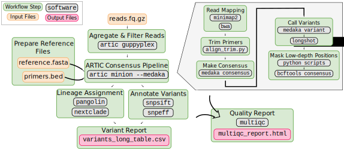
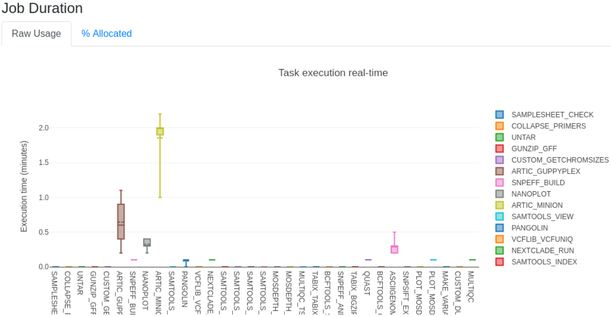

:::warning
**Update May 2022** 

For participants who attended our workshops prior to May 2022, please note that this lesson has been updated to use a more recent _Nextflow_ pipeline. 
We recommend switching to the new pipeline introduced here, but if you want to use the older pipeline you can still access the [previous version of the lesson here](04-artic_nextflow.html).
:::

# Consensus Assembly

::: highlight

**Questions**

- What are the steps involved in assembling SARS-CoV-2 genome from amplicon sequencing (Illumina and Nanopore)?
- How can I do reference-based assembly of SARS-CoV-2 genomes?

**Learning Objectives**

- Recognise what the main steps are in processing raw sequencing data to generate consensus genome sequences, including sequence alignment, primer trimming and consensus generation. 
- Recognise the differences between Illumina and Nanopore pipelines.
- Apply the `nf-core/viralrecon` _Nextflow_ pipeline to generate a consensus sequence from Illumina and Nanopore data.
- Interpret and critically evaluate data quality reports from the assembled sequences and identify sequences suitable for downstream analyses.

:::

:::note
This section has an accompanying <a href="https://docs.google.com/presentation/d/1EbuH6KjK3oW5BUfSU43rVH_b-tPTKtubDWl86eAH47U/edit?usp=sharing" target="_blank">slide deck</a>.
:::


## SARS-CoV-2 Consensus Assembly

As we discussed [earlier in the course](01-intro.html), the starting material for sequencing SARS-CoV-2 samples from infected patients is PCR-amplified DNA generated with a panel of primers that covers the whole SARS-CoV-2 genome (for example the primers developed by the ARTIC network). 
This material can then be sequenced using either _Illumina_ or _Nanopore_ platforms. 

Although different sotware tools are used depending on which kind of sequencing platform was used, the main goal is the same: to align the sequencing reads to the reference genome, and identify any DNA changes (SNPs or Indels) relative to the reference genome (_Wuhan-Hu-1_).
This is called **consensus assembly**, since we are _assembling_ the genome of our sample from the PCR-amplified fragments and generating a _consensus_ sequence based on changes present in several reads covering a particular position of the genome. 

The general data processing steps are:

- Filter high-quality sequencing reads.
- Map the reads to the _Wuhan-Hu-1_ reference genome.
- Trim the primers from the aligned reads based on the primer location file (BED file).
- Perform variant calling (SNPs and indels) to identify changes relative to the reference sequence.
- Generate a consensus sequence for the sample based on those variants.


:::note
**Primer trimming** is a key step of the data processing, otherwise SNPs might be missed at the primer sites, on the final consensus sequence.
This is because the primer sequence is retained during PCR instead of the original sequence of the sample. 
Because the PCR amplicons overlap with each other, we can trim the primers from each read and do variant calling after trimming. 
An example of this is shown in the Figure above.

<!--
Consider adding some notes about sequence length (for Illumina), whether it spans the whole amplicon or not, whether reads without primers can be retained.

Depends on the library prep method:
- Ligation-based (e.g. Kappa kit from [this paper](https://www.biorxiv.org/content/10.1101/2020.06.16.154286v1.full)). See this [ligation illustration](https://sfvideo.blob.core.windows.net/sitefinity/images/default-source/default-album/decoded-temp-image-storage/19_ng_lib-prep-frag.png?sfvrsn=9e0a1b07_4).
- Tagmentation-based (e.g. Nextera kits from the same paper). See this [tagmentation illustration](https://upcvmda-pl480.weebly.com/uploads/8/3/9/0/83900706/tagmentation_1_orig.png).

As I understand it, with ligation-based method there is no fragmentation, adapters are ligated directly to the amplicon.
With tagmentation-based methods the fragment may sometimes not contain the primer, if the transposome cuts the amplicon in half or something like that. 

-->
:::


## Bioinformatic Workflows/Pipelines

As can already be seen from the brief description above, bioinformatic analyses always involve multiple steps where data is gathered, cleaned and integrated to give a final set of processed files of interest to the user. 
These sequences of steps are called a **workflow** or **pipeline**. 
As analyses become more complex, pipelines may include the use of many different software tools, each requiring a specific set of inputs and options to be defined. 
Furthermore, as we want to chain multiple tools together, the inputs of one tool may be the output of another, which can become challenging to manage. 

Although it is possible to code such workflows using _shell_ scripts, these often don't scale well across different users and compute setups. 
To overcome these limitations, dedicated [_workflow/pipeline management software_](https://en.wikipedia.org/wiki/Workflow_management_system) packages have been developed to help standardise pipelines and make it easier for the user to process their data. 


Two of the most popular _workflow software_ packages are [_Snakemake_](https://snakemake.readthedocs.io/en/stable/) and [_Nextflow_](https://www.nextflow.io/). 
We will not cover how to develop workflows with these packages, but rather how to use an existing workflow to generate consensus sequences from SARS-CoV-2 data.

### Why Use a Standardised Workflow? {.unlisted .unnumbered}

These are some of the key advantages of using a standardised workflow for our analysis:

- Fewer errors - because the workflow automates the process of managing input/output files, there are less chances for errors or bugs in the code to occur.
- Consistency and reproducibility - analysis ran by different people should result in the same output, regardless of their computational setup.
- Software installation - all software dependencies are automatically installed for the user using solutions such as _Conda_, _Docker_ and _Singularity_ (more about these in a later section of the course).
- Scalability - workflows can run on a local desktop or scale up to run on _high performance compute clusters_.
- Checkpoint and resume - if a workflow fails in one of the tasks, it can be resumed at a later time.


## SARS-CoV-2 Pipeline {.tabset}

To generate consensus SARS-CoV-2 genomes from these data, we will use a pipeline that was developed by the _Nextflow_ core team called [`nf-core/viralrecon`](https://nf-co.re/viralrecon) (which was itself inspired by a [previous pipeline from the Connor Lab](https://github.com/connor-lab/ncov2019-artic-nf)). 
Its objective is to harmonise the assembly of SARS-CoV-2 genomes from both Illumina and Nanopore amplicon sequencing data.
It can also work with metagenomic data, which we will not cover in this workshop.
This pipeline therefore includes different sub-pipelines, which are launched depending on the type of sequence data we have.
Watch the video below to learn more about the development of this pipeline.

<p align="center"><iframe width="560" height="315" src="https://www.youtube.com/embed/7BfuAOjFCFw" title="YouTube video player" frameborder="0" allow="accelerometer; autoplay; clipboard-write; encrypted-media; gyroscope; picture-in-picture" allowfullscreen></iframe><p align="center">

Generally speaking, _Nextflow_ pipelines are run with the command `nextflow run PIPELINE_NAME`, where "PIPELINE_NAME" is the name of the pipeline. 
Pipelines are usually shared in a public repository such as GitHub, and `nextflow` will automatically download the pipeline if it hasn't been downloaded already to your computer.

Let's test our pipeline by looking at its help documentation: 

```console
$ nextflow run nf-core/viralrecon --help
```

The command should print a long list of options available with this pipeline.
For pipelines developed by the _Nextflow_ core team you can also consult the documentation available online, which is easier to read: https://nf-co.re/viralrecon.
This page includes many details about the pipeline: which tools are used in different steps of the data processing, how to use the pipeline for different types of data, a detailed documentation of all the options of the pipeline and explanation of the output files generated by it. 

Below, we give an overview of the pipelines used for Illumina and Nanopore amplicon data.

:::note
**Reference Genome and Primer Locations**

The _Wuhan-Hu-1_ reference genome sequence and the amplicon primer locations (in BED file format) can all be found on the ARTIC [Primer Schemes repository](https://github.com/artic-network/primer-schemes/tree/master/nCoV-2019). 
The pipeline we are using takes care of downloading these files for us automatically, however it can be useful to know where to find them, in case you want to use other tools that require these files. 
:::


### Illumina

The Illumina sub-workflow is based on several standard bioinformatic tools and, importantly, on the [iVar](https://andersen-lab.github.io/ivar/html/) software, which was developed for analysing amplicon-based sequencing data.


To run the pipeline on Illumina data, we use the following general command:

```console
nextflow run nf-core/viralrecon \
  --input SAMPLESHEET_CSV \
  --outdir OUTPUT_DIRECTORY \
  --protocol amplicon \
  --genome 'MN908947.3' \
  --primer_set artic \
  --primer_set_version PRIMER_VERSION \
  --skip_assembly \
  --platform illumina \
  -profile conda,singularity,docker
```

One of the key options is `--platform illumina`, which makes sure that the correct sub-workflow will be used. 

<details><summary>Click to see more details about this sub-workflow</summary>

In summary, the steps performed by the Illumina sub-workflow are:

- Adapter trimming - this consists of trimming (or "cutting") the sequences to remove low-quality bases and any Illumina adapter sequences that are present in the sequences. 
- Removing human (host) reads - when doing the sequencing it is possible that many reads are still from human material and this step removes them from the rest of the analysis. 
- Read mapping - aligning (or mapping) the reads to the _Wuhan-Hu-1_ reference genome.
  - The software used for mapping is `bowtie2`.
  - The software `samtools` is used to convert the mapped file to BAM (instead of SAM) and sort the reads by coordinate (which is necessary for downstream steps).
- Trim Primers - primers are removed from the aligned reads using `ivar trim` (using the primer BED file).
- Call variants - identify SNPs and indels using `ivar variants`.
- Annotate variants - the called variants are annotated according to their potential effect on the genes/proteins they are located in. For example, if a mutation introduces a new stop codon, or causes a frameshift. 
- Make consensus - apply the SNPs and indels from the previous step to the reference FASTA file.
  - There are two tools that can be used in this step: `bcftools consensus` (default) or `ivar consensus` (can be set with the option `--consensus_caller ivar`).
- Lineage assignment - the consensus sequences are assigned to lineages or clades using the `pangolin` and `nextclade` programs. These are two of the main lineage/clade nomenclature systems in use. They also identify _variants of concern_ from the consensus sequences. 
- Quality control - at several steps in the pipeline different tools are used to collect quality metrics and these are compiled into a report using `multiqc`.

</details>


### Nanopore/medaka (basecalled FASTQ)

The nanopore sub-workflow is based on the [ARTIC bioinformatics protocol](https://artic.network/ncov-2019/ncov2019-bioinformatics-sop.html) and uses several of the tools from the accompanying [`artic` software package](https://artic.readthedocs.io/en/latest/). 

This sub-workflow is similar to the other nanopore sub-workflow, the main difference is the software used for generating a consensus sequence (`medaka` instead of `nanopolish`).



To run our pipeline on basecalled data (FASTQ files), we use the following command:

```console
nextflow run nf-core/viralrecon \
  --input SAMPLESHEET_CSV \
  --outdir OUTPUT_DIRECTORY \
  --protocol amplicon \
  --genome 'MN908947.3' \
  --primer_set artic \
  --primer_set_version PRIMER_VERSION \
  --skip_assembly \
  --platform nanopore \
  --artic_minion_caller medaka \
  --artic_minion_medaka_model MEDAKA_MODEL \
  --fastq_dir fastq_pass/ \
  -profile conda,singularity,docker
```

Some of the key options are:

- `--platform nanopore` makes sure that the correct sub-workflow will be used. 
- `--artic_minion_caller medaka` indicates we want to use the `medaka` program to do the variant/consensus calling (directly from the basecalled FASTQ files, rather than from the raw signal in the FAST5 files).
- `--artic_minion_medaka_model` specifies the model used by the `guppy_basecaller` software to do the basecalling. The model name follows the structure `{pore}_{device}_{caller variant}_{caller version}`. See more details about this in the [medaka models documentation](https://github.com/nanoporetech/medaka#models). **Note:** for recent versions of Guppy (>6) there is no exact matching model from `medaka`. The recommendation is to use the model for the latest version available; a list of supported models can be found on the [`medaka` GitHub repository](https://github.com/nanoporetech/medaka/tree/master/medaka/data).
- `--fastq_dir` specifies the directory containing the FASTQ files. This directory should contain sub-directories for each barcoded sample following the naming convention `barcodeXXXX` (where X is a number between 0 and 9). By default, the `guppy_basecaller` software from Nanopore generates a folder called "fastq_pass" which follows this convention. 

<details><summary>Click to see more details about this sub-workflow</summary>

In summary, the steps performed by the Medaka sub-workflow are:

- Aggregate reads from each sequencing barcode (when multiple files are availble for each barcode)
- Run the `artic minion` tool, which internally does several steps:
  - Map reads to the reference genome using `minimap2` (can be changed to use `bwa mem` with the option `--artic_minion_aligner bwa`).
  - Trim primers from the aligned reads based on the known primer positions in the BED file (using a custom python script called `align_trim.py`).
  - Call consensus sequences and SNP/indel variants using `medaka consensus` and `medaka variant`:
    - Positions with less than 20x depth are treated as missing data and converted to the ambiguous base 'N'. It is not advised to go below this threshold as the models used to call variants do not perform as well.
- Annotate variants - the called variants are annotated according to their potential effect on the genes/proteins they are located in. For example, if a mutation introduces a new stop codon, or causes a frameshift. 
- Lineage assignment - the consensus sequences are assigned to lineages or clades using the `pangolin` and `nextclade` programs. These are two of the main lineage/clade nomenclature systems in use. They also identify _variants of concern_ from the consensus sequences. 
- Quality control - at several steps in the pipeline different tools are used to collect quality metrics and these are compiled into a report using `multiqc`.

</details>


### Nanopore/nanopolish (signal-level FAST5)

The nanopore sub-workflow is based on the [ARTIC bioinformatics protocol](https://artic.network/ncov-2019/ncov2019-bioinformatics-sop.html) and uses several of the tools from the accompanying [`artic` software package](https://artic.readthedocs.io/en/latest/). 

This sub-workflow is similar to the other nanopore sub-workflow, the main difference is the software used for generating a consensus sequence (`nanopolish` instead of `medaka`).


<details><summary>Click to see more details about this sub-workflow</summary>

In summary, the steps performed by the Nanopolish sub-workflow are:

- Filter reads to ensure they pass minimum read length thresholds:
  - minimum length 400bp (can be changed with `--min_length` option)
  - maximum length 700bp (can be changed with `--max_length` option)
- Run the `artic minion` tool, which internally does:
  - Read alignment to reference genome using `minimap2` (can be changed to use `bwa mem` with the `--bwa` option).
  - Trim primers from the aligned reads (based on the known primer positions in the BED file).
  - Call consensus sequences and variants using `nanopolish variants` if using signal-level FAST5 files.
    - Positions with less than 20x depth are assigned the ambiguous base 'N'. It is not advised to go below this threshold as the models used to call variants do not perform as well.
- Annotate variants - the called variants are annotated according to their potential effect on the genes/proteins they are located in. For example, if a mutation introduces a new stop codon, or causes a frameshift. 
- Lineage assignment - the consensus sequences are assigned to lineages or clades using the `pangolin` and `nextclade` programs. These are two of the main lineage/clade nomenclature systems in use. They also identify _variants of concern_ from the consensus sequences. 
- Quality control - at several steps in the pipeline different tools are used to collect quality metrics and these are compiled into a report using `multiqc`.

</details>

To run our pipeline on signal-level data (FAST5 files), we use the following command: 

```console
nextflow run nf-core/viralrecon \
  --input SAMPLESHEET_CSV \
  --outdir OUTPUT_DIRECTORY \
  --protocol amplicon \
  --genome 'MN908947.3' \
  --primer_set artic \
  --primer_set_version PRIMER_VERSION \
  --skip_assembly \
  --platform nanopore \
  --fastq_dir fastq_pass/ \
  --fast5_dir fast5_pass/ \
  --sequencing_summary sequencing_summary.txt \
  -profile conda,singularity,docker
```

Some of the key options are:

- `--platform nanopore` makes sure that the correct sub-workflow will be used. 
- `--fastq_dir` specifies the directory containing the FASTQ files generated by the `guppy_basecaller` program (this is the standard software from Nanopore that processes the raw signal data from the sequencing device). This directory should contain sub-directories for each barcoded sample following the naming convention `barcodeXXXX` (where X is a number between 0 and 9). By default, `guppy_basecaller` generates a folder called "fastq_pass" which follows this convention. 
- `--fast5_dir` specifies the directory containing the FAST5 files generated by `guppy_basecaller`. This directory follows the same naming convention as above and is usually in a folder called "fast5_pass". 
- `--sequencing_summary` is a path to the "sequencing_summary.txt" text file generated by `guppy_basecaller`.

## {.unlisted .unnumbered}

Apart from the specific options used by each sub-workflow, there are some general options that are used: 

- `--input` specifies a CSV file with details about our samples. The format of this file depends on the specific sub-workflow you are using. See the details in the [samplesheet documentation page](https://nf-co.re/viralrecon/2.4.1/usage#samplesheet-format).
- `--outdir` specifies the output directory to store all our results.
- `--protocol amplicon` sets the pipeline for PCR amplicon data (the other option is `--protocol metagenomic`, which we do not cover in this course).
- `--genome 'MN908947.3'` this is the standard name of the [Wuhan-Hu-1 reference genome](https://www.ncbi.nlm.nih.gov/nuccore/MN908947.3).
- `--primer_set artic` at the moment only "artic" primers are available by default. It is possible to use custom primers with the Illumina workflow (see details [here](https://nf-co.re/viralrecon/2.4.1/parameters#primer_bed)). 
- `--primer_set_version` the version of the [ARTIC primer scheme](https://github.com/artic-network/primer-schemes) used. The [viralrecon primer config file](https://github.com/nf-core/configs/blob/master/conf/pipeline/viralrecon/genomes.config) indicates the available primer shemes are: `1`, `2`, `3`, `4`, `4.1` and also `1200` (the 1200bp amplicon protocol, also known as "midnight").
- `--skip_assembly` this is used to skip de-novo assembly of the genome. This step is unnecessary in amplicon protocols, which instead rely on mapping reads to the reference genome (reference-based assembly). De-novo assembly is necessary for metagenomic protocols.

There is one more option we used: `-profile`. This is a general `nextflow` option (not specific to our SARS-CoV-2 pipeline), which can be used to specify how the software used by the pipeline is managed. 
In our case, we are using a software called _Singularity_, which creates a "virtual operating system" (called a container) where all the necessary software is run from. 
This ensures that all of the software is automatically installed and runs on any Linux computer. 

:::note
**Conda, Singularity, Docker?**

Generally speaking, workflow management software such as _Nextflow_ or _Snakemake_ support three solutions for managing software dependencies:

- [_Docker_](https://docs.docker.com/) is a software that allows to package a small virtual operating system (or a "container") containing all the software and data necessary for running an analysis. 
- [_Singularity_](https://sylabs.io/guides/3.5/user-guide/index.html) also creates software containers, similarly to _Docker_. However, it can more easily interface with the user's filesystem, without the need to have special permissions. 
- [_Conda_](https://docs.conda.io/en/latest/) is a package manager, also very popular in bioinformatics. Instead of creating virtual OS containers, _Conda_ instead creates software environments (think of them as directories) where all the software is locally installed, including all its dependencies. The use of individual environments ensures that software packages with incompatible dependencies can still be used within the same pipeline. 

Of the three, **_Singularity_ is the recommended choice**, although _Conda_ is also a good alternative. 
:::


### Running the Workflow

Let's see an example in action by using some example data.
If you go to the directory `03-consensus/uk_illumina/` in the course materials, you will find several FASTQ files in the `data` directory. 
There is also a _shell script_ (`scripts/run_illumina_workflow.sh`) that contains the commands we will use to run the workflow on these data.

Opening the script, we can see the following commands: 

```bash
# create output directory
mkdir results

# run the workflow
nextflow run nf-core/viralrecon --input samplesheet.csv --outdir results/viralrecon --protocol amplicon --genome 'MN908947.3' --primer_set artic --primer_set_version 3 --platform illumina --skip_assembly -profile conda
```

It first creates a results directory (to store our output files) and then runs the `nextflow` command using the Illumina sub-workflow.
We could run these commands one at a time by copy/pasting them to the terminal. 
Or alternatively, we can run the entire script using `bash scripts/run_illumina_workflow.sh`

When you start running the workflow, you will get a list of the workflow steps and their progress. 
This may take quite a while to run, depending on the computer resources you have available. 
Once the workflow is complete, you should see a message similar to the following:

```
-[nf-core/viralrecon] 8/8 samples passed Bowtie2 1000 mapped read threshold:
    280038: GB16
    2946614: GB28
    252871: GB09
    3269412: GB21
    103742: GB23
    3016474: GB36
    ..see pipeline reports for full list
-
-[nf-core/viralrecon] Pipeline completed successfully-
Completed at: 18-May-2022 08:08:25
Duration    : 1h 13m
CPU hours   : 8.1
Succeeded   : 343
```

You should also get several output files in the results folder specified with our `nextflow` command. 
We will detail what these files are in the next section. 

:::note
**Running the pipeline on our training computers**

Our training computers don't have the high specifications needed for routine bioinformatic analysis, so the _Illumina_ pipeline takes up to 1h to complete. 

We provide already pre-processed results for 48 samples in the folder `03-consensus/uk_illumina/preprocessed`, which you can use to follow the next section. 
:::


## Output Files {.tabset}

After running our pipeline, we get several output directories and files. 
The directories we get depend on which version of the workflow was used (Illumina or Nanopore). 
The description of the output is detailed in the [pipeline documentation](https://nf-co.re/viralrecon/2.4.1/output). 
Although there are many output files, most of these contain results that are aggregated in an interactive _MultiQC_ report, which makes their analysis easier. 
We highlight some of the main files of interest below. 


### Illumina

- The file `multiqc/multiqc_report.html` contains a MultiQC quality and analysis report for the consensus assemblies generated by the pipeline. 
- The folder `variants/bowtie2/` contains individual BAM files, which can be visualised with _IGV_ if we want to look at the reads mapped to the reference genome.
- The folder `variants/ivar/consensus/bcftools` contains individual FASTA files (named `*.consensus.fa`) for each sample's consensus genome sequence.
- The file `variants/ivar/variants_long_table.csv` contains a table with the aggregated results of all the variants detected in each sample. 


### Nanopore/medaka

- The file `multiqc/medaka/multiqc_report.html` contains a MultiQC quality and analysis report for the consensus assemblies generated by the pipeline. 
- The folder `medaka/` contains:
  - Individual BAM files (named `*.primertrimmed.rg.sorted.bam`), which can be visualised with _IGV_ if we want to look at the reads mapped to the reference genome.
  - Individual FASTA files (named `*.consensus.fasta`) for each sample's consensus genome sequence.
  - A file called `variants_long_table.csv` with a table of all the variants detected in each sample. 

## {.unlisted .unnumbered}


## Quality Control 

The `viralrecon` pipeline produces many quality control metrics, which are conveniently compiled in an interactive report with _MultiQC_, as mentioned above. 
We will not detail here every section of the report (check the [pipeline documentation](https://nf-co.re/viralrecon/2.4.1/output) for a full description), but only highlight some of the sections that can be used for a first assessment of the quality of our samples.

### Variant Calling Metrics

The first section or the report - **Variant Calling Metrics** - contains a summary table with several statistics for each sample, including the total number of reads, the number/percentage of reads mapped to the reference genome, the depth of coverage, the number of SNPs (single-nucleotide polymorphisms) and INDELs (insertions/deletions), the number of missense variants (mutations that result in an aminoacid change) and the fraction of ambiguous bases 'N' per 100kb. 

Looking at these basic metrics gives us a good first idea of whether some of the samples have a high fraction of missing bases (marked as `N` in the FASTA file), leading to a poorer assembly. 
We can quickly check this by sorting the table by the column named "# Ns per 100kb consensus" (you can convert the values in this column to a percentage by dividing the numbers by 100).
There is also the ability to produce simple scatterplots from the data in this table, which can be useful to look at the relationship between the different metrics (see an example in the figure below). 

This table also contains information about the lineage/clade assigned to each sample by the programs _Pangolin_ and _Nextclade_. 
This gives us an idea of which samples may be more similar to each other, and where they fit in the global context of other sequences available publicly.
We will talk more about this topic in the [lineage assignment section](05-lineage_analysis.html). 

:::warning
**Lineage Versions**

Although the _Viralrecon_ pipeline runs _Pangolin_ and _Nextclade_ to perform lineage assignment, it does not use the latest version of these programs (because lineages evolve so fast, the nomenclature constantly changes). 
Therefore, this information should mostly be ignored at this stage, and instead we should run our analysis on the most up-to-date versions of these programs. 
We will detail this in the [Lineages and Variants](05-lineage_analysis.html) section of the materials. 
:::

![Snapshot of the "Variant Metrics" section of the `viralrecon` _MultiQC_ report. Simple scatterplots can be made from the data on this table using the <kbd>Plot</kbd> button. For example, at the bottom we show a scatterplot showing the relationship between the median depth of coverage and the number of ambiguous bases 'N' per 100kb. For the data in this example, we can see that when the average depth of coverage drops below around 200 reads we start getting higher number of missing bases in the assembly.](images/viralrecon_multiqc_variant_metrics.svg)

:::note
**Terminology Alert!**

The word **coverage** is sometimes used in an ambiguous way by bioinformaticians. 
It can mean two things:

- The number of reads aligning to a position of the genome. This is sometimes called **sequencing depth** or **depth of coverage** (we will use these terms in the materials to avoid confusion). For example, we may say that the average depth of coverage of the genome is 20x, meaning that on average there are 20 reads aligned to a position of the genome.
- The fraction of a genome that has a sufficient number of reads for analysis. For example, if 90% of the genome has a sufficient number of reads to be analysed (for example, at a threshold of 10x), we would say it has 90% coverage (we "covered" 90% of the genome with enough data). In the context of genome assembly, we sometimes use the word "coverage" to refer to the percentage of the consensus genome without ambiguous 'N' bases. 

**In the `viralrecon` _MultiQC_ report the word "coverage" is used to mean "depth of coverage".**
:::


### Amplicon Depth of Coverage

The next section of the report - **Amplicon Coverage Heatmap** - contains a graphical representation of the average depth of coverage for each PCR amplicon in the ARTIC protocol (i.e. the average number of reads mapped to each amplicon interval). 
This plot is extremely useful to identify common PCR dropouts occurring across many samples. 
This may be an indication that our PCR primer scheme is not working for some of the forms of the virus circulating in our population (for example due to mutations that accumulate in the primer site). 


We can investigate primer dropout in more detail, for example by looking at the BAM files with mapped reads using _IGV_. 

From our heatmap (shown in the Figure above) we can see one of the PCR fragments - _ncov-2019_83_ - seems to have poor amplification across many of our samples. 
Let's investigate this in more detail by looking at the alignment file:

- Open _IGV_ and go to <kbd>File → Load from file...</kbd>. 
- In the file browser that opens go to the folder `results/viralrecon/variants/bowtie2/` and select the file `GB36.ivar_trim.sorted.bam` to open it.
- Go back to <kbd>File → Load from file...</kbd> and this time load the BED files containing the primer locations. These can be found in `resources/primers/artic_primers_pool1.bed` and `resources/primers/artic_primers_pool2.bed`.

Once you have IGV open, you can navigate to the region where this amplicon is located by searching for the name of one of the primers - "ncov-2019_83_LEFT" - in the search box at the top. 
By zooming in to the region where this primer is located, we can see there is a mutation right at the start of this primer, which suggests that this may be the reason why this PCR fragment fails to amplify in this sample. 


## Mutation/Variant Analysis

One of the output files produced by the pipeline is a **table SNP and indel variants detected in our samples** saved as a CSV file in **`variants/ivar/variants_long_table.csv`**. 
This table can be useful to investigate if particular mutations are particularly frequent in our samples and what their likely effects are.


The columns in this table are: 

- `SAMPLE` is the name of our sequenced sample.
- `CHROM` is the name of the "chromosome", which in our case is just the name of the reference genome ("MN908947.3").
- `POS` is the position of the genome where the mutation occurs.
- `REF` is the reference nucleotide.
- `ALT` is the alternative nucleotide, that is the nucleotide that was observed in our sample.
- `FILTER` indicates whether the SNP passed quality filters from the variant calling software ("PASS") or whether some other issue was observed (for example "dp" means that the depth of sequencing was unusually high or low).
- `DP` is the total depth of sequencing at this position, meaning how many reads in total were aligned there.
- `REF_DP` is the depth of sequencing of the reference allele, meaning how many reads contained the reference nucleotide.
- `ALT_DP` is the depth of sequencing of the alternative allele, meaning how many reads contained the alternative nucleotide.
- `AF` is the allele frequence of the alternative allele, meaning the proportion of reads that contained the alternative nucleotide (this column is equivalent to `ALT_DP`/(`ALT_DP` + `REF_DP`)).
- `GENE` is the name of the gene in the SARS-CoV-2 annotation.
- `EFFECT` this is the predicted effect of the mutation in the gene. This output comes from the `snpeff` software and uses [The Sequence Ontology](http://www.sequenceontology.org/browser/obob.cgi) nomenclature (follow the link to search for each term).
- `HGVS_C`, `HGVS_P` and `HGVS_P_1LETTER` is the DNA or amino acid change using [HGVS nomenclature](https://varnomen.hgvs.org/). For example, "c.1112C>T" means a C changed to a T at position 1112 of the genome; and "p.Pro371Leu" would mean that a Proline changed to a Leucine at position 371 of the respective protein. 
- `CALLER` is the software used for variant calling.
- `LINEAGE` is the Pangolin lineage that the sample was assigned to. Note that this column should usually be ignored, since `viralrecon` doesn't use the latest _Pangolin_ data version by default.

This table can be opened in a spreadsheet program such as _Excel_ to look at particular features. 
In terms of quality-control, we can filter the table: 

- for mutations with **intermediate allele frequency** (say < 70%) -- if a sample has too many such mutations, that could indicate cross-contamination between samples. 
- for **frameshift mutations** -- these mutations should be rare because they are highly disruptive to the functioning of the virus, and their occurrence is more often due to errors. 
  The presence of these mutations are usually not critical for downstream analysis (such as lineage assignment and phylogenetics), but we should make a note that these mutations may be false-positives in our data.

This variants/mutations table can also be used to explore reasons for amplicon dropout. 
For example, we can identify how many samples contain the mutation we previously saw in the "_ncov-2019_83_LEFT_" primer (we saw this was in position 25,003 of the genome). 
We can do this by sorting our table by the column "POS" (position) and then scrolling down to find the samples with this mutation. 
We will find that only 3 of the samples contain this mutation, suggesting some other additional causes are leading to the dropout in this PCR fragment.

Finally, for the **Illumina pipeline** (`--platform illumina`), it is important to note that not all of the mutations on this table are included in the final consensus. 
Only mutations with allele frequency >75% (`AF` >= 0.75) and minimum depth of 10 (`DP` >= 10) are retained in the final consensus. 
Therefore, to see which mutations are actually present in our consensus sequences, we need to filter this table for these criteria. 
Again, we note that this only applies to the Illumina pipeline. 
For the **Nanopore pipeline** (`--platform nanopore`) all the mutations included in this table are retained in the consensus sequence. 

:::warning
**ORF1b Annotation Issues**

The annotation of the _ORF1b_ gene had some changes between the first original assembly and newer versions of this annotation. 
In particular, there is a frameshift that is not considered in the annotation used by most software, and this causes a discrepancy in the results between `viralrecon` and other tools such as _Nextclade_ (which we will cover in the next section).

This issue is [under investigation](https://github.com/nf-core/viralrecon/issues/263) by the developers of `viralrecon` and may be corrected in future versions of the pipeline.

For now, the advice is to **ignore the variant effects of ORF1b** as these correspond to an older version of the annotated gene. 
:::

:::note
**Keep Original Files Intact**

When you analyse the results of a CSV file in a spreadsheet software (such as Excel), it may be a good idea to create a copy of your file to avoid accidentally modifying the original table. 
For example, if you accidentally sort one column of the table but forget to sort other columns, of if you accidentally filter the results and delete some of the rows from the table, etc. 

You can save a copy of the file by going to <kbd>File → Save As...</kbd>. 
You may want to save the copy as an Excel file format, to include graphs and colours. 
(Remember that the CSV format is a plain text file - it does not support graphs or coloured cells.)
:::

:::exercise

Go to the course materials directory `03-consensus/india_nanopore` (on our training machines `cd ~/Course_Materials/03-consensus/india_nanopore`). 
This contains **Nanopore sequencing** data for several samples collected in India. 
Nanopore data is organised in directories named as `barcodeXX` (where `XX` is a number) - this is the standard output from the _Guppy_ software used to do basecalling and generate FASTQ files. 

The Nanopore _Medaka_ workflow expects to be given as an input a CSV file with two columns: sample name and barcode number. 
We already provide this file in `samplesheet.csv`.

1. Run these samples through the `nf-core/viralrecon` pipeline.
    - Using `nano`, open the script found in `scripts/run_medaka_workflow.sh`.
    - Fix the code in the script where you see the word "_FIXME_":
        - Output the results to a directory called `results/viralrecon/`.
        - The input sample sheet is in the file `samplesheet.csv` (check the [pipeline documentation](https://nf-co.re/viralrecon/2.4.1/usage#nanopore-input-format) to review what the format of this samplesheet should be for the Nanopore pipeline).
        - The FASTQ files are in a folder `data/fastq_pass`.
    - Run the script using `bash`. This may take ~15 minutes to complete.
2. While you wait for the pipeline to complete, use the file explorer <i class="fa-solid fa-folder"></i> to open the folder called `preprocessed`, which contains already pre-processed results from a larger run with 48 samples. 
    - Open the file in `pipeline_info/execution_report_DATE.html` (where "DATE" is the date when the files were processed).
    - How long did the workflow on the bigger data take to run?
    - Which step of the pipeline took the longest to run?
3. Open the _MultiQC_ report found in `preprocessed/multiqc/medaka/multiqc_report.html` and answer the following questions: 
    - Produce a plot between median depth of coverage (x-axis) and #Ns (y-axis). What do you think is the average coverage needed for <10% of missing data. 
    - Were there any PCR amplicons with a dropout (i.e. very low depth of coverage) across multiple samples?
    - Do any of these dropout amplicons coincide with gene "S" (Spike protein gene)? Note: you can see the ARTIC PCR primer location from the [online repository](https://github.com/artic-network/artic-ncov2019/blob/master/primer_schemes/nCoV-2019/V3/nCoV-2019.bed) and the gene locations in the [SARS-CoV-2 NCBI genome browser](https://www.ncbi.nlm.nih.gov/projects/sviewer/?id=NC_045512).
4. Based on any amplicons that you identified in the previous question, find if there are any mutations coinciding with their primer locations. You can use the mutation variant table in `preprocessed/medaka/variants_long_table.csv`.
5. With the mutation variants table open in a spreadsheet program (LibreOffice on our training machines):
    - Use the filter button <svg stroke="grey" fill="grey" stroke-width="0" viewBox="0 0 512 512" height="15" width="15" xmlns="http://www.w3.org/2000/svg"><path d="M487.976 0H24.028C2.71 0-8.047 25.866 7.058 40.971L192 225.941V432c0 7.831 3.821 15.17 10.237 19.662l80 55.98C298.02 518.69 320 507.493 320 487.98V225.941l184.947-184.97C520.021 25.896 509.338 0 487.976 0z"></path></svg> to look for mutations in gene "S" (encodes for the Spike protein). 
    - Identify the samples and positions of mutations of the type "disruptive_inframe_deletion". 
    - Using IGV, open the BAM file for one of those samples. Note: BAM files are located in `preprocessed/medaka/SAMPLE.primertrimmed.rg.sorted.bam` (were 'SAMPLE' is the sample name). 
    - Go to the location of those mutations. From the read alignment, how confident are you about it? What could you do to confirm it?

<details><summary>Answer</summary>

**Question 1**

We can open the script with _Nano_ using the command:

```console
$ nano scripts/run_medaka_workflow.sh
```

The fixed code is:

```bash
# create output directory
mkdir -p results

# run the workflow
nextflow run nf-core/viralrecon \
  --input samplesheet.csv \
  --outdir results/viralrecon \
  --platform nanopore \
  --protocol amplicon \
  --genome 'MN908947.3' \
  --primer_set artic \
  --primer_set_version 3 \
  --skip_assembly \
  --fastq_dir data/fastq_pass/ \
  --artic_minion_caller medaka \
  --artic_minion_medaka_model r941_min_high_g360 \
  --max_cpus 8 --max_memory "56.GB" -profile conda
```

What we did to fix the code was:

- Set `--input` as `samplesheet.csv`, which is the CSV file with two columns: sample name and Nanopore barcode number. The format of this file is detailed in the [`nf-core/viralrecon` documentation](https://nf-co.re/viralrecon/2.4.1/usage#samplesheet-format).
- Set `--outdir` as `results/viralrecon/`, which is the directory where we want to output our results.
- Set `--fastq_dir` as `data/fastq_pass`, which is the directory containing the FASTQ file folders named as `barcodeXX` (where `XX` is a number). This is the standard output from the _Guppy_ software used to do basecalling of Nanopore data to produce FASTQ files.

When we finish editing the file we can hit <kbd>Ctrl</kbd> + <kbd>X</kbd> to exit _Nano_. 
Before it closes it will ask us if we want to save the file and we can type "Y" for yes. 

To run the script we can do `bash scripts/run_medaka_workflow.sh`.
After the workflow completes, we get a message similar to this one:

```
-[nf-core/viralrecon] Pipeline completed successfully-
Completed at: 18-May-2022 08:08:25
Duration    : 13m 22s
CPU hours   : 1.6
Succeeded   : 167
```

Note that the exact time that the workflow takes to run may differ from what we show here. 
The time depends on how many samples you are processing and how big the computer you are using is. 

----

**Question 2**

We open the file found in `preprocessed/pipeline_info/execution_report_2022-05-04_12-41-12.html`, which contains information about the pipeline that was run on a set of 48 samples.
We can see at the top of the report that it took ~15 minutes to run. 
This report also gives us information about how long each individual step of the pipeline took the longest to run (and other information such as which used more CPU or RAM memory). 
For example, in the section "Job Duration" we can see a graph that looks like this:



This indicates that the step running the `artic minion` tool takes the longest. 
This is not surprising as this is the step where most of the work is happening (mapping, primer trimming and making a consensus sequence). 
You can revise the steps of the workflow in the [respective section above](04-consensus.html#SARS-CoV-2_Workflow)

----

**Question 3**

When opening the _MultiQC_ report, we can see the first section contains a table with several statistics about the quality of each sample. 
We can produce a plot from this table, by pressing the "Plot" button above the table. 
The plot we were asked for is the following: 


The y-axis of the plot tells us the number of 'N' per 100kb of sequence. 
If we divide those numbers by 100 we get a percentage and from these samples it seems like a median depth of coverage of around 200 reads generates samples with less than 10% of missing bases. 

From the section of the report "Amplicon coverage heatmap" we can see the average depth of coverage for each PCR amplicon from the ARTIC protocol. 
There are 3 amplicons in particular that have very low depth of coverage: nCoV-2019_51, nCoV-2019_62 and nCoV-2019_95.

We can check the [ARTIC V3 primer BED file online](https://github.com/artic-network/artic-ncov2019/blob/master/primer_schemes/nCoV-2019/V3/nCoV-2019.bed) to look at the location of these primers, or we could look for it using command-line tools. 
Here is an example: 

```console
$ cat resources/primers/artic_version3_pool*.bed | grep "_51_"
```

```
MN908947.3      15171   15193   nCoV-2019_51_LEFT       1       +
MN908947.3      15538   15560   nCoV-2019_51_RIGHT      1       -
```

For this example, we can see the amplicon is between positions 15171 - 15560 of the genome.
Looking at the [SARS-CoV-2 NCBI genome browser](https://www.ncbi.nlm.nih.gov/projects/sviewer/?id=NC_045512), we can see this coincides with _ORF1ab_. 
If we do the same analysis for the other primers, we will see that none of them coincides with gene S.

----

**Question 4**

To investigate whether this amplicon dropout is due to mutations in the primer regions we can open the mutations table `preprocessed/medaka/variants_long_table.csv`. 
If we sort the table by the column "POS", we can scroll to the location of each primer pair. 

We can see that in only one case there is a mutation coinciding one of the primers: in sample "IN33" position 28687 there is a `C > T` mutation, which coincides with primer nCoV-2019_95_LEFT.
However, this only occurs for one of the samples, suggesting the reason for the PCR dropout might be related to other factors. 

----

**Question 5**

After filtering our table for gene _S_ (Spike gene), we can see only a couple of mutations of type "disruptive_inframe_deletion" in some of the samples at positions 21764 and 21990. 
To look at the reads with this mutation, we open the BAM file for one of these samples in _IGV_ (for example sample IN22): 

- Go to <kbd>File → Load from file...</kbd>. 
- In the file browser that opens go to the folder `preprocessed/medaka` and select the file `IN22.primertrimmed.rg.sorted.bam` to open it.
- In the search box we can type "NC_045512.2:21990" which will zoom-in on the region around the deletion.

From looking at the reads aligned to this position of the genome, we can see several of them containing a 3bp deletion. 
However, we can also see some reads that do not contain the deletion, and others that seem to be mis-aligned. 
If we were interested in confirming this mutation, we could do an independent PCR followed by Sanger sequencing, for example.

Although this was not part of the question, it is also worth noting that the primer "nCoV-2019_73_LEFT" starts very near this deletion. 
In the MultiQC report, we can see that this PCR amplicon had very poor amplification in this sample. 
One possibility is that the deletion interfered with the primer efficiency in this sample. 

Generally, we don't need to confirm every single mutation obtained from our analysis. 
But if we see a mutation occurring many times, then it may be worth further investigation, especially if it is disruptive and in an important gene such as the Spike gene. 

</details>

:::


## Cleaning FASTA Files (Optional)

To proceed with our analysis, we need a FASTA file containing _all_ of our consensus sequences.
However, our `viralrecon` pipeline outputs _separate_ FASTA files for each sample. 
We can see this by running (from within the `03-consensus/uk_illumina/` directory): 

```console
$ ls results/viralrecon/variants/ivar/consensus/bcftools/
```

Also, the workflow modifies our original sample names in the FASTA file, by adding extra information to the sequence name. 
For example:

```console
$ head -n 1 results/viralrecon/variants/ivar/consensus/bcftools/ERR5728910.consensus.fa
```

```
>ERR5728910 MN908947.3
```

What we want to do is clean these sample names, so that we end up with:

```
>ERR5728910
```

We also want to make sure to combine all the samples into a single FASTA file. 

We can the command-line skills we acquired so far, in particular the use of the `cat` command to combine (or _concatenate_) the individual files and the `sed` command to replace text and clean our sample names. 
Let's do this step by step.

First, we can use the `*` _wildcard_ to combine all the FASTA files with the `cat` command:

```console
$ cat results/viralrecon/variants/ivar/consensus/bcftools/*.fa
```

Running this command will print all of the sequences on the screen!
To see what happened a little better, we could _pipe_ this command to `less` to browse up-and-down through the file:

```console
$ cat results/viralrecon/variants/ivar/consensus/bcftools/*.fa | less
```

We could also check that we now have all our samples combined, we could pass the results to `grep` and search for the word `>`, which in the FASTA format indicates the sequence name:

```console
$ cat results/viralrecon/variants/ivar/consensus/bcftools/*.fa | grep ">" | wc -l
```

This should give us 7 as the result (which makes sense, since we have 7 samples). 

We can now proceed with cleaning the names of the sequences, by using `sed`:

```bash
cat results/viralrecon/variants/ivar/consensus/bcftools/*.fa | sed 's/ MN908947.3//' > results/viralrecon/clean_sequences.fa
```

Notice that in this last command we make sure to redirect the result to a new file using `>`.


:::exercise

In this exercise we will create a clean FASTA file for the samples collected in India. 
These are found in the `03-consensus/india_nanopore` directory, so make sure to change to that directory first (on our training machines you can do: `cd ~/Course_Materials/03-consensus/india_nanopore`)

In this case, the output FASTA files are in the folder `results/viralrecon/medaka` and have the file extension `.fasta`.
If we look at one of the files:

```console
$ head -n 1 results/viralrecon/medaka/IN42.consensus.fasta
```

```
>IN42/ARTIC/medaka MN908947.3
```

We can see that the name has a lot of extra information attached to it. 
We want to clean the name of the sequences so that the result is:

```
>IN42
```

- Use the tools `cat` and `sed` to construct a command that generates a new file called `results/consensus/clean_sequences.fa` containing all the sequences with "clean" sequence names. 

<details><summary>Hint</summary>Remember the syntax for pattern replacement with `sed` is: `sed 's/replace this/with that/'`. Also remember that if you want to replace the character "/", you need to use the special _escape character_, for example: `sed 's/replace \/ slash//'`</details>

<details><summary>Answer</summary>

The complete code to achieve the desired outcome is:

```bash
cat results/viralrecon/medaka/*.consensus.fasta | sed 's/\/ARTIC\/medaka MN908947.3//' > results/viralrecon/clean_sequences.fa
```

Note that in order to replace the pattern `/ARTIC/medaka MN908947.3`, we needed to "_escape_" the `/` symbol by using `\/`.
This is because `/` alone is used by `sed` to separate different parts of the command. 

Look at the [section about pattern replacement](02-unix-sed.html) for a reminder of how the `sed` command works.

</details>
:::


## Summary

:::highlight

**Key Points**

- The main steps to generate SARS-CoV-2 consensus sequences are: filter high-quality reads, map reads to reference genome, trim PCR primers and variant/mutation calling, which is finally used to produce a consensus sequence.
- Other steps that can be done include annotating the variants/mutations (what their effects in each gene might be) and assigning sequencences to known lineages/clades. 
- _Nextflow_ is a software used for building workflows/pipelines involving multiple tools and data processing steps. Using established pipelines helps with automation, reproducibility, consistency of results and reduces the chances of data processing errors.
- The `nf-core/viralrecon` pipeline implements the steps to generate SARS-CoV-2 consensus sequences from _Illumina_ or _Nanopore_ data.
- The command `nextflow run nf-core/viralrecon` is used to run the pipeline, using specific options depending on the data we have.
- The output of the pipeline includes, among others:
  - A detailed _MultiQC_ report, including information about genome coverage, the depth of sequencing for each amplicon, as well as other quality metrics that can help to troubleshoot problematic samples.
  - A table with SNP and indel mutation variants identified in each sample. 
  - Information about SARS-CoV-2 lineages/clades/variants, which is detailed in the [next section](05-lineage_analysis.html). 

:::
