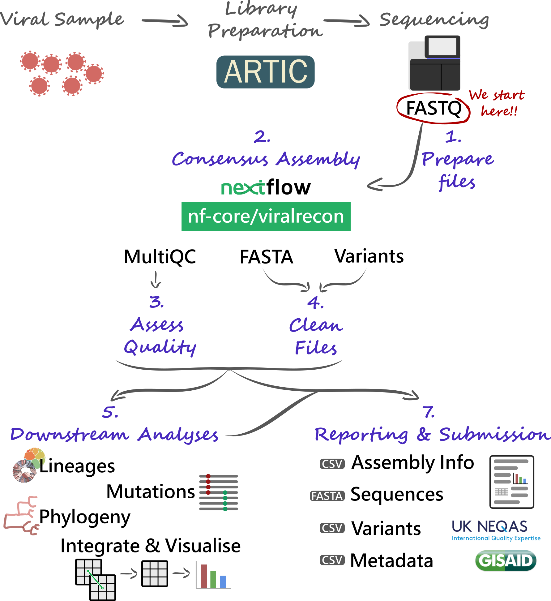

# Case Study: EQA

:::highlight
This section is an **extended self-paced practice** applying the concepts covered in previous sections. 

By the end of this practice, you should be able to:

- Prepare all the files necessary to run the consensus pipeline.
- Run the _viralrecon_ pipeline to generate FASTA consensus from raw FASTQ files. 
- Assess and collect several quality metrics for the consensus sequences. 
- Clean output files, in preparation for other downstream analysis.
- Assign sequences to lineages. 
- Contextualise your sequences in other background data and cluster them based on phylogenetic analysis. 
- Integrate the metadata and analysis results to generate timeseries visualisations of your data. 
:::


_External Quality Assessment_ (EQA) is a procedure that allows laboratories to assess the quality of the data they produce, including its analysis. 
For genomic analysis of SARS-CoV-2, a standard panel of samples has been developed by the [GenQA](https://genqa.org/) consortium, which is part of [UK NEQAS](https://ukneqas.org.uk/), a non-profit that designs EQA protocols for a range of applications. 
_GenQA_'s panel of samples includes lab-cultured SARS-CoV-2 samples of known origin, enabling laboratories to assess whether their sequencing and bioinformatic pipelines correctly identify expected mutations and lineage assignments for each of the samples in the panel. 

In this case study, we are going to analyse samples from the _GenQA_ panel, to helps us assess the quality of our bioinformatic analysis and extract key pieces of information to be reported.
The panel we will work with includes the following samples: 

- 1x Alpha
- 1x Beta
- 1x Delta
- 2x Gamma
- 1x Omicron
- 1x Adenovirus (negative control)

From the sequencing data analysis, we will address the following: 

- What was the quality of the consensus sequence obtained?
- What lineage/clade was each of our samples assigned to? Did we identify the correct (expected) lineage?
- Which of the expected mutations were we able to detect? Where there any "false positives" or "false negatives"?

We should also produce several essential output files, which would usually be necessary to upload our data to public repositories: 

- Consensus sequences (FASTA)
- Metadata and consensus sequence quality metrics (TSV)
- Variants (TSV)


## Pipeline Overview

We will start our analysis with **FASTQ files** produced by our sequencing platforms (Illumina and Nanopore are considered here). 
These FASTQ files will be used with the **`nf-core/viralrecon` _Nextflow_ pipeline**, allowing us to automate the generation of consensus sequences and produce several **quality control** metrics essential for our downstream analysis and reporting. 

Critical files output by the pipeline will need to be further processed, including combining and cleaning our **consensus FASTA files**. 
Using these clean files, we can then proceed to downstream analysis, which includes assigning each sample to the most up-to-date **Pango lineage**, **Nextclade clade** and **WHO designation**. 
Finally, we can do more advanced analysis, including the idenfication of **sample clusters** based on phylogenetic analysis, or produce timeseries visualisations of variants of concern. 
With all this information together, we will have the necessary pieces to submit our results to **public repositories** and write **reports** to inform public health decisions. 




## Preparing Files

Before we start our work, it's always a good idea to setup our directory structure, so we keep our files organised as the analysis progresses. 
There is no standard way to do this, but here are some suggested directories: 

- `data` → contains the sequencing data for the particular run or project you are working on. 
  Data may sometimes be stored in a separate server, in which case you may not need to create this directory. 
  Generally, you should _leave the original data unmodified_, in case something goes wrong during your analysis, you can always re-run it from the start. 
- `results` → to save results of the analysis. 
- `scripts` → to save scripts used to run the analysis. 
  You should always try to save all the commands you run in a script, this way you will have a record of what was done to produce the results, and it makes your life easier if you want to run the analysis again on a new set of data. 
- `report` → to save the final files and documents that we report to our colleagues or upload to public repositories. 
- `resources` → files that you download from the internet could be saved here. 
  For example, the reference genome sequence, background data used for phylogenetics, etc. 
  Sometimes you may share these resources across multiple projects, in which case you could have this folder somewhere else that you can access across multiple projects. 

On our computers, we have a directory in `~/Documents/eqa_workshop`, where we will do all our analysis. 
We already include the following: 
 
- `data` → with the results of the EQA sample sequencing. 
- `resources` → where we include the SARS-CoV-2 reference genome, and some background datasets that will be used with some of the tools we will cover. 
- `scripts` → where we include some scripts that we will use towards the end of the workshop. You should also create several scripts during the workshop, which you will save here. 
- `sample_info.csv` → a table with some metadata for our samples.

:::exercise

Your first task is to **create two new directories** in the project folder called `report` and `results`. 
You can do this either using the file explorer <i class="fa-solid fa-folder"></i> or from the command line (using the `mkdir` command). 

:::


### Data {.tabset}

Regardless of which platform you used to sequence your samples, the analysis starts with FASTQ files (if you need a reminder of what a FASTQ file is, look at the [Intro to NGS > FASTQ](03-intro_ngs.html#FASTQ_Files) section of the materials). 
However, the organisation of these files is slightly different depending on the platform, and is detailed below. 

#### Nanopore

Typically, Nanopore data is converted to FASTQ format using the program _Guppy_. 
This software outputs the files to a directory called **`fastq_pass`**.
Within this directory, it creates further sub-directories for each sample barcode, which are named `barcodeXX` (`XX` is the barcode number). 
Finally, within each barcode directory there is one (or sometimes more) FASTQ files corresponding to that sample. 

You can look at the files you have available from the command line using: 

```bash
ls data/fastq_pass
```

#### Illumina

The Illumina files come as compressed FASTQ files (`.fq.gz` format) and there's two files per sample, corresponding to read 1 and read 2. 
This is indicated by the file name suffix: 

- `*_1.fq.gz` for read 1
- `*_2.fq.gz` for read 2

You can look at the files you have available from the command line using: 

```bash
ls data/
```


### Metadata

A critical step in any analysis is to make sure that our samples have all the relevant metadata associated with them. 
This is important to make sense of our results and produce informative reports at the end. 
There are many types of information that can be collected from each sample (revise the [Genomic Surveillance > Metadata](01-intro.html#Metadata) section of the materials to learn more about this). 
For effective genomic surveillance, we need at the very minimum three pieces of information:

- **When**: date when the sample was collected (not when it was sequenced!).
- **Where**: the location where the sample was collected (not where it was sequenced!).
- **How**: how the sample was sequenced (sequencing platform and protocol used).

Of course, this is the _minimum_ metadata we need for a useful analysis. 
However, the more information you collect about each sample, the more questions you can ask from your data -- so always remember to record as much information as possible for each sample. 

:::exercise

We already provide some basic metadata for these samples in the file `sample_info.csv`: 

- `sample` → the sample ID.
- `collection_date` → the date of collection for the sample in the format YYYY-MM-DD.
- `country` → the country of origin for this sample.
- `expected_lineage` and `expected_voc` → because we are using the EQA panel, we know what lineage and variant-of-concern (VOC) each sample belongs to. We will use this later to assess the quality of our analysis. 

There is however some information missing from this table, which you may have available at this point. 
Open this file in _Excel_ and create the following columns: 

- `ct` → Ct value from qPCR viral load quantification.
- `sequencing_instrument` → the model for the sequencing instrument used (e.g. NovaSeq 6000, MinION, etc.).
- `sequencing_protocol_name` → the type of protocol used to prepare the samples (e.g. ARTIC).
- `amplicon_primer_scheme` → for amplicon protocols, what version of the primers was used (e.g. V3, V4.1)
- Specific columns for Oxford Nanopore data, which are essential for the bioinformatic analysis: 
  - `ont_nanopore` → the version of the pores used (e.g. `9.4.1` or `10.4.1`). 
  - `ont_guppy_version` → the version of the _Guppy_ software used for basecalling.
  - `ont_guppy_mode` → the basecalling mode used with _Guppy_ (usually "fast", "high", "sup" or "hac").

This will ensure that in the future people have sufficient information to re-run the analysis on your data. 
:::

:::warning
**Dates in Spreadsheet Programs**

Note that programs such as _Excel_ often convert date columns to their own format, and this can cause problems when analysing data later on. 
For example, GISAID wants dates in the format YYYY-MM-DD, but by default _Excel_ displays dates as DD/MM/YYYY.  
You can change how _Excel_ displays dates by highlighting the date column, right-clicking and selecting <kbd>Format cells</kbd>, then select "Date" and pick the format that matches YYYY-MM-DD. 
However, every time you open the CSV file, _Excel_ annoyingly converts it back to its default format!

To make sure no date information is lost due to _Excel_'s behaviour, it's a good idea to store information about year, month and day in separate columns (stored just as regular numbers).
:::


## Consensus Assembly

At this point we are ready to start our analysis with the first step: generating a consensus genome for our samples. 
We will use a standardised pipeline called _viralrecon_, which automates most of this process for us, helping us be more efficient and reproducible in our analysis. 

If you need to revise how the `nf-core/viralrecon` pipeline works, please consult the [Consensus Assembly](04-consensus.html) section of the materials.


### Samplesheet

The first step in this process is to prepare a CSV file with information about our sequencing files, which will be used as the input to the _viralrecon_ pipeline.  
The pipeline's documentation gives details about the format of this samplesheet, depending on whether you are working with Illumina or Nanopore data: https://nf-co.re/viralrecon/2.5/usage. 

:::exercise

Using _Excel_, produce the input samplesheet for `nf-core/viralrecon`, making sure that you save it as a CSV file (<kbd>File</kbd> → <kbd>Save As...</kbd> and choose "CSV" as the file format).  

**Note:** make sure that the sample names you use in this samplesheet match those in the metadata `sample_info.csv` file (pay attention to things like spaces, uppercase/lowercase, etc. -- make sure the names used match _exactly_). 

If you are working with Illumina data, you should check the tip below. 

<details><summary>Illumina samplesheet: saving time with the command line!</summary>
You can save some time (and a lot of typing!) in making the Illumina samplesheet using the command line to get a list of file paths. 
For example, if your files are saved in a folder called `data`, you could do: 

```bash
# list read 1 files and save output in a temporary file
ls data/*_1.fq.gz > read1_filenames.txt

# list read 2 files and save output in a temporary file
ls data/*_2.fq.gz > read2_filenames.txt

# initiate a file with column names
echo "fastq_1,fastq_2" > samplesheet.csv

# paste the two temporary files together, using comma as a delimiter
paste -d "," read1_filenames.txt read2_filenames.txt >> samplesheet.csv

# remove the two temporary files
rm read1_filenames.txt read2_filenames.txt
```

Now, you can open this file in _Excel_ and continue editing it to add a new column of sample names. 

</details>
:::


### Running Viralrecon {.tabset}

The next step in our analysis is to run the `nf-core/viralrecon` pipeline. 
The way the command is structured depends on which kind of data we are working with. 
There are [many options](https://nf-co.re/viralrecon/2.5/parameters) that can be used to customise the pipeline, but typical commands are shown below for each platform. 


#### Nanopore

```
nextflow run nf-core/viralrecon -profile singularity \
  --max_memory '15.GB' --max_cpus 8 \
  --input SAMPLESHEET_CSV \
  --outdir results/viralrecon \
  --protocol amplicon \
  --genome 'MN908947.3' \
  --primer_set artic \
  --primer_set_version PRIMER_VERSION \
  --skip_assembly \
  --platform nanopore \
  --artic_minion_caller medaka \
  --artic_minion_medaka_model MEDAKA_MODEL \
  --fastq_dir FASTQ_PASS_FOLDER
```

You need to check which model the _medaka_ software should use to process the data. 
You need three pieces of information to determine this:

- The version of the nanopores used (usually 9.4.1 or 10.4.1).
- The sequencing device model (MinION, GridION or PromethION).
- The mode used in the _Guppy_ software for basecalling ("fast", "high", "sup" or "hac").
- The version of the _Guppy_ software. 

Once you have these pieces of information, you can see how the model is specified based on the model files available on the [`medaka` GitHub repository](https://github.com/nanoporetech/medaka/tree/master/medaka/data). 
For example, if you used a flowcell with chemistry 9.4.1, sequenced on a _MinION_ using the "fast" algorithm on _Guppy_ version 5.0.7, the model used should be `r941_min_fast_g507`.  
Note that in some cases there is no model for recent versions of _Guppy_, in which case you use the version for the latest version available. 
In our example, if our version of _Guppy_ was 6.1.5 we would use the same model above, since that's the most recent one available. 

:::warning
**Viralrecon Medaka Models**

At the moment, _viralrecon_ only supports models up to Guppy version 3. 
So, make sure to use models ending in `g3XX` in your analysis.

This may change in future versions of the pipeline.
:::


#### Illumina

```
nextflow run nf-core/viralrecon -profile singularity \
  --max_memory '15.GB' --max_cpus 8 \
  --input SAMPLESHEET_CSV \
  --outdir results/viralrecon \
  --protocol amplicon \
  --genome 'MN908947.3' \
  --primer_set artic \
  --primer_set_version PRIMER_VERSION \
  --skip_assembly \
  --platform illumina
```


### {.unlisted .unnumbered}

:::exercise

Your next task is to run the pipeline on your data. 
However, rather than run the command directly from the command line, let's save it in a **shell script** -- for reproducibility and as a form of documenting our analysis.

Using a text editor, create a shell script and save it in `scripts/01-run_viralrecon.sh`. 
You can either use the command-line text editor `nano` or use _Gedit_, which comes installed with Ubuntu. 

In this script, include the Nextflow command based on the command shown above, adjusting it to fit your input files and type of data. 
Once your command is ready, save the script and run it from the command line using `bash scripts/01-run_viralrecon.sh`.

If you need a reminder of how to work with shell scripts, revise the [Shell Scripts section](02d-unix_pipes.html#Shell_Scripts) of the materials. 
:::


:::note
**Maximum Memory and CPUs**

In our _Nextflow_ command above we have set `--max_memory '15.GB' --max_cpus 8` to limit the resources used in the analysis. 
This is suitable for the computers we are using in this workshop. 
However, make sure to set these options to the maximum resources available on the computer where you process your data. 
:::


## Consensus Quality

Once your workflow is complete, it's time to assess the quality of the initial assembly. 
At this stage we want to identify issues such as:

- Any samples which have critically low coverage. There is no defined threshold, but samples with less than 85% coverage should be considered carefully.
- Any problematic regions that systematically did not get amplified (amplicon dropout).

:::exercise
To assess the quality of our assemblies, we can use the **_MultiQC_ report** generated by the pipeline, which compiles several pieces of information about our samples. 
If you need a reminder of where to find this file, consult the [Consensus > Output Files](04-consensus.html#Output_Files) section of the materials, or the [Viralrecon output documentation](https://nf-co.re/viralrecon/2.5/output).

Open the quality report and try to answer the following questions: 

- Were there any samples with more than 15% missing bases ('N's)?
- Were there any samples with a median depth of coverage <20x?
- Were there any problematic amplicons with low depth of coverage across multiple samples?

Make a note of any samples that you think are problematic. 
You can discuss with your colleagues and compare your results/conclusions to see if you reach similar conclusions.

:::


### Variants

The _viralrecon_ pipeline outputs a table with information about SNP/Indel variants as a CSV file named `variants_long_table.csv`. 
It is important to inspect the results of this file, to identify any mutations with severe effects on annotated proteins, or identify samples with an abnormal high number of "mixed" bases. 

:::exercise
Open the `variants_long_table.csv` file and answer the following questions.
If you need a reminder of where to find this file, consult the [Consensus > Output Files](04-consensus.html#Output_Files) section of the materials, or the [Viralrecon output documentation](https://nf-co.re/viralrecon/2.5/output). 

- How many variants have allele frequency < 75%? 
- Does any of the samples have a particularly high number of these low-frequency variants, compared to other samples? (This could indicate cross-contamination of samples)
- Investigate if there are any samples with frameshift mutations. These mutations should be rare because they are highly disruptive to the functioning of the virus. So, their occurrence may be due to errors rather than a true mutation and it's good to make a note of this. 

If you need a reminder of the meaning of the columns in this file, consult the [Consensus > Mutation/Variant Analysis](04-consensus.html#MutationVariant_Analysis) section of the materials.

Make a note of any samples that you think may be problematic, either because they have a high number of low-frequency variants or because they have frameshift mutations.

**(Optional)**  
If you identify samples with frameshift mutations, open the _BAM_ file of the sample using the software _IGV_. 
Go to the position where the mutation is located, and try to see if there is evidence that this mutation is an error (for example, if it's near an homopolymer). 

:::

:::exercise

The samples we are using in this analysis come from a standard EQA panel.
As such, we already know what lineages we expect to find in these samples.

- Open IGV and load one (or more) of the alignment BAM files into it.
  If you need a reminder of where to find this file, consult the [Consensus > Output Files](04-consensus.html#Output_Files) section of the materials, or the [Viralrecon output documentation](https://nf-co.re/viralrecon/2.5/output). 
- Open your metadata table (`sample_info.csv`) and check which lineages your loaded samples belong to.
- Do a web search to find what mutations characterise those lineages. 
- On IGV, go to the location of some of the expected mutations, and see if you can see it in the respective samples. 

:::


## Clean FASTA {.tabset}

The _viralrecon_ pipeline outputs each of our consensus sequences as individual FASTA files for each sample (look at the [FASTA Files](03-intro_ngs.html#FASTA_Files) section if you need a reminder of what these files are). 
However, by default, the sample names in this file have extra information added to them, which makes some downstream analysis less friendly (because the names will be too long and complicated). 

To clean up these files, we will do two things: 

- Combine all the individual FASTA files together.
- Remove the extra text from the sequence names.

:::exercise
We will use the programs `cat` (concatenate) and `sed` (text replacement) to clean our FASTA files. 
Consider the commands given below: 

### Nanopore

```bash
cat <INPUT> | sed 's/\/ARTIC\/medaka MN908947.3//' > report/consensus.fa
```

### Illumina

```bash
cat <INPUT> | sed 's/ MN908947.3//' > output > report/consensus.fa
```

## {.unlisted .unnumbered}

The `sed` command shown is used to remove the extra pieces of text added by the pipeline to each sample name. 
This is a slightly more advanced program to use, so we already give you the code. 
(If you want to learn more about it, check the [Unix > Text Manipulation > Text Replacement](02c-unix_text_manipulation.html#Text_Replacement) section of the materials.)

Copy the command above to a new shell script called `scripts/02-clean_fasta.sh`. 
Fix the code by replacing `<INPUT>` with the path to all the FASTA files generated by the pipeline (remember you can use the `*` wildcard).  
If you need a reminder of where to find the FASTA consensus files from _viralrecon_, consult the [Consensus > Output Files](04-consensus.html#Output_Files) section of the materials, or the [Viralrecon output documentation](https://nf-co.re/viralrecon/2.5/output).

Once you fixed the script, run it with `bash` and check that the output file is generated. 

**Bonus:**  
Check that you have all expected sequences in your FASTA file using `grep` to find the lines of the file with `>` (which is used to indicate sample names).
:::


## Downstream Analyses

Now that we have cleaned our FASTA file, we can use it for several downstream analysis.
We will focus on these: 

- **Mising Intervals**: identify the intervals with ambiguous characters ('N') in each sample.
- **Lineage assignment:** identify if our samples come from known lineages from the _Pangolin_ consortium.
- **Clustering:** assess how many clusters of sequences we have, based on a phylogenetic analysis.
- **Phylogeny:** produce an annotated phylogenetic tree of our samples.
- **Integration & Visualisation:** cross-reference different results tables and produce visualisations of how variants changed over time.


### Missing Intervals

When we generate our consensus assembly, there are regions for which we did not have enough information (e.g. due to amplicon dropout) or where there were mixed bases. 
These regions are missing data, and are denoted as 'N' in our sequences. 
Although we already determined the percentage of each sequence that is missing from the _MultiQC_ report, we don't have the **intervals of missing data**, which can be a useful quality metric to have. 
In particular, we may want to know what is the largest continuous stretch of missing data in each sample. 

:::exercise

We will use the software tool `seqkit` to find intervals where the 'N' character occurs. 
This tool has several functions available, one of which is called `locate`. 

Here is the command that would be used to locate intervals containing _one or more_ 'N' characters: 

```bash
seqkit locate --ignore-case --only-positive-strand --hide-matched -r -p "N+" report/consensus.fa
```

Copy this command to a new shell script called `scripts/03-missing_intervals.sh`, and modify it to _redirect_ the output to a file called `results/missing_intervals.tsv`.  
Then run the script you created using `bash`. 

:::

:::exercise

Open the file you created in the previous step (`results/consensus_miss_intervals.tsv`) in a spreadsheet program. 
Create a new column with the length of each interval (`end - start + 1`). 

Note if any missing intervals are larger than 1Kb, and whether they overlap with the _Spike_ gene. 
(Note: you can use the [Sars-CoV-2 genome browser](https://www.ncbi.nlm.nih.gov/projects/sviewer/?id=NC_045512&tracks=[key:sequence_track,name:Sequence,display_name:Sequence,id:STD649220238,annots:Sequence,ShowLabel:false,ColorGaps:false,shown:true,order:1][key:gene_model_track,name:Genes,display_name:Genes,id:STD3194982005,annots:Unnamed,Options:ShowAllButGenes,CDSProductFeats:true,NtRuler:true,AaRuler:true,HighlightMode:2,ShowLabel:true,shown:true,order:9]&v=1:29903&c=null&select=null&slim=0) to help you see the lcoation of the annotated genes.)

:::


### Lineage Assignment {.tabset}

Although the _Viralrecon_ pipeline runs _Pangolin_ and _Nextclade_ on our samples, it does not use the latest version of these programs (because lineages evolve so fast, the nomenclature constantly changes). 
Therefore, it is good practice to re-run our samples through these tools, to make sure we get the most up-to-date lineage assignment. 
Although it is possible to [configure _viralrecon_](https://nf-co.re/viralrecon/2.5/usage#updating-containers) to use more recent versions of these tools, it requires more advanced use of configuration files with the pipeline. 

Alternatively, we can run our consensus sequences through the latest versions of _Nextclade_ and _Pangolin_. 
There are two ways to do this: using their respective web applications, or their command-line versions. 
The following exercises give you both options -- chose the one you feel more comfortable with. 


#### Web Apps

:::exercise
**Running Nextclade**

Go to [clades.nextstrain.org](https://clades.nextstrain.org/) and run _Nextclade_ on the clean FASTA file you created earlier (`report/consensus.fa`).  
If you need a reminder about this tool, see the [Lineages & Variants > Nextclade](05-lineage_analysis.html#Nextclade) section of the materials.

Once the analysis completes, pay particular attention to the quality control column, to see what problems your samples may have (in particular those classified as "bad" quality). 

Then:

- Create a new folder in your project directory: `results/nextclade`.
- Use the "download" button (top-right) and download the file `nextclade.tsv` (tab-delimited file), which contains the results of the analysis. **Important:** please download the TSV file (not the CSV file, as it uses `;` to separate columns, and will not work later with the "Data Integration" section).
- Save this file in the `results/nextclade` folder you created. 
:::

:::exercise
**Running Pangolin**

Go to [pangolin.cog-uk.io](https://pangolin.cog-uk.io/) and run _Pangolin_ on the clean FASTA file you created earlier (`report/consensus.fa`).  
If you need a reminder about this tool, see the [Lineages & Variants > Pangolin](05-lineage_analysis.html#Pangolin) section of the materials.

Once the analysis completes, pay particular attention to any samples that failed. 
If there were any failed samples, check if they match the report from _Nextclade_.

Then:

- Create a new folder in your project directory: `results/pangolin`.
- Use the "download" button (the "arrow down" symbol on the results table) and download the file `results.csv`. Rename this file to `report.csv` (**important:** make sure to rename the file like this, otherwise it will not work later with the "Data Integration" section).
- Save this file in the `results/pangolin` folder you created. 
:::

#### Command line

:::exercise

To run the command-line version of these tools, there are two steps: 

- Update the datasets of each software (to ensure they are using the latest lineage/clade nomenclature available). 
- Run the actual analysis on your samples. 

The following gives the code to perform all these steps: 

```bash
# update nextclade data
nextclade dataset get --name sars-cov-2 --output-dir resources/nextclade_background_data

# run nextclade
nextclade run --input-dataset resources/nextclade_background_data/ --output-all results/nextclade/ <INPUT>

# update pangolin data
<DATA_UPDATE_COMMAND>

# run pangolin
pangolin --outdir results/pangolin/ --outfile report.csv <INPUT>
```

Save this code in a script called `scripts/04-lineages.sh`.
Fix the code, in particular: 

- Replace `<INPUT>` with the path to your consensus sequence file. 
- Replace `<DATA_UPDATE_COMMAND>` with the pangolin command used to update its data. 
  Check the documentation of the tool with `pangolin --help` to see if you can find what this option is called. 
  Alternatively, look at the [documentation online](https://cov-lineages.org/resources/pangolin/updating.html). 

Once your code is fixed, run the script using `bash`.

After the analysis completes: 

- Open the file `results/nextclade/nextclade.tsv` in _Excel_ and see what problems your samples may have (in particular those classified as "bad" quality).
- Open the file `results/pangolin/report.csv` in _Excel_ and see if there were any samples for which the analysis failed. If there were any failed samples, check if they match the report from _Nextclade_.

:::


### Phylogeny

Although tools such as _Nextclade_ and _civet_ can place our samples in a phylogeny, sometimes it may be convenient to build our own phylogenies.
This requires three steps: 

- Producing a multiple sequence alignment from all consensus sequences.
- Tree inference.
- Tree visualisation.

:::exercise

- Perform a multiple sequence alignment of your consensus sequences using the program `mafft`.
  Consult the [Building Phylogenies > Alignment](06-phylogeny.html#Alignment) section of the materials to see what command to use. 
- Infer a phylogenetic tree using the `iqtree2` program. 
  Consult the [Building Phylogenies > Tree Inference](06-phylogeny.html#Tree_Inference:_IQ-Tree) section of the materials to see what command to use. 
- Once you have both of these commands working, make sure to save them in a new shell script (as a record of your analysis). 
  Save the script as `scripts/05-phylogeny.sh`. 
- Visualise the tree using FigTree. (Note: at this point you will not be able to annotate the tree yet, but we will come back to this in the "Integration & Visualisation" section.)

What substitution model was chosen as the best for your data by IQ-Tree?
:::


### Clustering  (Optional Section)

<!-- 
TODO - move this to its own (new) section.
-->

The software _civet_ (Cluster Investigation and Virus Epidemiology Tool) can be used to produce a report on the phylogenetic relationship between viral samples, using a background dataset to contextualise them (e.g. a global or regional sample of sequences) as well as metadata information to enable the identification of emerging clusters of samples. 

_Civet_ works in several stages, in summary:

- Each input sequence is assigned to a "catchment" group.
  These are groups of samples that occur at a given genetic distance (number of SNP differences) from each other. 
- Within each catchment group, a phylogeny is built (using the `iqtree2` software with the HKY substitution model). 
- The phylogeny is annotated with user-input metadata (e.g. location, collection date, etc.). 
  The results are displayed in an interactive HTML report. 

One of the critical pieces of information needed by _civet_ is the background data, to which the input samples will be compared with. 
These background data could be anything the user wants, but typically it's a good idea to use samples from the local geographic area from where the samples were collected. 
For example, a national centre may choose to have their background data composed of all the samples that have been sequenced in the country so far. 
Or perhaps all the samples in its country and other neighbouring countries. 

One way to obtain background data is to download it from GISAID. 
An example of how to do this is detailed in the [_civet_ documentation](https://cov-lineages.org/resources/civet/walkthrough.html#background_dataset). 
We have already downloaded the data from GISAID, so we can go straight to running our _civet_ analysis. 

<!-- 
:::exercise
As background data for _civet_, we have pre-downloaded samples from GISAID for all major world regions, which is stored in `resources/background_data/`. 
Before running our samples through _civet_, we need to prepare this background data. 

1. Inspect the files in `resources/background_data/`, looking at the sub-directory that fits your country of residence. 
  In particular, look at the metadata file that comes with the background data, to identify the column name that contains the sample IDs and collection date. 
2. Using the information from the previous step, adjust the following _civet_ command (save this command in a new script in `scripts/02-prepare_civet_data.sh`):
  ```bash
  civet -bd align_curate \
    -bd-seqs <PATH_TO_BACKGROUND_FASTA> \
    -bd-metadata <PATH_TO_BACKGROUND_METADATA> \
    --sequence-id-column <METADATA_COLUMN_WITH_IDS>
  ```
3. Once you've created your new script, run it using `bash`. 

Note: you only need to do this step once for each version of the background data. 
If you have a new version of the background data (for example, revised monthly), then you need to run the `civet -bd align_curate` command again. 
::: 
-->

:::exercise

Create a new script in `scripts/06-civet.sh`, with the following command, adjusted to fit your files: 

```bash
civet -i <PATH_TO_YOUR_SAMPLE_METADATA> \
  -f <PATH_TO_YOUR_CONSENSUS_FASTA> \
  -icol <COLUMN_NAME_FOR_YOUR_SAMPLE_IDS> \
  -idate <COLUMN_NAME_FOR_YOUR_COLLECTION_DATE> \
  -d <PATH_TO_CIVET_BACKGROUND_DATA> \
  -o results/civet
```

Once your script is ready, run it with `bash`. 

After the analysis completes, open the HTML output file in `results/civet` and examine into how many catchments your samples were grouped into.

:::


### Integration & Visualisation

At this point in our analysis, we have several tables with different pieces of information: 

- `sample_info.csv` → the original table with metadata for our samples. 
- `results/viralrecon/multiqc/medaka/summary_variants_metrics_mqc.csv` → quality metrics from the _MultiQC_ report generated by the _viralrecon_ pipeline.
- `results/nextclade/nextclade.tsv` → the results from _Nextclade_. 
- `results/pangolin/report.csv` → the results from _Pangolin_.
- (optional) `results/civet/master_metadata.csv` → the results from the _civet_ analysis, namely the catchment (or cluster) that each of our samples was grouped into.

Each of these tables stores different pieces of information, and it would be great if we could _integrate_ them together, to facilitate their interpration and generate some visualisations. 

We will demonstrate how this analysis can be done using the _R_ software, which is a popular programming language used for data analysis and visualisation. 
Check the [Quick R Intro](107-quick_r.html) section of the materials for the basics of how to work with R and RStudio.


:::exercise
**Data Integration**

From RStudio, open the script in `scripts/07-data_integration.R`. 
Run the code in the script, going line by line (remember in RStudio you can run code from the script panel using <kbd>Ctrl</kbd> + <kbd>Enter</kbd>). 
As you run the code check the tables that are created (in your "Environment" panel on the top-right) and see if they were correctly imported.

Once you reach the end of the script, you should have two tab-delimited files named `report/consensus_metrics.tsv` and `report/variants.tsv`. 
Open both files in _Excel_ to check their content and confirm they contain information from across the multiple tables. 
:::

:::exercise
**Data Visualisation**

After integrating the data, it's time to produce some visualisations. 
From RStudio, open the script in `scripts/08-visualisation.R`. 
Run the code in the script, going line by line. 

As you run the code, several plots will be created. 
You can export these plots from within RStudio using the "Export" button on the plotting panel -- these will be useful when you write your report later. 
:::

:::exercise
**Annotating Phylogenetic Tree**

Use the file `report/consensus_metrics.tsv` (created in the Data Integration exercise) to annotate your phylogenetic tree in FigTree and display the lineages assigned to each sample as the tip labels. 

If you need a reminder of how to load annotations in FigTree, check the [Building Phylogenies > Visualising Trees](06-phylogeny.html#Visualising_Trees) section of the materials. 

:::


### EQA Panels

The analysis we have done so far is applicable to any new sequences that you want to process. 
However, we have also been using a pre-defined panel of samples to be used as part of an _External Quality Assessment_ (EQA) process. 
This allows us to assess whether our bioinformatic analysis identified all the expected mutations in these samples, as well as assigned them to the correct lineages. 

To do this, requires to compare the mutations we detected in our EQA samples to the expected mutations provided to us. 
From this, we will be able to calculate True Positives (TP), False Positives (FP) and False Negatives (FN), and calculate two performance metrics: 

- Precision = TP / (TP + FP) → what fraction of the mutations we detected are true?
- Sensitivity = TP / (TP + FN) → what fraction of all true mutations did we detect?

There can be cases where one of these metrics is high and the other one lower. 
For example, if you have a high-coverage genome (say >95%) but lots of sequencing errors, you may have a high sensitivity (you manage to detect all true mutations), but low precision (you also detect lots of false positives, due to sequencing errors).
Conversely, if you have a low-coverage genome (say <50%) but very high-quality sequencing, you may have low sensitivity (you missed lots of true mutations, because of missing data), but high precision (those mutations that you did manage to identify were all true, you didn't have many false positives). 


:::exercise

From RStudio, open the script in `scripts/09-eqa_validation.R`. 
Run the code in the script, going line by line. 

This script will save a new tab-delimited file in `report/eqa_performance_metrics.tsv`. 
Open this file in _Excel_ and check what the precision and sensitivity of your analysis was. 
Are you happy with the results? 

:::

:::exercise
**(Optional)**

While you run the R script, you will have an object called `all_mutations` in your environment (check the top-right panel). 
From RStudio, click on the name of this object to open it in the table viewer. 

Look at mutations that were not detected in your samples, but were present in the expected mutations (i.e. false negatives). 
Open the BAM file for one of those samples in _IGV_ and navigate to the position where that mutation should occur. 
Investigate what the reason may have been for missing that mutation. 

If you need a reminder of where to find the BAM file, consult the [Consensus > Output Files](04-consensus.html#Output_Files) section of the materials, or the [Viralrecon output documentation](https://nf-co.re/viralrecon/2.5/output). 

:::


## Reporting

Finally, we have come to the end of our analysis. 
So, all that is left is to report our results in the most informative way to our colleagues and decision-makers. 
You may already have established reporting templates in your institution, and if that's the case, you should use those. 
Alternatively, we will look at a suggested template, based on the reports done by the UK Health Security Agency (UKHSA). 

:::exercise
Open our shared [report template](https://docs.google.com/document/d/10StS8Sd7DzKpB6yjjOhb14R2-jkpNAF4UQfPhTuVuVU/edit?usp=sharing) document and download it as a _Word_ document (<kbd>File</kbd> → <kbd>Download</kbd> → <kbd>Microsoft Word (.docx)</kbd>). 
Save the file in `report/YYYY-MM-DD_analysis_report.docx` (replace `YYYY-MM-DD` by today's date).

Open the file and complete it with the information you collected throughout your analysis. 
You should be able to get all this information from the files in your `report/` directory.

:::

