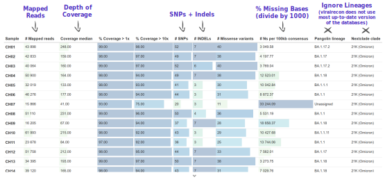

# Case Study: Switzerland (Nanopore)

:::highlight
This section demonstrates a start-to-finish analysis of a dataset sequenced on a _Nanopore_ platform, using the concepts and tools covered in previous sections. 
You can download the data from this link: [Switzerland Case Study - Data](TODO).

By the end of this section, you should be able to:

- Prepare all the files necessary to run the consensus pipeline.
- Run the _viralrecon_ pipeline to generate FASTA consensus from raw FASTQ files. 
- Assess and collect several quality metrics for the consensus sequences. 
- Clean output files, in preparation for other downstream analysis.
- Assign sequences to lineages using _Nextclade_ and/or _Pangolin_. 
- Contextualise your sequences in other background data and cluster them based on phylogenetic analysis. 
- Integrate the metadata and results to generate useful visualisations of your data. 
- Report your analysis.
:::

We will analyse data from 48 samples collected in Switzerland between Nov 2021 and Jan 2022. 
The samples were sequenced on a _GridION_ platform using pore version 9.4.1. 

The final product of our work (and main objective) is to produce a report of the analysis, which you can see here: <a href="https://docs.google.com/document/d/1GfsNngQ_WhERk9DxSf_HWmqo3MMVq0rOIxyXM3xvEgE/edit?usp=sharing" target="_blank">Switzerland Case Study Report</a>.

In summary, the report addresses the following: 

- What was the quality of the consensus sequences?
- What lineage/clade was each of our samples assigned to? 
- How many clusters of samples did we identify?
- How did the detected lineages change over the time of sampling?

We also produce several essential output files, which would usually be necessary to upload our data to public repositories: 

- Metadata (CSV)
- Consensus sequences (FASTA)
- Consensus sequence quality metrics (CSV)
- Variants (CSV)


## Pipeline Overview

Our analysis starts with **FASTQ files**, which will be used with the **`nf-core/viralrecon` _Nextflow_ pipeline**.
This will give us several **quality control** metrics essential for our downstream analysis and reporting. 

Critical files output by the pipeline will need to be further processed, including combining our **consensus FASTA files** and obtaining a list of **filtered SNP/indel variants**. 
Using these clean files, we can then proceed to downstream analysis, which includes assigning each sample to the most up-to-date **Pango lineage**, **Nextclade clade** and **WHO designation**. 
Finally, we can do more advanced analysis, including the idenfication of **sample clusters** based on phylogenetic analysis, or produce timeseries visualisations of mutations or variants of concern. 
With all this information together, we will have the necessary pieces to submit our results to **public repositories** and write **reports** to inform public health decisions. 


## Preparing Files

Before we start our work, it's always a good idea to setup our directory structure, so we keep our files organised as the analysis progresses. 
From the [data we are starting with](TODO), we already have the following directories: 

- `data` --> contains the sequencing data in a sub-directory called `fast_pass`. 
- `resources` --> files that were downloaded from public repositories. 
- `scripts` --> _bash_ and _R_ scripts used to run the analysis. 

We create two additional directories: 

- `report` --> files and documents that we report to our colleagues or upload to public repositories. 
- `results` --> results of the analysis. 

You can create directories from the command line using the `mkdir` command: 

```bash
mkdir results
mkdir report
```


### Data

We start our analysis from FASTQ files generated using the software _Guppy_ v6.1.5 ran in "fast" mode. 
This software outputs the files to a directory called **`fastq_pass`**, with further sub-directories for each sample barcode. 
This is how it looks like in this case: 

```bash
$ ls data/fastq_pass
```

```
barcode01  barcode08  barcode15  barcode22  barcode29  barcode36  barcode43  barcode50  barcode57
barcode02  barcode09  barcode16  barcode23  barcode30  barcode37  barcode44  barcode51  barcode58
barcode03  barcode10  barcode17  barcode24  barcode31  barcode38  barcode45  barcode52  barcode59
barcode04  barcode11  barcode18  barcode25  barcode32  barcode39  barcode46  barcode53  barcode60
barcode05  barcode12  barcode19  barcode26  barcode33  barcode40  barcode47  barcode54  barcode61
barcode06  barcode13  barcode20  barcode27  barcode34  barcode41  barcode48  barcode55  barcode62
barcode07  barcode14  barcode21  barcode28  barcode35  barcode42  barcode49  barcode56  barcode63
```


### Metadata

Metadata for these samples is available in the file `sample_info.csv`. 
Here is some of the information we have available for these samples: 

- `sample` --> the sample ID.
- `collection_date` --> the date of collection for the sample in the format YYYY-MM-DD.
- `country` --> the country of origin for this sample.
- `latitude`/`longitude` --> coordinates for sample location (optional).
- `sequencing_instrument` --> the model for the sequencing instrument used (e.g. NovaSeq 6000, MinION, etc.).
- `sequencing_protocol_name` --> the type of protocol used to prepare the samples (e.g. ARTIC).
- `amplicon_primer_scheme` --> for amplicon protocols, what version of the primers was used (e.g. V3, V4.1)
- Specific columns for Oxford Nanopore data, which are essential for the bioinformatic analysis: 
  - `ont_pore` --> the version of the pores. 
  - `ont_guppy_version` --> the version of the _Guppy_ software used for basecalling.
  - `ont_guppy_mode` --> the basecalling mode used with _Guppy_.


## Consensus Assembly

The first step in the bioinformatic analysis is to run the `nf-core/viralrecon` pipeline. 
But first we need to prepare our input files. 

### Samplesheet

For _Nanopore_ data, we need a **samplesheet CSV file** with two columns, indicating sample name (first column) and the respective barcode number (second column). 

We produced this table in _Excel_ and saved it as a CSV file. 
Here are the top few rows of the file: 

```bash
$ head samplesheet.csv
```

```
sample,barcode
CH01,1
CH02,2
CH03,3
CH04,4
CH05,5
CH06,6
CH07,7
CH08,8
CH09,9
CH10,10
```


### Running Viralrecon

Now we are ready to run the `nf-core/viralrecon` pipeline. 
We saved our command in a script (`scripts/01-run_viralrecon.sh`), which we created with the command line text editor `nano`. 
This ensures that our analysis is **reproducible** and **traceable** (we can go back to the script to see how the analysis was run). 

Here is the content of the script, which we ran using `bash scripts/01-run_viralrecon.sh`: 

```bash
#!/bin/bash 

nextflow run nf-core/viralrecon -profile singularity \
  --max_memory '16.GB' --max_cpus 8 \
  --input samplesheet.csv \
  --outdir results/viralrecon \
  --platform nanopore \
  --protocol amplicon \
  --genome 'MN908947.3' \
  --primer_set artic \
  --primer_set_version 3 \
  --skip_assembly \
  --fastq_dir data/fastq_pass/ \
  --artic_minion_caller medaka \
  --artic_minion_medaka_model r941_min_fast_g507
```

In this case, we used the medaka model `r941_min_fast_g507`, because that is the latest one available (even though our _Guppy_ version is 6.1.5). 
We also restricted our `--max_memory` and `--max_cpus` due to the size of our processing computers. 
If a larger computer was available, we could have used higher values for these parameters. 


### Consensus Quality

We used the _MultiqQC_ report to assess the initial quality of our samples. 
The quality report can be found in `results/viralrecon/multiqc/medaka/multiqc_report.html`. 

We paid particular attention to:

- Number of reads mapped to the reference genome.
- Median depth of coverage.
- Percentage of the genome with missing bases ('N'). 
- Number of SNP + Indel variants.

We noted that:

- 9 samples had more than 15% missing bases.
- All samples had median depth of coverage greater than 20x.
- There was some systematic dropout for some amplicons, in particular `nCoV-2019_64` had very low amplification in several of the samples. 
  Of note was also `nCoV-2019_73`, and other neighbouring amplicons. 

Besides the _MultiQC_ report, the pipeline also outputs a CSV file with collected summary metrics (equivalent to the first table on the report): `results/viralrecon/multiqc/medaka/summary_variants_metrics_mqc.csv`.
We used this file to initiate a new file where we collected metrics of particular interest, highlighted in the figure below. 
This file could have been created in _Excel_, for example. 
But we used the _R_ software to achieve this programmatically (detailed in "Integration & Visualisation" section, below). 




## Clean Output Files

After the pipeline, we created a new script to achieve three things: 

- Combine all our FASTA consensus sequences into a single file and clean the sequence names. 
- Create a table of SNP/indel variants. 
- Create a table of missing bases present in each consensus sequence.

Here is the script we wrote to do this, which we ran with `bash scripts/02-clean_files.sh`: 

```bash
#!/bin/bash 

# combine and clean FASTA files
cat results/viralrecon/medaka/*.consensus.fasta | sed 's/\/ARTIC\/medaka MN908947.3//' > report/consensus.fa

# create CSV file with variants
cat results/viralrecon/medaka/variants_long_table.csv | cut -d "," -f 1,3,4,5 > report/variants.csv

# create missing bases TSV file
seqkit locate --ignore-case --only-positive-strand --hide-matched -r -p "N+" report/consensus.fa | cut -f 1,5,6 > report/missing_intervals.tsv
```

This generated 3 new files in the `report/` directory: 

- `consensus.fa` -- all consensus sequences combined into a single FASTA file, with cleaner names by removing "/ARTIC/medaka MN908947.3" from the sequence names (we used the `sed` command to do this). 
- `variants.csv` -- all the SNP/indel variants in a CSV (comma-separated file), with the following information: sample name, position, reference allele and alternative allele (we used the `cut` command to extract those columns from the table). 
- `missing_intervals.tsv` -- intervals of missing data in each sample as a TSV (tab-separated file) file (we used the `seqkit` software to achieve this).

We opened the `missing_intervals.tsv` file in _Excel_ and noted that two samples -- _CH07_ and _CH59_ -- both have a continuous interval of 5130 missing bases between positions 19580 and 24709. 
This includes part of the _ORF1a_ gene and nearly all of the _S_ (_Spike_) gene. 
This may be due to a poor amplification of one of the PCR amplicons and may affect the interpretation of the results for these two samples. 


## Downstream Analyses

Based on the clean consensus sequences, we then perform several downstream analysis. 


### Lineage Assignment

Although the _Viralrecon_ pipeline runs _Pangolin_ and _Nextclade_, it does not use the latest version of these programs (because lineages evolve so fast, the nomenclature constantly changes). 
An up-to-date run of both of these tools can be done using each of their web applications:

- [clades.nextstrain.org](https://clades.nextstrain.org/)
- [pangolin.cog-uk.io](https://pangolin.cog-uk.io/)

However, for **automation**, **reproducibility** and **traceability** purposes, we used the command line versions of these tools, and included their analysis in a script, which we ran with `bash scripts/03-lineages.sh`: 

```bash
#!/bin/bash

# get nextclade data
nextclade dataset get --name sars-cov-2 --output-dir resources/nextclade_dataset

# run nextclade
nextclade run --input-dataset resources/nextclade_dataset/ --output-all results/nextclade report/consensus.fa

# run pangolin
# first make sure to update it with
# conda update pangolin
pangolin --outdir results/pangolin/ --outfile switzerland_report.csv report/consensus.fa
```

Note that we first download the latest version of the _Nextclade_ background data using `nextclade dataset` and then use `nextclade run` using the up-to-date dataset. 

With `pangolin` we needed to ensure that we use the latest version, which we installed using the _Conda_ package manager. 
We can check the version of the data used with `pangolin --all-versions` (at the time we ran this we had `pangolin-data: 1.15.1`).

Both of these tools output CSV files, which can be open in _Excel_ for further examination.  
Opening the _pangolin_ results (`results/pangolin/switzerland_report.csv`), we noticed that two samples -- CH07 and CH59 -- failed the QC due to high fraction of missing data. 
These are the same two samples that had a large gap of missing data in the previous section. 
Several other samples were classified as "Probable Omicron", which from the "scorpio_notes" column we can see may be because too many of the expected mutations had missing (ambiguous) bases in those consensus sequences.  
Opening the _nextclade_ results (`results/nextclade/nextclade.tsv`), we noticed that 23 samples were assigned a QC status of "bad", mostly due to high percentage of missing data (_nextclade_ uses a stringent threshold of 3000 sites, or ~10%, missing data).

Like before, we will do further analysis (and visualisation) of these data using the software _R_, in the section "Integration & Visualisation", detailed below.


### Clustering

We identified groups of similar sequences in our data using the software _civet_ (Cluster Investigation and Virus Epidemiology Tool). 
This software compares our samples with a background dataset of our choice, which givus us more context for our analysis. 
In our case, we chose to use European samples as background data, which we downloaded from GISAID following the instructions on the [_civet_ documentation](https://cov-lineages.org/resources/civet/walkthrough.html#background_dataset) (you need an account on GISAID to obtain these data). 

We already have our _civet_ data prepared in `resources/civet_data`, and we ran our analysis using the commands in the script `scripts/04-civet.sh`.
Note that due to the way this software is installed, we first need to activate a _Conda_ environment using the command `conda activate civet`. 
The code in the script is: 

```bash
#!/bin/bash

# run civet analysis
civet -i sample_info.csv \
  -f report/consensus.fa \
  -icol sample \
  -idate sample_collection_date \
  -d resources/civet_data/ \
  -o results/civet \
  -bicol modified_strain
```

After we finish running the script, we deactivate our environment, using `conda deactivate`. 

The result of this analysis includes an interactive HTML report (in `results/civet/civet.html`).
We can see that our samples were grouped into 4 catchments. 
The most numerous catchment (2) had 28 samples, which were tightly clustered and corresponded to _Omicron_ variants (based on the analysis from the previous section). 


_Civet_ also outputs a CSV file (`results/civet/master_metadata.csv`), which includes the catchment that each sample was assigned to. 
We will use this CSV file later to integrate this information with other parts of our analysis, in _R_, detailed in the "Integration & Visualisation" section. 


### Phylogeny

Although tools such as _Nextclade_ and _civet_ can place our samples in a phylogeny, sometimes it may be convient to build our own phylogenies.
This requires three steps: 

- Producing a multiple sequence alignment from all consensus sequences.
- Tree inference.
- Tree visualisation and annotation.

We performed the first two steps with the following script, which we ran with `bash scripts/05-phylogeny.sh`: 

```bash
#!/bin/bash

# alignment
mkdir -p results/mafft
mafft --6merpair --maxambiguous 0.2 --addfragments report/consensus.fa resources/reference/sarscov2.fa > results/mafft/alignment.fa

# tree inference
mkdir -p results/iqtree
iqtree2 -s results/mafft/alignment.fa --prefix results/iqtree/consensus
```

The output of _iqtree_ includes a tree file, which can be visualised using FigTree or online using [Microreact](https://microreact.org/upload). 
The figure below shows an example of an annotated tree, where we highlight the main VOCs detected. 
This annotation was done based on the file that we generate in the next section ("Integration & Visualisation"), so those steps would have to be done first. 


## Integration & Visualisation

At this point in our analysis, we have several tables with different pieces of information: 

- `sample_info.csv` --> the original table with metadata for our samples. 
- `results/viralrecon/multiqc/medaka/summary_variants_metrics_mqc.csv` --> quality metrics from the _MultiQC_ report generated by the _viralrecon_ pipeline.
- `results/nextclade/nextclade.tsv` --> the results from _Nextclade_. 
- `results/pangolin/switzerland_report.csv` --> the results from _Pangolin_.
- `results/civet/master_metadata.csv` --> the results from the _civet_ analysis, namely the catchment (or cluster) that each of our samples was grouped into.

To consolidate our analysis, we **tidied and integrated** the information from across these different files, into a single table using the software _R_. 
The script used to do this is in `scripts/06-data_integration.R`. 
Because this is an _R_ script, we opened it in _RStudio_ to execute the code. 

The output of our script is a new tab-delimited table, which we saved in `report/consensus_metrics.tsv`, and contains the following columns: 

- `sample` --> sample ID.
- `collection_date` --> date of collection day.
- `collection_week` --> date of collection week (useful for summarising/visualising counts per-week).
- `country` --> country of origin.
- `latitude`/`longitude` --> latitude and longitude of collection.
- `n_mapped_reads` --> number of mapped reads.
- `median_depth` --> median depth.
- `pct_missing` --> percentage of missing data.
- `pct_coverage` --> percentage of coverage.
- `n_variants` --> number of SNP + indel variants detected. 
- `nextclade` --> nextclade clade.
- `qc_status` --> QC status as determined by _Nextclade_ ("bad", "mediocre", "good").
- `lineage` --> _Pangolin_ lineage.
- `who_variant` --> variant of concern designation.
- `catchment` --> catchment group from _Civet_. 

This table, which aggregates information from many of the tools we used, was then used to produce different visualisations of our analysis. 
These visualisations were also done using the _R_ software (`scripts/07-visualisation.R`), and integrated into a report, shown below. 

<iframe src="https://docs.google.com/document/d/e/2PACX-1vSfmZHiZUy_W6C3qJkLuxoXMdtELJJHyvnoBnPvWjvsDLHJ-P37ep-bCxi-MkuIg_ROnk0CPzrh_GuE/pub?embedded=true" width="100%" height="500"></iframe>
