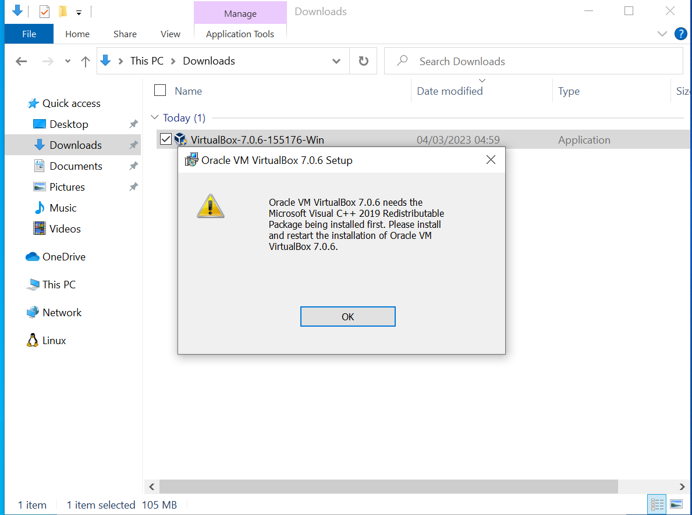
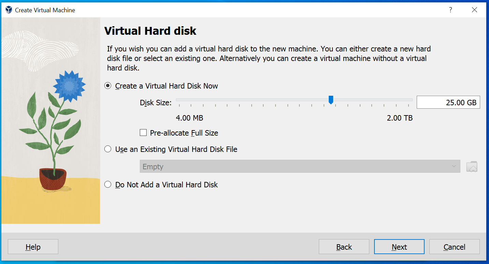

## Running Ubuntu on Oracle VirtualBox (OVB)

To install and run Ubuntu on Oracle VirtualBox please follow below instructions:

-   Download and install [Oracle VirtualBox](https://www.virtualbox.org/wiki/Downloads) in your Windows PC

    -   OVB depends on the [Microsoft Visual C++ redistiributable](https://aka.ms/vs/17/release/vc_redist.x64.exe), which should be installed first.
        Otherwise you may get the following error:

        

    -   After downloads follow the instructions on the screen to install OVB.

    -   You may also need to install later a Python Core package and the win32api bindings as instructed [here](https://www.sysnettechsolutions.com/en/fix-python-win32api-virtualbox/).
        Otherwise you will get warning message and possibly OVB will not work properly.

        

-   While installing Oracle VM, seprately download Ubuntu Linux distribution which is in ISO image [here](https://ubuntu.com/download/desktop/thank-you?version=22.04.2&architecture=amd64) (preferred the latest Ubuntu 22.04).

    ::: note
    Depending in the Internet speed it may take roughly 10 minutes or more to download the latest Ubuntu image ISO.
    In my case it took about 13 minutes to fully download the Ubuntu ISO image.
    :::

-   After Oracle VM successfully installed, click its desktop icon {width="18"} to start your Oracle VM

    -   You will see a window similar like this one:

        

-   Set up your Virtual Machine as follows

    -   In the opened up window click 'Machine' menu and in the dropdown menu click 'New'

    -   Name the machine whatever name you would like for instance "Bioinformatics"

    -   Choose the folder where VirtualMachine will reside in your PC.

    -   Then choose downloaded Ubuntu Linux ISO image.
        You can leave to default all other parameters.
        See the diagram below:

        

    -   You may want to set up Username and Password of Ubuntu.
        See the diagram below:

        

    -   Select memory size you want for your Ubuntu OS when it runs.
        Drag the slider up to the end of the green bar, which is a safe memory size based on your laptop memory size.

    -   Select the number of processors you want.

        -   For illustration, please see the diagram below.

            

    -   Create a virtual hard drive.
        Make sure you have enough physical hard drive storage size.
        If you have less than 20Gb free space of your actual memory, probably the installation may not be completed and you may get installation error.

        

        -   File location and size - default is fine (although in practice they may want to increase this limit for larger data)

-   The next step is to read a summary of all parameters you have selected before actual installation starts as see in the diagram below:

    

    -   Then click next

-   The installation of Ubuntu 22.04 will start and a window like the one below will be appearing.
    While installation in progress, several windows after will be changing.

    

## Using apt, apt-get, dpkg or Installing aptitude

After the installation is successfully now it is time to install the package managers.
We will test the Ubuntu shipped package manager which is apt and apt-get both are the same with very minor variation.
Many bioinformatics tools require to first update the system package managers before installing the tool.
In this kind of situation the apt or apt-get is used as shown in the example below.

```{bash}
sudo apt-get update # Update database packages to the current state 
sudo apt upgrade # upgrade the old package
```

After those two commands you can then install the bioinformatics tools you want, for instance you can install bwa tool for doing mapping using the following commands.

```{bash}
sudo apt -y install bwa
```

There is another built-in package manager called 'dpkg' which is required in some cases to install bioinformatics software for your analysis particularly when the required tool is in the .deb format.
A good example is when installing RStudio package which is in .deb format.
The command used to install RStudio is demonstrated below.

```{bash}
sudo dpkg -i studio-2022.12.0-353-amd64.deb # install rstudio .deb package
```

## Installing and using Conda

The following are the steps to follow to install and use Conda package manager:

-   Update your Ubuntu packages database through this command:

    ```{bash}
    sudo apt-get update
    ```

-   Go to [Miniconda Page to download](https://docs.conda.io/en/latest/miniconda.html#linux-installers) the latest version for Ubuntu

-   Right click on the first link depending on the python version which in our case is supposedly to be 3.10

-   Then copy the Miniconda link by clicking on 'copy link address' from the pop up Window

-   Open the terminal window using Ctrl+Alt+T keyboard shortcut 

-   Paste the copied link by right click inside you terminal or by pressing Ctrl + Alt + letter 'v' in your keyboard.

-   And then using the following command to download Miniconda in your machine:

    ```{bash}
    wget https://repo.anaconda.com/miniconda/Miniconda3-py310_23.1.0-1-Linux-x86_64.sh
    ```

-   Type the following command to install the conda:

    ```{bash}
     bash Miniconda3-py310_23.1.0-1-Linux-x86_64.sh
    ```

-   After installation remove the downloaded miniconda file to clear up the storage drive.

    ```{bash}
    rm Miniconda3-py310_23.1.0-1-Linux-x86_64.sh
    ```

-   Then initiate and configure conda channels in the system.
    Lastly, install mamba which you can use to install other conda packages on your own PCs

    ```{bash}
    conda init

    conda config --add channels defaults; conda config --add channels bioconda; conda config --add channels conda-forge; conda config --set channel_priority strict

    conda install -y mamba
    ```

-   Now you can install samtools using conda by running the command:

    ```{bash}
    conda install -c bioconda samtools bcftools
    ```

-   You can then use 'mamba' to install the following useful packages for the workshop in your own PCs.

    ```{bash}
    mamba create -n sars -y nextflow mafft iqtree treetime
    ```

## Using pip

To install pip in Ubuntu, run the following commands:

```{bash}
which python && which python3 # Check the python version of your Ubuntu OS and its path.

pip --version # Check which pip version is your installed Python

sudo apt install python-pip # install pip for Python2 if it does not exit

sudo apt install python3-pip # installing pip for Python3 if it does not exist
```

Now you can install and run any Python based tool.
For instance, you install in your Ubuntu OS installed the bowtie popular mapper.

```{bash}
pip install bowtie # example of installing bowtie using pip
```
