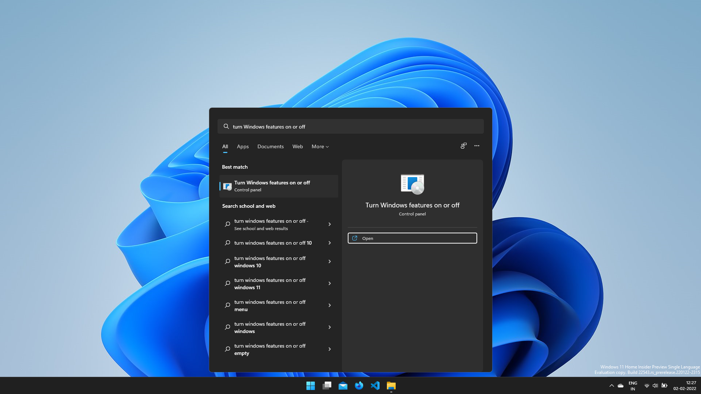
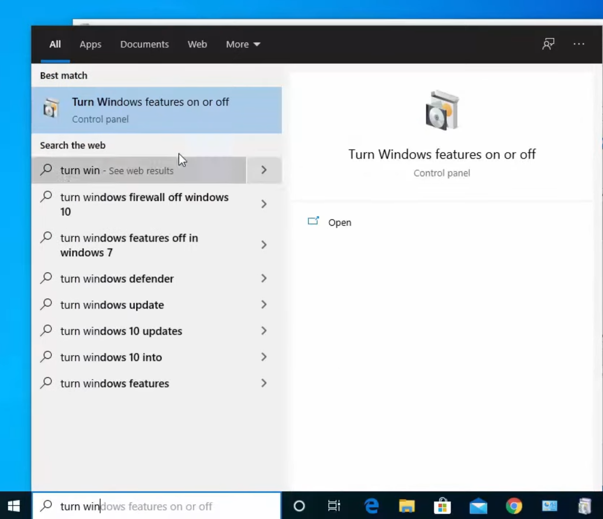
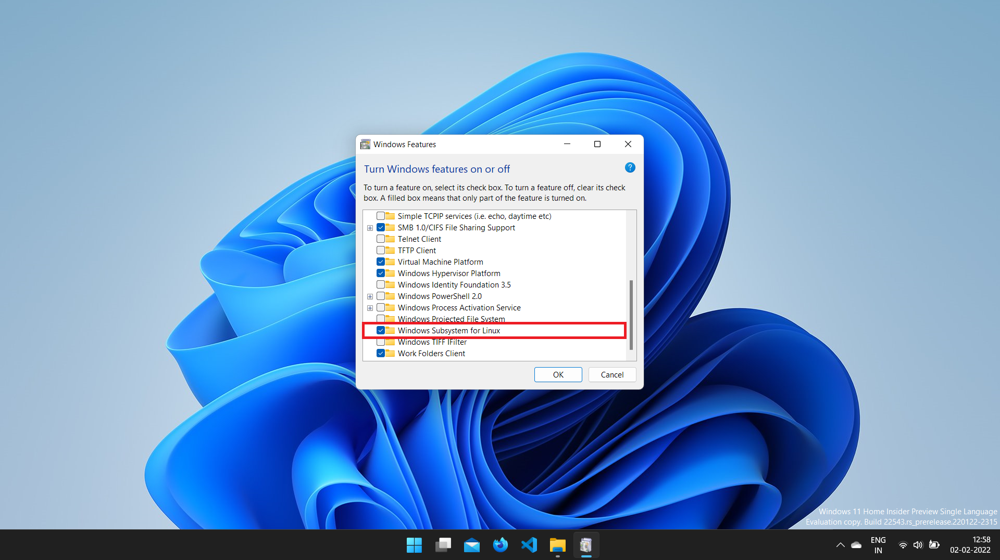
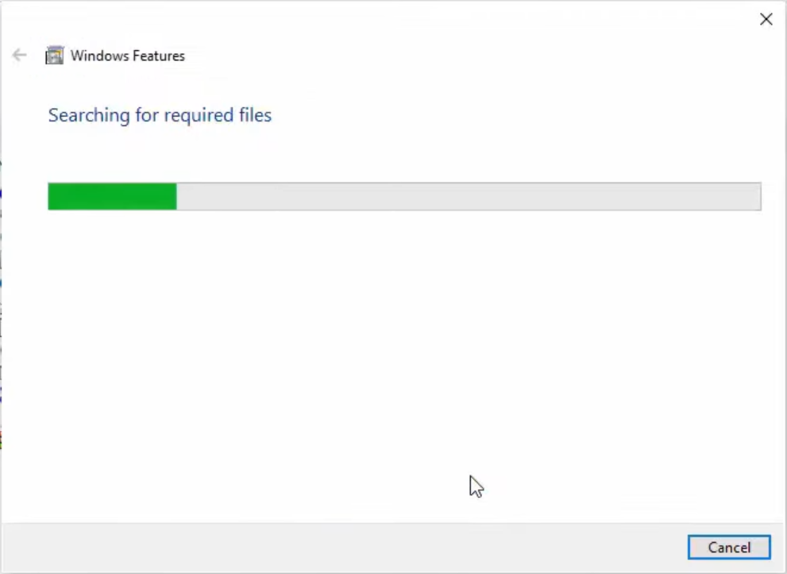
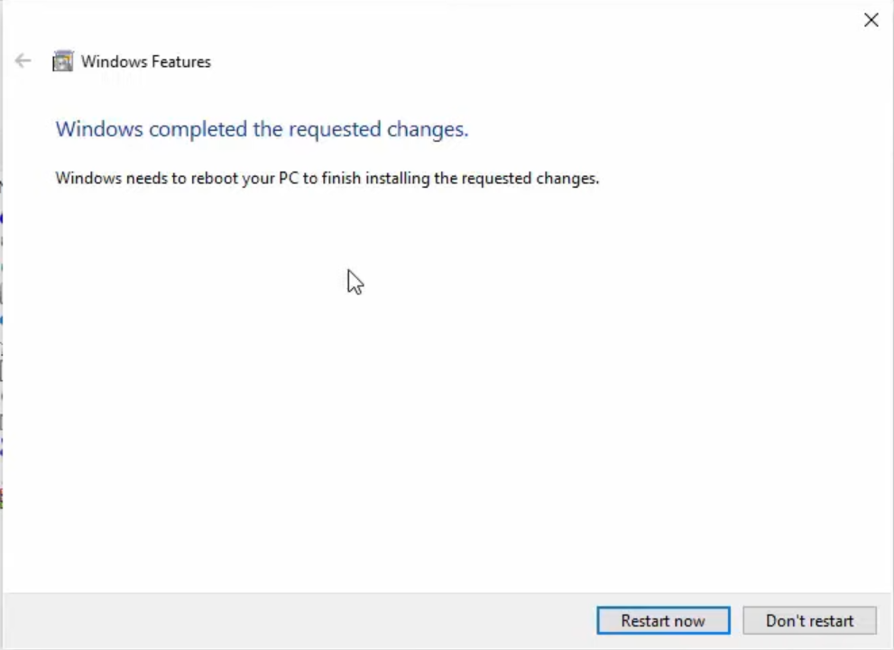
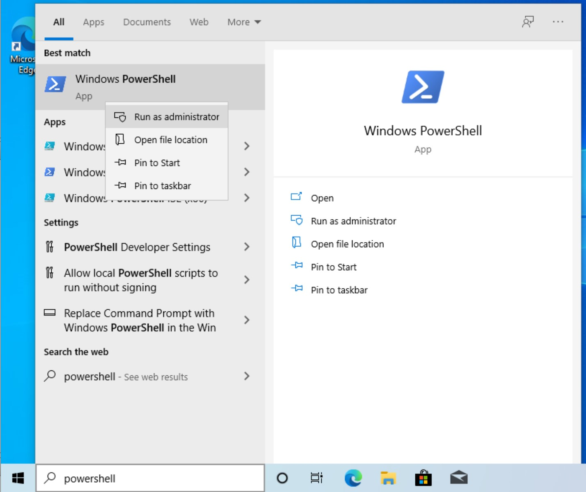

# How to install WSL on Windows 10/11

This tutorial will guide you on how to install the Windows Subsystem for Linux (or WSL) on your Windows 10 / 11. This tutorial will not be helpful if you are running Windows 10 / 11 on Virtual Machine.

## Introduction
The WSL is a tool that allows developers/users to run a GNU/Linux environment directly on Windows without any overhead or dual-boot setup. It natively integrates with most applications on your system, allowing for a Linux-like development experience on Windows.

## Prerequisites
You must be running Windows 11 or Windows 10 (build 19041 and higher) on your system. To check your Windows version and build, press Windows logo key + R, type **winver**, select OK.

:::note
If you are running an older build of Windows 10 then you can follow instructions available here: [https://docs.microsoft.com/en-us/windows/wsl/install-manual](https://docs.microsoft.com/en-us/windows/wsl/install-manual).
:::

## Step 1 - Enabling Windows Services for the WSL
The first thing you need to do is enable Windows Services for the WSL. Open the Start Menu and search for **Turn Windows feature on or off**. Click on the first result.





You will see a small window will appear. Scroll down and look for **Windows Subsystem for Linux**. Most probably, you have to scroll to the bottom. Check the **Windows Subsystem for Linux** option if not checked. Then click on **OK**.



You will see another window open that downloads additional software needed for the WSL. Once it is complete, it will ask you to Restart. Click on the **Restart** button.





## Step 2 - Enabling Widows Services for the Virtual Machine Platform
:::note
Feel free to skip this step if you don't want WSL 2. Visit here: [https://docs.microsoft.com/en-us/windows/wsl/compare-versions](https://docs.microsoft.com/en-us/windows/wsl/compare-versions) to see the comparison between WSL 1 and WSL 2.
:::

Open the Start menu and search for **Powershell**. You'll need to open **PowerShell** as Administrator, for that you'll need to right-click on **PowerShell** and click on **Run as Administrator**



To enable Windows' Virtual machine Platform run the following command in the Powershell.

```powershell
dism.exe /online /enable-feature /featurename:VirtualMachinePlatform /all /norestart
```

After running the command you will see output similar to the following:
```powershell
Deployment Image Servicing and Management tool
Version: 10.0.19041.844

Image Version: 10.0.19042.985

Enabling feature(s)
[==========================100.0%==========================]
The operation completed successfully.
```
