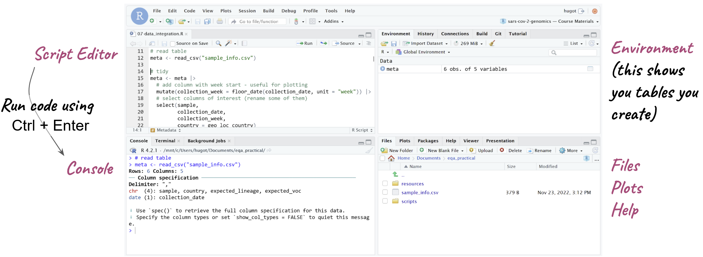

```{r setup, include=FALSE}
knitr::opts_chunk$set(echo = TRUE, root.dir = "course_files/r_demo/")
knitr::opts_knit$set(root.dir = "course_files/r_demo/")
```

# R Fundamentals

This section gives a (very) quick and brief introduction to R and RStudio. 
It will not teach you the details of how to program in R, but it should serve as a basis to start you on that journey. 
R can be used for a range of data analysis applications, including statistics, machine learning, plotting, image analysis, bioinformatics, etc. 
R is also a programming language, which makes it very flexible. 
With this flexibility, comes a somewhat steeper learning curve, compared to point-and-click programs. 
However, in the long run it can really help you improve as a data analyst. 

These materials will not teach you the details of how to write your own R programs (we won't have time for these), but to make you familiar with some of its applications and how to use RStudio to run your code.
It's only the start of your journey into R programming. 

If you want to learn more about this topic, we recommend:

- [R for Data Science](https://r4ds.had.co.nz/) - available as a free e-book.
- [Introduction to R/tidyverse](https://tavareshugo.github.io/r-intro-tidyverse-gapminder/) - course materials introducing R and the `tidyverse` packages. 


## RStudio

R is the software and programming language itself, but the R interface is quite basic and not very user-friendly. 
Fortunately, there is a companion piece of software called _RStudio_, which makes working with R a little bit easier. 

There are 4 basic panels in RStudio (see image below):

- The “script” panel is essentially a text editor, where we can write code and save it as a text file, which in this case, because it contains R code, we call it an R script (but remember, a script is just a text file with some code in it. We’ve been creating shell scripts that run on the command line, here we have some R scripts, which contain R code)
- The “console” panel is where the code actually runs, or is executed. This is equivalent to the terminal, on the command line. If we want to execute a line of code, then we need to run it on the console. 
  - One nice feature of RStudio is that we can edit our code on the script panel and then run a line of code from the script on the console - it's like copy/pasting that line of code from the script to the console. This makes working interactively with RStudio much easier, because we can edit our code in the script and run it as we go along. 
- On the top-right we have the “Environment”, which shows us objects that we create, that store information such as tables of data that we read into R. 
- Finally we have the bottom-right quadrant, which contains a few tabs: a file browser (allowing us to see files in our computer), a plot display panel (for plots we generate) and a help panel to look at documentation of R functions.




### Setting RStudio

Before we start working with RStudio, it’s a good idea to change one of its default options. 
Go to <kbd>Tools</kbd> → <kbd>Global Options...</kbd> and change the following:


This will tell RStudio to NOT automatically save and load things that we have done in the past. 
You may think this is a helpful thing, but actually it’s very inconvenient, because if you are doing multiple analysis, it might get very very confusing what the objects that you created are! 
So, it’s always best to start R with a fresh session, and setting these options makes sure we do this. 


### Starting a Project

R has a concept called **working directory**, which is the location on your computer where it is working from (looking for files and folders). 
You can think of it as the folder that you `cd` into if you were working on the command-line. 

The easiest way to ensure that R is using the correct working directory for our analysis, is to create an **R project**. 
In RStudio: <kbd>File</kbd> → <kbd>New Project...</kbd> → <kbd>Existing Directory</kbd> and then click the <kbd>Browse...</kbd> button to navigate to the folder where your project files are located. 

This will create an `.Rproj` file on your project folder. 
Next time you want to work on your analysis, you can simply double-click on this file, and it will open RStudio, with the correct working directory already set for you. 


## R Basics

This section introduces some of the basic concepts in the R programming language. 

### Packages/Libraries

R has several extensions to the basic functionality called “packages” or “libraries”. 
A popular library for data manipulation is called `tidyverse`, which we are using in this course. 
Each time we start a new R session, we need to load the libraries we want to use: 

```{r, eval=FALSE}
library(tidyverse)
```

```{r, echo=FALSE, warning=FALSE, message=FALSE}
# this reduces dependencies for github actions
library(dplyr)
library(readr)
library(ggplot2)
```

If you get an error like `Error in library(tidyverse) : there is no package called ‘tidyverse’`, that means that you didn't install the package. 
To install packages you can run: 

```{r, eval=FALSE}
install.packages("tidyverse")
```

You only need to do this the first time you want to use a library. 
Once it's installed, you don't need to run this command again (unless you want to update the library to its latest version -- often a good idea!).


### Create objects

Create **objects** (something that contains a value) with `<-`.
For example, the following creates an object called `x` containing a single number:

```{r}
x <- 53.341
```

We can print the content of the object by typing its name:

```{r}
x
```


### Functions

Most of the tasks we can achieve in R are done through the use of **functions**. 
We can think of functions as mini-programs that take an input and give an output.

Functions are easy to identify, because they are always followed by parenthesis. 
Inside the parenthesis we include the _inputs_ to the function. 

```{r}
round(x)   # round the the value of x
```

Functions have **options** that can change their behaviour.
Separate options using a comma:

```{r}
round(x, digits = 1) # round to one decimal point
```


### Vector

A **vector** is the most basic type of object in R. 
It is a collection of values, which are _all of the same type_, for example numeric, character or logical (TRUE/FALSE).

```{r}
x_chr <- c("dog", "cat", "goldfish")   # character vector
x_num <- c(1, 5, 23.3, 55.2)           # numeric vector
x_log <- c(TRUE, TRUE, FALSE, TRUE)    # logical vector
```

**Access values** inside the vector with `[]`:

```{r}
x_chr[2]        # the second value
x_chr[c(2, 3)]  # the second and third values
```


### Conditions

In many situations (for example to filter rows in a table), it's useful to evaluate a set of conditions. 
We can create logical vectors using **conditions**:

```{r}
x_num

# is x_num greater than 20?
x_num > 20

# is x_num equal to 5?
x_num == 5

# is x_num contained the vector on the right?
x_num %in% c(20, 30, 1)
```

Combine conditions with & (AND) and | (OR):

```{r}
x_num

# is x_num greater than or equal to 10 AND smaller than or equal to 30?
x_num >= 10 & x_num <= 30

# is x_num smaller than 10 OR greater than 30?
x_num < 10 | x_num > 30
```

To set the filtering conditions, several _relational operators_ can be used:

* `==` is equal to
* `!=` is different from
* `%in%` is contained in
* `>` is greater than
* `>=` is greater than or equal to
* `<` is less than
* `<=` is less than or equal to

It is also possible to combine several conditions together using the following _logical operators_:

* `&` AND
* `|` OR


### Missing Values

Sometimes we have **missing values** in our data, which are encoded as `NA`:

```{r}
y <- c(23, 44, NA, 212)
```

We need to ensure these are dealt with properly

```{r}
# returns NA
mean(y)

# removes NA and then calculates mean
mean(y, na.rm = TRUE)
```

The `is.na()` function is important to deal with missing values:

```{r}
y

# create a logical that is true if value is missing
is.na(y)

# Negate that expression using !
!is.na(y)
```


### Tables: `data.frame`/`tibble`

Tables in R are called **data.frame**.
The `tidyverse` package has its own version of a data.frame called a `tibble`. 
For the most part they are basically equivalent, but the `tibble` object has a nicer printing function to display our data on the console. 

As an example for working with tables in R, let's read a TSV (tab-delimited) file that contains intervals of missing information in 5 SARS-CoV-2 consensus sequences (this data comes from the [Switzerland case study](08-case_study_switzerland.html#Missing_Intervals)). 
To import a TSV file into R as a data.frame we can use the function `read_tsv()` (for a CSV file we would use `read_csv()`):

```{r}
missing_intervals <- read_tsv("missing_intervals.tsv")
```

When we read the table in, we get a message informing us of the column types found. 
In this case we have character columns containing text (indicated by `chr`) and numeric columns (indicated by `dbl`, which refers to the [double-precission floating point format](https://en.wikipedia.org/wiki/Double-precision_floating-point_format) that computers use to store numbers). 

To see the content of the table you can type the name of the object: 

```{r}
missing_intervals
```

Sometimes a more convenient way is to click the name of the table on the environment, which opens a new tab to preview your data. 


## Data Manipulation

Most of the work you will do in R is with tables of data (`data.frame`/`tibble` objects). 
There are several ways to manipulate tables in R, but we will give a quick overview of the functionality available through the `tidyverse` collection of packages. 

### Basic "verbs"

There's a set of basic functions that can be thought of as "data manipulation verbs". 
They are: 

- `mutate()` → add a new column of modify an existing one.
- `select()` → select columns from the table.
- `filter()` → subset the rows from the table that fullfill a certain logical condition.

Here are some examples of each: 

```{r}
# create a new column with the missing interval lengths
mutate(missing_intervals, 
       length = (end - start) + 1)

# select only a few columns of the table
select(missing_intervals,
       seqID, start, end)

# subset the table to include only intervals within the Spike protein
filter(missing_intervals,
       start > 21563 & end < 25384)
```


### Pipes

We can chain multiple commands together using **pipes** (similarly to pipes in _Unix_). 
In R the pipe is represented by `|>` (or `%>%`). 
The way the pipe works is that the output of one function is sent as the input to the next function. 

Taking the examples from the previous section, we could chain all those commands like this: 

```{r}
missing_intervals |> 
  mutate(length = (end - start) + 1) |> 
  select(seqID, start, end, length)
```

If you want to _update_ the `missing_intervals` table, then you need to use `<-` at the beggining of the chain of pipes: 

```{r}
missing_intervals <- missing_intervals |> 
  mutate(length = (end - start) + 1) |> 
  select(seqID, start, end, length)
```

### Grouped Summaries

We can calculate summaries of the data (e.g. mean, standard deviation, maximum, minimum) per group (e.g. per sample) using a pair of functions together. 
For example: 

```{r}
# mean and maximum interval length per sample
missing_intervals |> 
  # for each sample
  group_by(seqID) |> 
  # calculate summary statistics
  summarise(max_length = max(length),
            min_length = min(length),
            mean_length = mean(length))
```

As before, if we wanted to save this result in a new object, we would need to use `<-`:

```{r}
intervals_summary <- missing_intervals |> 
  # for each sample
  group_by(seqID) |> 
  # calculate summary statistics
  summarise(max_length = max(length),
            min_length = min(length),
            mean_length = mean(length)) |> 
  # and rename the seqID column
  rename(sample = seqID)
```

Notice in this case we also renamed the column called `seqID` to be named `sample` instead (this will be useful for the exercise later on). 

Another useful function is `count()`, which counts how many times the values in a column appear on a data frame. 
For example, if we wanted to know how many missing intervals each sample had, we could do it like this: 

```{r}
missing_intervals |> 
  count(seqID)
```

:::exercise

Modify the following code: 

```{r, eval=FALSE}
missing_intervals |> 
  count(seqID)
```

To also: 

- rename the column `seqID` to be named `sample` instead. 
- save the output in an object called `intervals_count`. 

<details><summary></summary>
To rename the column, we could use the `rename()` function: 

```{r}
missing_intervals |> 
  count(seqID) |> 
  rename(sample = seqID)
```

And to save this output to a new object, we need to use `<-`: 

```{r}
intervals_count <- missing_intervals |> 
  count(seqID) |> 
  rename(sample = seqID)
```

</details>
:::

### Joining Tables

We can join multiple tables together based on a common identifier. 
There are different types of join operations, depending on what we want to achieve. 

Take these two tables as an example (these tables come pre-loaded with `tidyverse`):

```{r}
band_members
band_instruments
```

Here are some different ways we can join these tables:

```{r}
# keep all records from both tables
full_join(band_members, band_instruments, by = "name")

# keep all records from the first table
left_join(band_members, band_instruments, by = "name")

# keep all records from the second table
right_join(band_members, band_instruments, by = "name")

# keep only the records occurring in both tables
inner_join(band_members, band_instruments, by = "name")
```

In each case, if there was no match between the two tables, the cells are filled with missing values `NA`. 

:::exercise

In this exercise we will join the `intervals_summary` table we created earlier, with the metadata table that contains information about our samples. 

1. Read the your metadata table `sample_info.csv` into R and save it as an object called `sample_info`. 
  <details><summary>Hint</summary>Remember that you can use the `read_csv()` function to read CSV files into R.</details>
2. Join the `sample_info` table that you just imported with the `intervals_summary` table we created earlier. 
  Save the output to the `intervals_summary` table (this will update the table). 
  <details><summary>You can use the `left_join()` function to achieve this, using the "sample" column as the identifier column used to join the two tables.</summary></details>

<details><summary>Answer</summary>
**Answer 1**

To read the metadata CSV file, we use the `read_csv()` function, and use `<-` to save the output in an object called `sample_info`:

```{r}
sample_info <- read_csv("sample_info.csv")
```

We can see the content of our file by typing its name in the console.
Here is the file in our example data (yours might look different):

```{r}
sample_info
```

**Answer 2**

To join the two tables together, we can use one of the `*_join()` functions. 
In this case it doesn't matter which function we use, because both tables have the same sample IDs. 
But, for example, let's say we only wanted to retain the samples that are in common across _both_ tables. 
In that case, we would use `inner_join()`:

```{r}
intervals_summary <- inner_join(intervals_summary, sample_info, by = "sample")
```

</details>

:::


## Data Visualisation

For this section, we will use another table, which contains some of the metrics that we can collect from our consensus pipeline: 

```{r}
# read the table
qc_metrics <- read_tsv("consensus_metrics.tsv")

# preview the table
qc_metrics
```

We can build plots from our tables using the `ggplot2` package (which is also part of the `tidyverse`). 

To build a _ggplot_, we usually need at least three things:  

- The data frame we want to use for the plot (the **data**).
- The columns we want to visualise as our x-axis, y-axis, and colours (these are called **aesthetics**).
- The type of shape that we want to plot (these are called **geometries**).

For example, let's try to make a plot to show the relationship between total number of counts and the median depth of sequencing in these samples:

```{r}
ggplot(data = qc_metrics, aes(x = n_mapped_reads, y = median_depth))
```

When we do this, we simply get an empty plot, with x and y axis, but nothing drawn on it. 
To draw something on the plot, we add (literally with `+`) geometries to our plot. 
In this case, we can use the `geom_point()` geometry, which draws "points" on the plot:

```{r}
ggplot(data = qc_metrics, aes(x = n_mapped_reads, y = median_depth)) +
  geom_point()
```

There are many geometries available with ggplot: 

- `geom_point()` draws points. 
- `geom_boxplot()` draws a boxplot. 
- `geom_histogram()` draws a histogram. 
- `geom_col()` draws a barplot (this one is named a little strangely, but "col" means it draws "columns" or bars).

We can further modify the look to the plot by adding other _aesthetics_ such as the colour of the points. 
For example, let's say we wanted to colour our points according to their "QC Status":

```{r}
ggplot(data = qc_metrics, 
       aes(x = n_mapped_reads, y = median_depth, colour = qc_status)) +
  geom_point()
```

Finally, we may sometimes want to change the _labels_ of our plot. 
In that case, we can add the `labs()` function to our plotting code: 

```{r}
ggplot(data = qc_metrics, 
       aes(x = n_mapped_reads, y = median_depth, colour = qc_status)) +
  geom_point() +
  labs(x = "Number Mapped Reads", 
       y = "Median Sequencing Depth", 
       colour = "Nextclade QC Status")
```

:::exercise

Modify the plot we just did, to show the relationship between median depth of sequencing (x-axis) and percentage of missing bases (y-axis). 
Colour the points according to the lineage column. 

<details><summary>Answer</summary>

Here is the modified code:

```{r}
ggplot(data = qc_metrics, 
       aes(x = median_depth, y = pct_missing, colour = lineage)) +
  geom_point() +
  labs(x = "Median Sequencing Depth", 
       y = "% Missing Bases", 
       colour = "Pango Lineage")
```

The things we have changed were the aesthetics and labels. 

</details>
:::