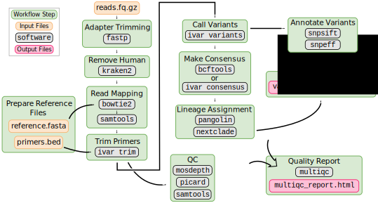
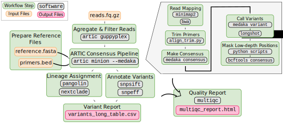

# Consensus assembly

:::{.callout-tip}
#### Learning Objectives

- Recognise what the main steps are in processing raw sequencing data to generate consensus genome sequences, including sequence alignment, primer trimming and consensus generation. 
- Recognise the differences between Illumina and Nanopore pipelines.
- Apply the `nf-core/viralrecon` _Nextflow_ pipeline to generate a consensus sequence from Illumina and Nanopore data.

:::

:::{.callout-note}
#### Slides

This section has an accompanying <a href="https://docs.google.com/presentation/d/1EbuH6KjK3oW5BUfSU43rVH_b-tPTKtubDWl86eAH47U/edit?usp=sharing" target="_blank">slide deck</a>.
:::


## SARS-CoV-2 Consensus Assembly

As we discussed [earlier in the course](../01-intro/01-surveillance.md), the starting material for sequencing SARS-CoV-2 samples from infected patients is PCR-amplified DNA generated with a panel of primers that covers the whole SARS-CoV-2 genome (for example the primers developed by the ARTIC network). 
This material can then be sequenced using either _Illumina_ or _Nanopore_ platforms. 

Although different sotware tools are used depending on which kind of sequencing platform was used, the main goal is the same: to align the sequencing reads to the reference genome, and identify any DNA changes (SNPs or Indels) relative to the reference genome (_Wuhan-Hu-1_).
This is called **consensus assembly**, since we are _assembling_ the genome of our sample from the PCR-amplified fragments and generating a _consensus_ sequence based on changes present in several reads covering a particular position of the genome. 

The general data processing steps are:

- Filter high-quality sequencing reads.
- Map the reads to the _Wuhan-Hu-1_ reference genome.
- Trim the primers from the aligned reads based on the primer location file (BED file).
- Perform variant calling (SNPs and indels) to identify changes relative to the reference sequence.
- Generate a consensus sequence for the sample based on those variants.


:::{.callout-important}
#### Primer trimming

**Primer trimming** is a key step of the data processing, otherwise SNPs might be missed at the primer sites, on the final consensus sequence.
This is because the primer sequence is retained during PCR instead of the original sequence of the sample. 
Because the PCR amplicons overlap with each other, we can trim the primers from each read and do variant calling after trimming. 
An example of this is shown in the Figure above.

<!--
Consider adding some notes about sequence length (for Illumina), whether it spans the whole amplicon or not, whether reads without primers can be retained.

Depends on the library prep method:
- Ligation-based (e.g. Kappa kit from [this paper](https://www.biorxiv.org/content/10.1101/2020.06.16.154286v1.full)). See this [ligation illustration](https://sfvideo.blob.core.windows.net/sitefinity/images/default-source/default-album/decoded-temp-image-storage/19_ng_lib-prep-frag.png?sfvrsn=9e0a1b07_4).
- Tagmentation-based (e.g. Nextera kits from the same paper). See this [tagmentation illustration](https://upcvmda-pl480.weebly.com/uploads/8/3/9/0/83900706/tagmentation_1_orig.png).

As I understand it, with ligation-based method there is no fragmentation, adapters are ligated directly to the amplicon.
With tagmentation-based methods the fragment may sometimes not contain the primer, if the transposome cuts the amplicon in half or something like that. 
-->
:::


## Bioinformatic Workflows/Pipelines

As can already be seen from the brief description above, bioinformatic analyses always involve multiple steps where data is gathered, cleaned and integrated to give a final set of processed files of interest to the user. 
These sequences of steps are called a **workflow** or **pipeline**. 
As analyses become more complex, pipelines may include the use of many different software tools, each requiring a specific set of inputs and options to be defined. 
Furthermore, as we want to chain multiple tools together, the inputs of one tool may be the output of another, which can become challenging to manage. 

Although it is possible to code such workflows using _shell_ scripts, these often don't scale well across different users and compute setups. 
To overcome these limitations, dedicated [_workflow/pipeline management software_](https://en.wikipedia.org/wiki/Workflow_management_system) packages have been developed to help standardise pipelines and make it easier for the user to process their data. 


Two of the most popular _workflow software_ packages are [_Snakemake_](https://snakemake.readthedocs.io/en/stable/) and [_Nextflow_](https://www.nextflow.io/). 
We will not cover how to develop workflows with these packages, but rather how to use an existing workflow to generate consensus sequences from SARS-CoV-2 data.

### Why Use a Standardised Workflow? {.unlisted .unnumbered}

These are some of the key advantages of using a standardised workflow for our analysis:

- **Fewer errors** - because the workflow automates the process of managing input/output files, there are less chances for errors or bugs in the code to occur.
- **Consistency and reproducibility** - analysis ran by different people should result in the same output, regardless of their computational setup.
- **Software installation** - all software dependencies are automatically installed for the user using solutions such as _Conda_, _Docker_ and _Singularity_ (more about these in a later section of the course).
- **Scalability** - workflows can run on a local desktop or scale up to run on _high performance compute clusters_.
- **Checkpoint and resume** - if a workflow fails in one of the tasks, it can be resumed at a later time.


## SARS-CoV-2 Pipeline

To generate consensus SARS-CoV-2 genomes from these data, we will use a pipeline that was developed by the _Nextflow_ core team called [`nf-core/viralrecon`](https://nf-co.re/viralrecon) (which was itself inspired by a [previous pipeline from the Connor Lab](https://github.com/connor-lab/ncov2019-artic-nf)). 
Its objective is to harmonise the assembly of SARS-CoV-2 genomes from both Illumina and Nanopore amplicon sequencing data.
It can also work with metagenomic data, which we will not cover in this workshop.
This pipeline therefore includes different sub-pipelines, which are launched depending on the type of sequence data we have.
Watch the video below to learn more about the development of this pipeline.

<p align="center"><iframe width="560" height="315" src="https://www.youtube.com/embed/7BfuAOjFCFw" title="YouTube video player" frameborder="0" allow="accelerometer; autoplay; clipboard-write; encrypted-media; gyroscope; picture-in-picture" allowfullscreen></iframe><p align="center">

Generally speaking, _Nextflow_ pipelines are run with the command `nextflow run PIPELINE_NAME`, where "PIPELINE_NAME" is the name of the pipeline. 
Pipelines are usually shared in a public repository such as GitHub, and `nextflow` will automatically download the pipeline if it hasn't been downloaded already to your computer.

Let's test our pipeline by looking at its help documentation: 

```bash
nextflow run nf-core/viralrecon -r 2.6.0 --help
```

The command should print a long list of options available with this pipeline.
For pipelines developed by the _Nextflow_ core team you can also consult the documentation available online, which is easier to read: [nf-co.re/viralrecon](https://nf-co.re/viralrecon).
This page includes many details about the pipeline: which tools are used in different steps of the data processing, how to use the pipeline for different types of data, a detailed documentation of all the options of the pipeline and explanation of the output files generated by it. 

Below, we give an overview of the pipelines used for Illumina and Nanopore amplicon data.

:::{.callout-note}
#### Reference Genome and Primer Locations

The _Wuhan-Hu-1_ reference genome sequence and the amplicon primer locations (in BED file format) can all be found on the ARTIC [Primer Schemes repository](https://github.com/artic-network/primer-schemes/tree/master/nCoV-2019). 
The pipeline we are using takes care of downloading these files for us automatically, however it can be useful to know where to find them, in case you want to use other tools that require these files. 
:::

::: {.panel-tabset group="platform"}
### Illumina

The Illumina sub-workflow is based on several standard bioinformatic tools and, importantly, on the [iVar](https://andersen-lab.github.io/ivar/html/) software, which was developed for analysing amplicon-based sequencing data.



To run the pipeline on Illumina data, we use the following general command:

```bash
nextflow run nf-core/viralrecon 
  -r 2.6.0 -profile singularity \
  --platform illumina \
  --input SAMPLESHEET_CSV \
  --outdir OUTPUT_DIRECTORY \
  --protocol amplicon \
  --genome 'MN908947.3' \
  --primer_set artic \
  --primer_set_version PRIMER_VERSION \
  --skip_assembly --skip_asciigenome \
  --skip_pangolin --skip_nextclade 
```

One of the key options is `--platform illumina`, which makes sure that the correct sub-workflow will be used. 

<details><summary>Click to see more details about this sub-workflow</summary>

In summary, the steps performed by the Illumina sub-workflow are:

- Adapter trimming - this consists of trimming (or "cutting") the sequences to remove low-quality bases and any Illumina adapter sequences that are present in the sequences. 
- Removing human (host) reads - when doing the sequencing it is possible that many reads are still from human material and this step removes them from the rest of the analysis. 
- Read mapping - aligning (or mapping) the reads to the _Wuhan-Hu-1_ reference genome.
  - The software used for mapping is `bowtie2`.
  - The software `samtools` is used to convert the mapped file to BAM (instead of SAM) and sort the reads by coordinate (which is necessary for downstream steps).
- Trim Primers - primers are removed from the aligned reads using `ivar trim` (using the primer BED file).
- Call variants - identify SNPs and indels using `ivar variants`.
- Annotate variants - the called variants are annotated according to their potential effect on the genes/proteins they are located in. For example, if a mutation introduces a new stop codon, or causes a frameshift. 
- Make consensus - apply the SNPs and indels from the previous step to the reference FASTA file.
  - There are two tools that can be used in this step: `bcftools consensus` (default) or `ivar consensus` (can be set with the option `--consensus_caller ivar`).
- Lineage assignment - the consensus sequences are assigned to lineages or clades using the `pangolin` and `nextclade` programs. These are two of the main lineage/clade nomenclature systems in use. They also identify _variants of concern_ from the consensus sequences. 
- Quality control - at several steps in the pipeline different tools are used to collect quality metrics and these are compiled into a report using `multiqc`.

</details>


### Nanopore (FASTQ)

The nanopore sub-workflow is based on the [ARTIC bioinformatics protocol](https://artic.network/ncov-2019/ncov2019-bioinformatics-sop.html) and uses several of the tools from the accompanying [`artic` software package](https://artic.readthedocs.io/en/latest/). 

This sub-workflow is similar to the other nanopore sub-workflow, the main difference is the software used for generating a consensus sequence (`medaka` instead of `nanopolish`).



To run our pipeline on basecalled data (FASTQ files), we use the following command:

```bash
nextflow run nf-core/viralrecon \
  -r 2.6.0 -profile singularity \
  --platform nanopore \
  --input SAMPLESHEET_CSV \
  --fastq_dir fastq_pass/ \
  --outdir OUTPUT_DIRECTORY \
  --protocol amplicon \
  --genome 'MN908947.3' \
  --primer_set artic \
  --primer_set_version PRIMER_VERSION \
  --artic_minion_caller medaka \
  --artic_minion_medaka_model MEDAKA_MODEL \
  --skip_assembly --skip_asciigenome \
  --skip_pangolin --skip_nextclade 
```

Some of the key options are:

- `--platform nanopore` makes sure that the correct sub-workflow will be used. 
- `--artic_minion_caller medaka` indicates we want to use the `medaka` program to do the variant/consensus calling (directly from the basecalled FASTQ files, rather than from the raw signal in the FAST5 files).
- `--artic_minion_medaka_model` specifies the model used by the `guppy_basecaller` software to do the basecalling. The model name follows the structure `{pore}_{device}_{caller variant}_{caller version}`. See more details about this in the [medaka models documentation](https://github.com/nanoporetech/medaka#models). **Note:** for recent versions of Guppy (>6) there is no exact matching model from `medaka`. The recommendation is to use the model for the latest version available; a list of supported models can be found on the [`medaka` GitHub repository](https://github.com/nanoporetech/medaka/tree/master/medaka/data).
- `--fastq_dir` specifies the directory containing the FASTQ files. This directory should contain sub-directories for each barcoded sample following the naming convention `barcodeXXXX` (where X is a number between 0 and 9). By default, the `guppy_basecaller` software from Nanopore generates a folder called "fastq_pass" which follows this convention. 

<details><summary>Click to see more details about this sub-workflow</summary>

In summary, the steps performed by the Medaka sub-workflow are:

- Aggregate reads from each sequencing barcode (when multiple files are availble for each barcode)
- Run the `artic minion` tool, which internally does several steps:
  - Map reads to the reference genome using `minimap2` (can be changed to use `bwa mem` with the option `--artic_minion_aligner bwa`).
  - Trim primers from the aligned reads based on the known primer positions in the BED file (using a custom python script called `align_trim.py`).
  - Call consensus sequences and SNP/indel variants using `medaka consensus` and `medaka variant`:
    - Positions with less than 20x depth are treated as missing data and converted to the ambiguous base 'N'. It is not advised to go below this threshold as the models used to call variants do not perform as well.
- Annotate variants - the called variants are annotated according to their potential effect on the genes/proteins they are located in. For example, if a mutation introduces a new stop codon, or causes a frameshift. 
- Lineage assignment - the consensus sequences are assigned to lineages or clades using the `pangolin` and `nextclade` programs. These are two of the main lineage/clade nomenclature systems in use. They also identify _variants of concern_ from the consensus sequences. 
- Quality control - at several steps in the pipeline different tools are used to collect quality metrics and these are compiled into a report using `multiqc`.

</details>


### Nanopore (FAST5)

The nanopore sub-workflow is based on the [ARTIC bioinformatics protocol](https://artic.network/ncov-2019/ncov2019-bioinformatics-sop.html) and uses several of the tools from the accompanying [`artic` software package](https://artic.readthedocs.io/en/latest/). 

This sub-workflow is similar to the other nanopore sub-workflow, the main difference is the software used for generating a consensus sequence (`nanopolish` instead of `medaka`).


<details><summary>Click to see more details about this sub-workflow</summary>

In summary, the steps performed by the Nanopolish sub-workflow are:

- Filter reads to ensure they pass minimum read length thresholds:
  - minimum length 400bp (can be changed with `--min_length` option)
  - maximum length 700bp (can be changed with `--max_length` option)
- Run the `artic minion` tool, which internally does:
  - Read alignment to reference genome using `minimap2` (can be changed to use `bwa mem` with the `--bwa` option).
  - Trim primers from the aligned reads (based on the known primer positions in the BED file).
  - Call consensus sequences and variants using `nanopolish variants` if using signal-level FAST5 files.
    - Positions with less than 20x depth are assigned the ambiguous base 'N'. It is not advised to go below this threshold as the models used to call variants do not perform as well.
- Annotate variants - the called variants are annotated according to their potential effect on the genes/proteins they are located in. For example, if a mutation introduces a new stop codon, or causes a frameshift. 
- Lineage assignment - the consensus sequences are assigned to lineages or clades using the `pangolin` and `nextclade` programs. These are two of the main lineage/clade nomenclature systems in use. They also identify _variants of concern_ from the consensus sequences. 
- Quality control - at several steps in the pipeline different tools are used to collect quality metrics and these are compiled into a report using `multiqc`.

</details>

To run our pipeline on signal-level data (FAST5 files), we use the following command: 

```bash
nextflow run nf-core/viralrecon \
  --input SAMPLESHEET_CSV \
  --outdir OUTPUT_DIRECTORY \
  --protocol amplicon \
  --genome 'MN908947.3' \
  --primer_set artic \
  --primer_set_version PRIMER_VERSION \
  --skip_assembly \
  --platform nanopore \
  --fastq_dir fastq_pass/ \
  --fast5_dir fast5_pass/ \
  --sequencing_summary sequencing_summary.txt \
  -profile conda,singularity,docker
```

Some of the key options are:

- `--platform nanopore` makes sure that the correct sub-workflow will be used. 
- `--fastq_dir` specifies the directory containing the FASTQ files generated by the `guppy_basecaller` program (this is the standard software from Nanopore that processes the raw signal data from the sequencing device). This directory should contain sub-directories for each barcoded sample following the naming convention `barcodeXXXX` (where X is a number between 0 and 9). By default, `guppy_basecaller` generates a folder called "fastq_pass" which follows this convention. 
- `--fast5_dir` specifies the directory containing the FAST5 files generated by `guppy_basecaller`. This directory follows the same naming convention as above and is usually in a folder called "fast5_pass". 
- `--sequencing_summary` is a path to the "sequencing_summary.txt" text file generated by `guppy_basecaller`.
:::

Apart from the specific options used by each sub-workflow, there are some general options that are used: 

- `--input` specifies a CSV file with details about our samples. The format of this file depends on the specific sub-workflow you are using. See the details in the [samplesheet documentation page](https://nf-co.re/viralrecon/2.6.0/docs/usage#samplesheet-format).
- `--outdir` specifies the output directory to store all our results.
- `--protocol amplicon` sets the pipeline for PCR amplicon data (the other option is `--protocol metagenomic`, which we do not cover in this course).
- `--genome 'MN908947.3'` this is the standard name of the [Wuhan-Hu-1 reference genome](https://www.ncbi.nlm.nih.gov/nuccore/MN908947.3).
- `--primer_set artic` at the moment only "artic" primers are available by default. It is possible to use custom primers with the Illumina workflow (see details [here](https://nf-co.re/viralrecon/2.6.0/parameters#primer_bed)). 
- `--primer_set_version` the version of the [ARTIC primer scheme](https://github.com/artic-network/primer-schemes) used. The [viralrecon primer config file](https://github.com/nf-core/configs/blob/master/conf/pipeline/viralrecon/genomes.config) indicates the available primer shemes are: `1`, `2`, `3`, `4`, `4.1`, `5.3.2` and also `1200` (the 1200bp amplicon protocol, also known as "midnight").
- `--skip_assembly` this is used to skip de-novo assembly of the genome. This step is unnecessary in amplicon protocols, which instead rely on mapping reads to the reference genome (reference-based assembly). De-novo assembly is necessary for metagenomic protocols.
- `--skip_pangolin` and `--skip_nextclade` is used to skip the lineage assignment. The reason is that `viralrecon` does not use the latest version of the SARS lineage databases, so we skip this step for now, and run it separately in a later step of the analysis.

There are two more generic options we used: 

- `-r 2.6.0` indicates the version of the pipeline we want to use. It's always good to check what the latest version is on the [`viralrecon` website](https://nf-co.re/viralrecon). 
`-profile singularity` indicates how we want to manage the software required by the pipeline. In our case, we are using a software called _Singularity_, which creates a "virtual operating system" (called a container) where all the necessary software is run from. 
This ensures that all of the software is automatically installed and runs on any Linux computer. 

:::{.callout-note}
#### Conda, Singularity, Docker?

Generally speaking, workflow management software such as _Nextflow_ or _Snakemake_ support three solutions for managing software dependencies:

- [_Docker_](https://docs.docker.com/) is a software that allows to package a small virtual operating system (or a "container") containing all the software and data necessary for running an analysis. 
- [_Singularity_](https://sylabs.io/guides/3.5/user-guide/index.html) also creates software containers, similarly to _Docker_. However, it can more easily interface with the user's filesystem, without the need to have special permissions. 
- [_Conda_](https://docs.conda.io/en/latest/) is a package manager, also very popular in bioinformatics. Instead of creating virtual OS containers, _Conda_ instead creates software environments (think of them as directories) where all the software is locally installed, including all its dependencies. The use of individual environments ensures that software packages with incompatible dependencies can still be used within the same pipeline. 

Of the three, **_Singularity_ is the recommended choice**, although _Conda_ is also a good alternative. 
:::


### Running the Workflow

Let's see an example in action by using some example data.
If you go to the directory `uk_illumina/` in the course materials, you will find several FASTQ files in the `data` directory. 
There is also a _shell script_ (`scripts/run_illumina_workflow.sh`) that contains the commands we will use to run the workflow on these data.

Opening the script, we can see the following commands: 

```bash
# create output directory
mkdir results

# run the workflow
nextflow run nf-core/viralrecon \
  -r 2.6.0 -profile singularity \
  --platform illumina \
  --input samplesheet.csv \
  --outdir results/viralrecon \
  --protocol amplicon \
  --genome 'MN908947.3' \
  --primer_set artic \
  --primer_set_version 3 \
  --skip_assembly --skip_asciigenome \
  --skip_pangolin --skip_nextclade
```

It first creates a results directory (to store our output files) and then runs the `nextflow` command using the Illumina sub-workflow.
We could run these commands one at a time by copy/pasting them to the terminal. 
Or alternatively, we can run the entire script using `bash scripts/run_illumina_workflow.sh`

When you start running the workflow, you will get a list of the workflow steps and their progress. 
This may take quite a while to run, depending on the computer resources you have available. 
Once the workflow is complete, you should see a message similar to the following:

```
-[nf-core/viralrecon] 8/8 samples passed Bowtie2 1000 mapped read threshold:
    280038: GB16
    2946614: GB28
    252871: GB09
    3269412: GB21
    103742: GB23
    3016474: GB36
    ..see pipeline reports for full list
-
-[nf-core/viralrecon] Pipeline completed successfully-
Completed at: 18-May-2022 08:08:25
Duration    : 1h 13m
CPU hours   : 8.1
Succeeded   : 343
```

You should also get several output files in the results folder specified with our `nextflow` command. 
We will detail what these files are in the next section. 

:::{.callout-note}
#### Running the pipeline on our training computers

Our training computers don't have the high specifications needed for routine bioinformatic analysis, so the _Illumina_ pipeline takes up to 1h to complete. 

We provide already pre-processed results for 48 samples in the folder `uk_illumina/preprocessed`, which you can use to follow the next section. 
:::


## Exercises

:::{.callout-exercise}
#### Running `nf-core/viralrecon`: ONT data

Go to the course materials directory `india_nanopore`. 
This contains **Nanopore sequencing** data for several samples collected in India. 
Nanopore data is organised in directories named as `barcodeXX` (where `XX` is a number) - this is the standard output from the _Guppy_ software used to do basecalling and generate FASTQ files. 

The Nanopore _Medaka_ workflow expects to be given as an input a CSV file with two columns: sample name and barcode number. 
We already provide this file in `samplesheet.csv`.

Your task now is to process these samples using the `nf-core/viralrecon` pipeline:

- Using `nano`, open the script found in `scripts/run_medaka_workflow.sh`.
- Fix the code in the script where you see the word "_FIXME_":
  - Output the results to a directory called `results/viralrecon/`.
  - The input sample sheet is in the file `samplesheet.csv` (check the [pipeline documentation](https://nf-co.re/viralrecon/2.6.0/usage#nanopore-input-format) to review what the format of this samplesheet should be for the Nanopore pipeline).
  - The FASTQ files are in a folder `data/fastq_pass`.
- Run the script using `bash`. This may take ~15 minutes to complete.

:::{.callout-answer}

We can open the script with _Nano_ using the command:

```bash
nano scripts/run_medaka_workflow.sh
```

The fixed code is:

```bash
# create output directory
mkdir -p results

# run the workflow
nextflow run nf-core/viralrecon \
  -r 2.6.0 -profile singularity \
  --max_cpus 8 --max_memory "24.GB" \
  --input samplesheet.csv \
  --outdir results/viralrecon \
  --platform nanopore \
  --protocol amplicon \
  --genome 'MN908947.3' \
  --primer_set artic \
  --primer_set_version 3 \
  --skip_assembly \
  --fastq_dir data/fastq_pass/ \
  --artic_minion_caller medaka \
  --artic_minion_medaka_model r941_min_high_g360
```

What we did to fix the code was:

- Set `--input` as `samplesheet.csv`, which is the CSV file with two columns: sample name and Nanopore barcode number. The format of this file is detailed in the [`nf-core/viralrecon` documentation](https://nf-co.re/viralrecon/2.6.0/usage#samplesheet-format).
- Set `--outdir` as `results/viralrecon/`, which is the directory where we want to output our results.
- Set `--fastq_dir` as `data/fastq_pass`, which is the directory containing the FASTQ file folders named as `barcodeXX` (where `XX` is a number). This is the standard output from the _Guppy_ software used to do basecalling of Nanopore data to produce FASTQ files.

When we finish editing the file we can hit <kbd>Ctrl</kbd> + <kbd>X</kbd> to exit _Nano_. 
Before it closes it will ask us if we want to save the file and we can type "Y" for yes. 

To run the script we can do `bash scripts/run_medaka_workflow.sh`.
After the workflow completes, we get a message similar to this one:

```
-[nf-core/viralrecon] Pipeline completed successfully-
Completed at: 18-May-2022 08:08:25
Duration    : 13m 22s
CPU hours   : 1.6
Succeeded   : 167
```

Note that the exact time that the workflow takes to run may differ from what we show here. 
The time depends on how many samples you are processing and how big the computer you are using is. 
:::
:::


## Summary

:::{.callout-tip}
#### Key Points

- The main steps to generate SARS-CoV-2 consensus sequences are: filter high-quality reads, map reads to reference genome, trim PCR primers and variant/mutation calling, which is finally used to produce a consensus sequence.
- Other steps that can be done include annotating the variants/mutations (what their effects in each gene might be) and assigning sequencences to known lineages/clades. 
- _Nextflow_ is a software used for building workflows/pipelines involving multiple tools and data processing steps. Using established pipelines helps with automation, reproducibility, consistency of results and reduces the chances of data processing errors.
- The `nf-core/viralrecon` pipeline implements the steps to generate SARS-CoV-2 consensus sequences from _Illumina_ or _Nanopore_ data.
- The command `nextflow run nf-core/viralrecon` is used to run the pipeline, using specific options depending on the data we have.
:::
