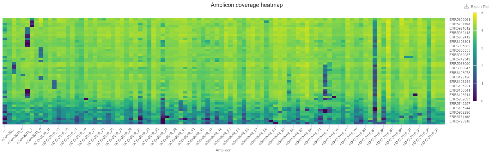
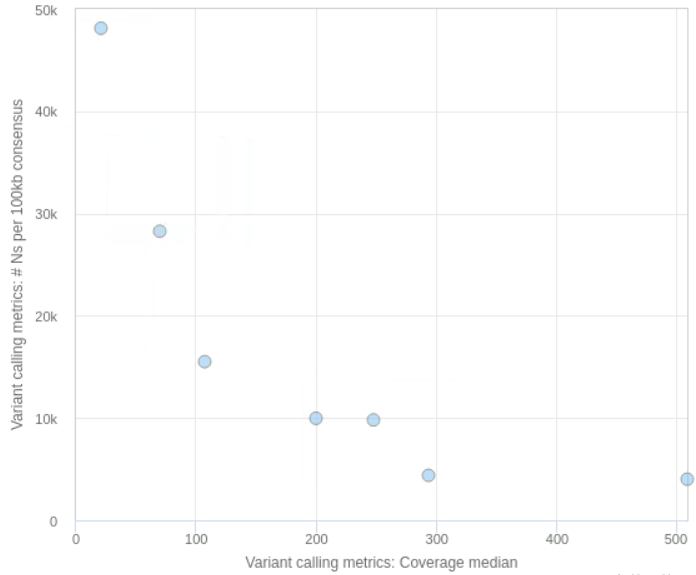

# Quality Control

:::{.callout-tip}
#### Learning Objectives

- Interpret and critically evaluate data quality reports from the assembled sequences and identify sequences suitable for downstream analyses.
:::


## Output Files

After running our pipeline, we get several output directories and files. 
The directories we get depend on which version of the workflow was used (Illumina or Nanopore). 
The description of the output is detailed in the [pipeline documentation](https://nf-co.re/viralrecon/2.6.0/docs/output). 
Although there are many output files, most of these contain results that are aggregated in an interactive _MultiQC_ report, which makes their analysis easier. 
We highlight some of the main files of interest below. 

:::{.panel-tabset group="platform"}
### Illumina

- The file `multiqc/multiqc_report.html` contains a MultiQC quality and analysis report for the consensus assemblies generated by the pipeline. 
- The folder `variants/bowtie2/` contains individual BAM files, which can be visualised with _IGV_ if we want to look at the reads mapped to the reference genome.
- The folder `variants/ivar/consensus/bcftools` contains individual FASTA files (named `*.consensus.fa`) for each sample's consensus genome sequence.
- The file `variants/ivar/variants_long_table.csv` contains a table with the aggregated results of all the variants detected in each sample. 


### Nanopore (FASTQ)

- The file `multiqc/medaka/multiqc_report.html` contains a MultiQC quality and analysis report for the consensus assemblies generated by the pipeline. 
- The folder `medaka/` contains:
  - Individual BAM files (named `*.primertrimmed.rg.sorted.bam`), which can be visualised with _IGV_ if we want to look at the reads mapped to the reference genome.
  - Individual FASTA files (named `*.consensus.fasta`) for each sample's consensus genome sequence.
  - A file called `variants_long_table.csv` with a table of all the variants detected in each sample. 
:::


## Quality Control {#sec-consensus-qc}

The `viralrecon` pipeline produces many quality control metrics, which are conveniently compiled in an interactive report with _MultiQC_, as mentioned above. 
We will not detail here every section of the report (check the [pipeline documentation](https://nf-co.re/viralrecon/2.6.0/docs/output) for a full description), but only highlight some of the sections that can be used for a first assessment of the quality of our samples.

### Variant Calling Metrics

The first section or the report - **Variant Calling Metrics** - contains a summary table with several statistics for each sample, including the total number of reads, the number/percentage of reads mapped to the reference genome, the depth of coverage, the number of SNPs (single-nucleotide polymorphisms) and INDELs (insertions/deletions), the number of missense variants (mutations that result in an aminoacid change) and the fraction of ambiguous bases 'N' per 100kb. 

Looking at these basic metrics gives us a good first idea of whether some of the samples have a high fraction of missing bases (marked as `N` in the FASTA file), leading to a poorer assembly. 
We can quickly check this by sorting the table by the column named "# Ns per 100kb consensus" (you can convert the values in this column to a percentage by dividing the numbers by 100).
There is also the ability to produce simple scatterplots from the data in this table, which can be useful to look at the relationship between the different metrics (see an example in the figure below). 

This table also contains information about the lineage/clade assigned to each sample by the programs _Pangolin_ and _Nextclade_. 
This gives us an idea of which samples may be more similar to each other, and where they fit in the global context of other sequences available publicly.
We will talk more about this topic in the [lineage assignment section](03-lineages.md). 

<!-- :::{.callout-warning}
#### Lineage Versions

Although the _Viralrecon_ pipeline runs _Pangolin_ and _Nextclade_ to perform lineage assignment, it does not use the latest version of these programs (because lineages evolve so fast, the nomenclature constantly changes). 
Therefore, this information should mostly be ignored at this stage, and instead we should run our analysis on the most up-to-date versions of these programs. 
We will detail this in the [Lineages and Variants](03-lineages.md) section of the materials. 
::: -->

![Snapshot of the "Variant Metrics" section of the `viralrecon` _MultiQC_ report. Simple scatterplots can be made from the data on this table using the <kbd>Plot</kbd> button. For example, at the bottom we show a scatterplot showing the relationship between the median depth of coverage and the number of ambiguous bases 'N' per 100kb. For the data in this example, we can see that when the average depth of coverage drops below around 200 reads we start getting higher number of missing bases in the assembly.](images/viralrecon_multiqc_variant_metrics.svg)

:::{.callout-note}
#### Terminology Alert!

The word **coverage** is sometimes used in an ambiguous way by bioinformaticians. 
It can mean two things:

- The number of reads aligning to a position of the genome. This is sometimes called **sequencing depth** or **depth of coverage** (we will use these terms in the materials to avoid confusion). For example, we may say that the average depth of coverage of the genome is 20x, meaning that on average there are 20 reads aligned to a position of the genome.
- The fraction of a genome that has a sufficient number of reads for analysis. For example, if 90% of the genome has a sufficient number of reads to be analysed (for example, at a threshold of 10x), we would say it has 90% coverage (we "covered" 90% of the genome with enough data). In the context of genome assembly, we sometimes use the word "coverage" to refer to the percentage of the consensus genome without ambiguous 'N' bases. 

**In the `viralrecon` _MultiQC_ report the word "coverage" is used to mean "depth of coverage".**
:::


### Amplicon Depth of Coverage {#sec-amplicon-coverage}

The next section of the report - **Amplicon Coverage Heatmap** - contains a graphical representation of the average depth of coverage for each PCR amplicon in the ARTIC protocol (i.e. the average number of reads mapped to each amplicon interval). 
This plot is extremely useful to identify common PCR dropouts occurring across many samples. 
This may be an indication that our PCR primer scheme is not working for some of the forms of the virus circulating in our population (for example due to mutations that accumulate in the primer site). 



We can investigate primer dropout in more detail, for example by looking at the BAM files with mapped reads using _IGV_. 

From our heatmap (shown in the Figure above) we can see one of the PCR fragments - _ncov-2019_83_ - seems to have poor amplification across many of our samples. 
Let's investigate this in more detail by looking at the alignment file:

- Open _IGV_ and go to <kbd>File → Load from file...</kbd>. 
- In the file browser that opens go to the folder `results/viralrecon/variants/bowtie2/` and select the file `GB36.ivar_trim.sorted.bam` to open it.
- Go back to <kbd>File → Load from file...</kbd> and this time load the BED files containing the primer locations. These can be found in `resources/primers/artic_primers_pool1.bed` and `resources/primers/artic_primers_pool2.bed`.

Once you have IGV open, you can navigate to the region where this amplicon is located by searching for the name of one of the primers - "ncov-2019_83_LEFT" - in the search box at the top. 
By zooming in to the region where this primer is located, we can see there is a mutation right at the start of this primer, which suggests that this may be the reason why this PCR fragment fails to amplify in this sample. 


## Mutation/Variant Analysis {#sec-mutations}

One of the output files produced by the pipeline is a **table SNP and indel variants detected in our samples** saved as a CSV file in **`variants/ivar/variants_long_table.csv`**. 
This table can be useful to investigate if particular mutations are particularly frequent in our samples and what their likely effects are.


The columns in this table are: 

- `SAMPLE` is the name of our sequenced sample.
- `CHROM` is the name of the "chromosome", which in our case is just the name of the reference genome ("MN908947.3").
- `POS` is the position of the genome where the mutation occurs.
- `REF` is the reference nucleotide.
- `ALT` is the alternative nucleotide, that is the nucleotide that was observed in our sample.
- `FILTER` indicates whether the SNP passed quality filters from the variant calling software ("PASS") or whether some other issue was observed (for example "dp" means that the depth of sequencing was unusually high or low).
- `DP` is the total depth of sequencing at this position, meaning how many reads in total were aligned there.
- `REF_DP` is the depth of sequencing of the reference allele, meaning how many reads contained the reference nucleotide.
- `ALT_DP` is the depth of sequencing of the alternative allele, meaning how many reads contained the alternative nucleotide.
- `AF` is the allele frequence of the alternative allele, meaning the proportion of reads that contained the alternative nucleotide (this column is equivalent to `ALT_DP`/(`ALT_DP` + `REF_DP`)).
- `GENE` is the name of the gene in the SARS-CoV-2 annotation.
- `EFFECT` this is the predicted effect of the mutation in the gene. This output comes from the `snpeff` software and uses [The Sequence Ontology](http://www.sequenceontology.org/browser/obob.cgi) nomenclature (follow the link to search for each term).
- `HGVS_C`, `HGVS_P` and `HGVS_P_1LETTER` is the DNA or amino acid change using [HGVS nomenclature](https://hgvs-nomenclature.org/stable/). For example, "c.1112C>T" means a C changed to a T at position 1112 of the genome; and "p.Pro371Leu" would mean that a Proline changed to a Leucine at position 371 of the respective protein. 
- `CALLER` is the software used for variant calling.
- `LINEAGE` is the Pangolin lineage that the sample was assigned to. Note that this column should usually be ignored, since `viralrecon` doesn't use the latest _Pangolin_ data version by default.

This table can be opened in a spreadsheet program such as _Excel_ to look at particular features. 
In terms of quality-control, we can filter the table: 

- for mutations with **intermediate allele frequency** (say < 70%) -- if a sample has too many such mutations, that could indicate cross-contamination between samples. 
- for **frameshift mutations** -- these mutations should be rare because they are highly disruptive to the functioning of the virus, and their occurrence is more often due to errors. 
  The presence of these mutations are usually not critical for downstream analysis (such as lineage assignment and phylogenetics), but we should make a note that these mutations may be false-positives in our data.

This variants/mutations table can also be used to explore reasons for amplicon dropout. 
For example, we can identify how many samples contain the mutation we previously saw in the "_ncov-2019_83_LEFT_" primer (we saw this was in position 25,003 of the genome). 
We can do this by sorting our table by the column "POS" (position) and then scrolling down to find the samples with this mutation. 
We will find that only 3 of the samples contain this mutation, suggesting some other additional causes are leading to the dropout in this PCR fragment.

Finally, for the **Illumina pipeline** (`--platform illumina`), it is important to note that not all of the mutations on this table are included in the final consensus. 
Only mutations with allele frequency >75% (`AF` >= 0.75) and minimum depth of 10 (`DP` >= 10) are retained in the final consensus. 
Therefore, to see which mutations are actually present in our consensus sequences, we need to filter this table for these criteria. 
Again, we note that this only applies to the Illumina pipeline. 
For the **Nanopore pipeline** (`--platform nanopore`) all the mutations included in this table are retained in the consensus sequence. 

:::{.callout-warning}
#### ORF1b Annotation Issues

The annotation of the _ORF1b_ gene had some changes between the first original assembly and newer versions of this annotation. 
In particular, there is a frameshift that is not considered in the annotation used by most software, and this causes a discrepancy in the results between `viralrecon` and other tools such as _Nextclade_ (which we will cover in the next section).

This issue is [under investigation](https://github.com/nf-core/viralrecon/issues/263) by the developers of `viralrecon` and may be corrected in future versions of the pipeline.

For now, the advice is to **ignore the variant effects of ORF1b** as these correspond to an older version of the annotated gene. 
:::

:::{.callout-note}
#### Keep Original Files Intact

When you analyse the results of a CSV file in a spreadsheet software (such as Excel), it may be a good idea to create a copy of your file to avoid accidentally modifying the original table. 
For example, if you accidentally sort one column of the table but forget to sort other columns, of if you accidentally filter the results and delete some of the rows from the table, etc. 

You can save a copy of the file by going to <kbd>File → Save As...</kbd>. 
You may want to save the copy as an Excel file format, to include graphs and colours. 
(Remember that the CSV format is a plain text file - it does not support graphs or coloured cells.)
:::


## Cleaning FASTA Files (Optional)

To proceed with our analysis, we need a FASTA file containing _all_ of our consensus sequences.
However, our `viralrecon` pipeline outputs _separate_ FASTA files for each sample. 
We can see this by running (from within the `uk_illumina/` directory): 

```bash
ls results/viralrecon/variants/ivar/consensus/bcftools/
```

Also, the workflow modifies our original sample names in the FASTA file, by adding extra information to the sequence name. 
For example:

```bash
head -n 1 results/viralrecon/variants/ivar/consensus/bcftools/ERR5728910.consensus.fa
```

```
>ERR5728910 MN908947.3
```

What we want to do is clean these sample names, so that we end up with:

```
>ERR5728910
```

We also want to make sure to combine all the samples into a single FASTA file. 

We can the command `cat` to combine (_concatenate_) the individual files and the `sed` command to substitute text and clean our sample names. 
Let's do this step by step.

First, we can use the `*` _wildcard_ to combine all the FASTA files with the `cat` command:

```bash
cat results/viralrecon/variants/ivar/consensus/bcftools/*.fa
```

Running this command will print all of the sequences on the screen!
To see what happened a little better, we could _pipe_ this command to `less` to browse up-and-down through the file:

```bash
cat results/viralrecon/variants/ivar/consensus/bcftools/*.fa | less
```

We could also check that we now have all our samples combined, we could pass the results to `grep` and search for the word `>`, which in the FASTA format indicates the sequence name:

```bash
cat results/viralrecon/variants/ivar/consensus/bcftools/*.fa | grep ">" | wc -l
```

This should give us 7 as the result (which makes sense, since we have 7 samples). 

We can now proceed with cleaning the names of the sequences, by using `sed`:

```bash
cat results/viralrecon/variants/ivar/consensus/bcftools/*.fa | sed 's| MN908947.3||' > results/clean_sequences.fa
```

Notice that in this last command we make sure to redirect the result to a new file using `>`.


## Missing data intervals

When we align reads to the reference genome, there may be regions that we were not able to sequence (e.g. due to amplicon dropout, discussed above) and therefore cannot tell what the base sequence in those positions is. 
In those cases, the `viralrecon` pipeline includes the missing character 'N' in the sequence. 

As a further quality check, it is useful to check how many contiguous intervals of missing bases we have in each of our assemblies, as well as how long those intervals are. 
For example, for this small sequence: 

```
T A N N N G C T N N A T
```

We have two missing intervals, from positions 3-5 and from positions 9-10. 

To obtain a list of missing intervals in a sequence, we can use the software `seqkit`, which is a toolkit of commands to do many operations on FASTA/FASTQ files ([check out its documentation](https://bioinf.shenwei.me/seqkit/usage/)). 
In particular, we can use the following command:

```bash
seqkit locate -i -P -G -M -r -p "N+" results/clean_sequences.fa
```

```
seqID  patternName  pattern  strand  start  end
GB09   N+           N+       +       1      342
GB09   N+           N+       +       9246   9502
GB09   N+           N+       +       10738  11331
GB09   N+           N+       +       21428  21543
GB09   N+           N+       +       27400  27462
GB09   N+           N+       +       27618  27644
GB09   N+           N+       +       29827  29893

... more output omitted...
```

The output is a tabular file specifying the consensus sequence name (first column) and the location of intervals in the genome where the pattern of one or more "N" were found. 

To see what all the options we used with this command are, see the [tool's documentation](https://bioinf.shenwei.me/seqkit/usage/#locate).


## Exercises

:::{.callout-exercise}
#### Quality control for India (ONT) samples

Now it's your turn to check the quality of the assembled genomes from our India samples, sequenced using Nanopore. 
For this exercise, we will use the results produced by `viralrecon` on 48 pre-processed samples:

1. Use the file explorer <i class="fa-solid fa-folder"></i> to open the folder `preprocessed`, and then:
   - Open the file in `pipeline_info/execution_report_DATE.html` (where "DATE" is the date when the files were processed).
   - How long did the workflow take to run?
   - Which step of the pipeline took the longest to run?
2. Open the _MultiQC_ report found in `preprocessed/multiqc/medaka/multiqc_report.html` and answer the following questions: 
   - Produce a plot between median depth of coverage (x-axis) and #Ns (y-axis). What do you think is the average coverage needed for <10% of missing data. 
   - Were there any PCR amplicons with a dropout (i.e. very low depth of coverage) across multiple samples?
   - Do any of these dropout amplicons coincide with gene "S" (Spike protein gene)? Note: you can see the ARTIC PCR primer location from the [online repository](https://github.com/artic-network/artic-ncov2019/blob/master/primer_schemes/nCoV-2019/V3/nCoV-2019.bed) and the gene locations in the [SARS-CoV-2 NCBI genome browser](https://www.ncbi.nlm.nih.gov/projects/sviewer/?id=NC_045512).
3. Based on any amplicons that you identified in the previous question, find if there are any mutations coinciding with their primer locations. You can use the mutation variant table in `preprocessed/medaka/variants_long_table.csv`.
4. With the mutation variants table open in a spreadsheet program (LibreOffice on our training machines):
   - Use the filter button <svg stroke="grey" fill="grey" stroke-width="0" viewBox="0 0 512 512" height="15" width="15" xmlns="http://www.w3.org/2000/svg"><path d="M487.976 0H24.028C2.71 0-8.047 25.866 7.058 40.971L192 225.941V432c0 7.831 3.821 15.17 10.237 19.662l80 55.98C298.02 518.69 320 507.493 320 487.98V225.941l184.947-184.97C520.021 25.896 509.338 0 487.976 0z"></path></svg> to look for mutations in gene "S" (encodes for the Spike protein). 
   - Identify the samples and positions of mutations of the type "disruptive_inframe_deletion". 
   - Using IGV, open the BAM file for one of those samples. Note: BAM files are located in `preprocessed/medaka/SAMPLE.primertrimmed.rg.sorted.bam` (were 'SAMPLE' is the sample name). 
   - Go to the location of those mutations. From the read alignment, how confident are you about it? What could you do to confirm it?

:::{.callout-answer}
**Question 1**

We open the file found in `preprocessed/pipeline_info/execution_report_2022-05-04_12-41-12.html`, which contains information about the pipeline that was run on a set of 48 samples.
We can see at the top of the report that it took ~15 minutes to run. 
This report also gives us information about how long each individual step of the pipeline took the longest to run (and other information such as which used more CPU or RAM memory). 
For example, in the section "Job Duration" we can see a graph that looks like this:


This indicates that the step running the `artic minion` tool takes the longest. 
This is not surprising as this is the step where most of the work is happening (mapping, primer trimming and making a consensus sequence). 
You can revise the steps of the workflow in the respective section above.

----

**Question 2**

When opening the _MultiQC_ report, we can see the first section contains a table with several statistics about the quality of each sample. 
We can produce a plot from this table, by pressing the "Plot" button above the table. 
The plot we were asked for is the following: 



The y-axis of the plot tells us the number of 'N' per 100kb of sequence. 
If we divide those numbers by 100 we get a percentage and from these samples it seems like a median depth of coverage of around 200 reads generates samples with less than 10% of missing bases. 

From the section of the report "Amplicon coverage heatmap" we can see the average depth of coverage for each PCR amplicon from the ARTIC protocol. 
There are 3 amplicons in particular that have very low depth of coverage: nCoV-2019_51, nCoV-2019_62 and nCoV-2019_95.

We can check the [ARTIC V3 primer BED file online](https://github.com/artic-network/artic-ncov2019/blob/master/primer_schemes/nCoV-2019/V3/nCoV-2019.bed) to look at the location of these primers, or we could look for it using command-line tools. 
Here is an example: 

```bash
cat resources/primers/artic_version3_pool*.bed | grep "_51_"
```

```
MN908947.3      15171   15193   nCoV-2019_51_LEFT       1       +
MN908947.3      15538   15560   nCoV-2019_51_RIGHT      1       -
```

For this example, we can see the amplicon is between positions 15171 - 15560 of the genome.
Looking at the [SARS-CoV-2 NCBI genome browser](https://www.ncbi.nlm.nih.gov/projects/sviewer/?id=NC_045512), we can see this coincides with _ORF1ab_. 
If we do the same analysis for the other primers, we will see that none of them coincides with gene S.

----

**Question 3**

To investigate whether this amplicon dropout is due to mutations in the primer regions we can open the mutations table `preprocessed/medaka/variants_long_table.csv`. 
If we sort the table by the column "POS", we can scroll to the location of each primer pair. 

We can see that in only one case there is a mutation coinciding one of the primers: in sample "IN33" position 28687 there is a `C > T` mutation, which coincides with primer nCoV-2019_95_LEFT.
However, this only occurs for one of the samples, suggesting the reason for the PCR dropout might be related to other factors. 

----

**Question 4**

After filtering our table for gene _S_ (Spike gene), we can see only a couple of mutations of type "disruptive_inframe_deletion" in some of the samples at positions 21764 and 21990. 
To look at the reads with this mutation, we open the BAM file for one of these samples in _IGV_ (for example sample IN22): 

- Go to <kbd>File → Load from file...</kbd>. 
- In the file browser that opens go to the folder `preprocessed/medaka` and select the file `IN22.primertrimmed.rg.sorted.bam` to open it.
- In the search box we can type "NC_045512.2:21990" which will zoom-in on the region around the deletion.

From looking at the reads aligned to this position of the genome, we can see several of them containing a 3bp deletion. 
However, we can also see some reads that do not contain the deletion, and others that seem to be mis-aligned. 
If we were interested in confirming this mutation, we could do an independent PCR followed by Sanger sequencing, for example.

Although this was not part of the question, it is also worth noting that the primer "nCoV-2019_73_LEFT" starts very near this deletion. 
In the MultiQC report, we can see that this PCR amplicon had very poor amplification in this sample. 
One possibility is that the deletion interfered with the primer efficiency in this sample. 

Generally, we don't need to confirm every single mutation obtained from our analysis. 
But if we see a mutation occurring many times, then it may be worth further investigation, especially if it is disruptive and in an important gene such as the Spike gene. 

:::
:::

:::{.callout-exercise}
#### Clean FASTA file: ONT data

In this exercise we will create a clean FASTA file for the samples collected in India. 

In this case, the output FASTA files are in the folder `results/viralrecon/medaka` and have the file extension `.fasta`.
If we look at one of the files:

```bash
head -n 1 results/viralrecon/medaka/IN42.consensus.fasta
```

```
>IN42/ARTIC/medaka MN908947.3
```

We can see that the name has a lot of extra information attached to it. 
We want to clean the name of the sequences so that the result is:

```
>IN42
```

The following `sed` command can be used to _substitute_ the text "/ARTIC/medaka MN908947.3" with nothing: 

```bash
sed 's|/ARTIC/medaka MN908947.3||'
```

- Pipe the tools `cat` and `sed` to construct a command that generates a new file called `results/clean_sequences.fa` containing all the sequences with "clean" sequence names. 


:::{.callout-answer}

The complete code to achieve the desired outcome is:

```bash
cat results/viralrecon/medaka/*.consensus.fasta | sed 's|/ARTIC/medaka MN908947.3||' > results/clean_sequences.fa
```

Look at our [companion Unix course materials](https://cambiotraining.github.io/unix-shell/materials/04-misc/01-sed.html) for more information about how the `sed` command works.

:::
:::


## Summary

:::{.callout-tip}
#### Key Points
- The output of the pipeline includes, among others:
  - A detailed _MultiQC_ report, including information about genome coverage, the depth of sequencing for each amplicon, as well as other quality metrics that can help to troubleshoot problematic samples.
  - A table with SNP and indel mutation variants identified in each sample. 
  - Information about SARS-CoV-2 lineages/clades/variants, which is detailed in the [next section](03-lineages.md).
:::