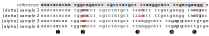
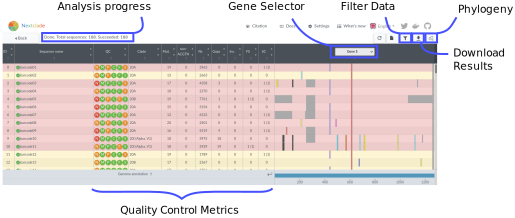
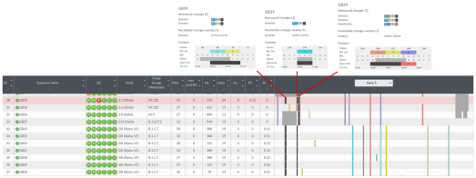

# Lineages and variants

:::{.callout-tip}
#### Learning Objectives

- Understand variant annotation conventions used by Gisaid, Pango, Nextstrain and WHO and how they relate to each other. 
- Assign sequences to Pango lineages using `pangolin`.
- Interactively explore mutations in the assembled genomes and their phylogenetic context using _Nexstrain_'s tools.
:::


<!-- :::{.callout-note}
#### Slides

This section has an accompanying <a href="https://docs.google.com/presentation/d/1urubrzjF6VzpWfknqnYMjbMcIQwcO2p1OQSE9-paAUI/edit?usp=sharing" target="_blank">slide deck</a>.
::: -->


## SARS-CoV-2 Variants {#sec-lineages}

As viruses (or any other organism) evolve, random DNA changes occur in the population, for example due to replication errors.
Many of these changes are likely to be _neutral_, meaning that they do not change the characteristics of the virus in any significant way. 
Neutral changes tend to _drift_ in the population, increasing or decreasing in frequency in a random way, but most likely end up disappearing due to their low starting frequency in the population. 

On the other hand, _advantageous mutations_ can occur, which lead to changes in the characteristics of the virus that are beneficial for its spread in the population (e.g. high transmissibility, resistance to immune response or vaccines, etc.). 
Such beneficial mutations will therefore experience _positive selection_, potentially leading to their increase in frequency in the population as they spread to more and more hosts. 

Viruses carrying those advantageous mutations may, over time, aquire other advantageous mutations that further increase their fitness and, therefore, their frequency in the population.
One way to visualise this is by looking at a _phylogenetic tree_ showing the relationship between sequences (based on their similarity) and how groups of sequences change over time.

. Colours show different Nextstrain clades. (Screenshot taken Feb 2022)](images/lineages_example.svg)

In the figure above, which shows SARS-CoV-2 samples from across the world, we can see groups of similar sequences rapidly "expanding" at certain points in time. 
Such groups of sequences, which share a collection of DNA changes, are referred to as SARS-CoV-2 _variants_ (see box below about the ambiguous meaning of this term).
In an effort to understand the spread of the virus and monitor situations of increased occurrence of such variants, several groups and institutions have developed a system to classify groups of SARS-CoV-2 sequences as _variants of interest_ and _variants of concern_. 

A full explanation and definitions of such variants is given in the [World Health Organisation (WHO) variants page](https://www.who.int/en/activities/tracking-SARS-CoV-2-variants)
The main classification systems currently in use are: 

- [GISAID clades](https://www.gisaid.org/references/statements-clarifications/clade-and-lineage-nomenclature-aids-in-genomic-epidemiology-of-active-hcov-19-viruses/)
- [Nextstrain clades](https://github.com/nextstrain/ncov/blob/master/defaults/clades.tsv)
- [Pango lineages](https://cov-lineages.org/lineage_list.html)
- [World Health Organisation (WHO) variants](https://www.who.int/en/activities/tracking-SARS-CoV-2-variants)

In practice, there is a big overlap between these different nomenclature systems, with WHO variants having a direct match to Pango lineages and Nextstrain clades. 
In fact, the different teams work together to try and harmonise the nomenclature used, and thus facilitate the interpretation of sequence analysis.

The two most popular systems - _Nextclade_ and _Pangolin_ - have slightly different levels of resolution. 
_Nextclade_'s [nomenclature system](https://nextstrain.org/blog/2021-01-06-updated-SARS-CoV-2-clade-naming) was developed to highlight diversity patterns at a larger scale, allowing discussions of SARS-CoV-2 diversity at a global level and over larger time scales. 
On the other hand, _Pangolin_'s [nomenclature system](https://www.pango.network/the-pango-nomenclature-system/statement-of-nomenclature-rules/) is more fine-grained, aiming to follow the dynamics of the pandemic as it unfolds. 
The two systems are complementary to each other, and our analysis of SARS-CoV-2 sequences should include both tools. 

:::{.callout-note}
#### What is a variant?

It is important to note that the term _variant_ can be sometimes ambiguous. 

The term "**SARS-CoV-2 variant**" usually refers to the [WHO definition of variants of concern/interest](https://www.who.int/en/activities/tracking-SARS-CoV-2-variants/) (e.g. the Alpha, Delta and Omicron variants), which includes sequences containing a _collection of several nucleotide changes_ that characterise that group.
According to this definition, we have two variants in the example below (samples 1 & 2 are one variant and samples 3 & 4 another variant).



However, in bioinformatic sequence analysis, a **sequence variant** refers to an individual change in the DNA sequence (a SNP or an insertion/deletion). 
Using this definition, in the example above we have 5 variants: 3 SNPs and 2 indels. 
In the [Consensus Sequence](01-consensus.md) section, we saw that one of our workflow steps was "variant calling". 
This was the definition of variant we were using: identifying individual SNPs and/or indels relative to the reference genome, from our sequencing data.
This is also reflected in the one of the common file formats used to store SNP/indel information, the [_VCF_ file](https://en.wikipedia.org/wiki/Variant_Call_Format), which means "Variant Call Format". 

Sometimes the term "mutation" is used to refer to SNP/indel variants.
For example see this [definition from the COG consortium](https://www.cogconsortium.uk/what-do-virologists-mean-by-mutation-variant-and-strain/). 

Because of this ambiguity, the terms "lineages" or "clades" are often used instead of "variants" when referring to groups of similar SARS-CoV-2 sequences, because they have a phylogenetic interpretation.
:::

## Pangolin


The first tool we will cover is called `pangolin` and uses the [Pango nomenclature system](https://cov-lineages.org/).
The main steps performed by this tool are:

- Multiple sequence alignment of our samples against the _Wuhan-Hu-1_ reference genome, using the `minimap2` software.
- Assigning our sequences to lineages based on the current global phylogeny. Two methods/software are available:
  - _pangoLEARN_ (default) uses a pre-trained machine learning model.
  - _UShER_ uses a more classic parsimony-based method, but highly optimised for working with large numbers of sequences.
- Classifying our sequences according to the WHO nomenclature of variants of interest/concern using the `scorpio` software.

Although _Pangolin_ can run as part of the `nf-core/viralrecon` pipeline we used, we recommended to turn this option off. 
The reason is that the model to classify variants regularly changes over time, as more public sequences become available and the nomenclature rules updated. 
Therefore, it important to always run the samples through the latest _Pangolin_ version available. 

_Pangolin_ can be run from the command line, using two steps: 

- Updating the data used for lineage/variant classification. 
- Running the actual lineage assignment step. 

On our example data, these would be the commands: 

```bash
# update pangolin data
pangolin --update-data

# run pangolin
pangolin --outdir results/pangolin/ --outfile pango_report.csv results/clean_sequences.fa
```

- The first command downloads the latest version of the lineages and their characteristic mutations from the Pango classification system. 
- The second command runs the FASTA file of consensus genomes through _Pangolin_'s classification algorithm. 
  - `--outdir` is used to define the directory to save the results in.
  - `--outfile` is used to give the file a name of our choice. 

The output is a CSV file, with several columns of interest, including WHO variants of concern identified using the _Scorpio_ software. 
A detailed explanation of the columns of this file is given in the [_Pangolin_ documentation page](https://cov-lineages.org/resources/pangolin/output.html).

More information about running _Pangolin_ from the command line can be found in [its online documentation](https://cov-lineages.org/resources/pangolin.html).


### Web Application

This tool can also be run separately using a [web application](https://pangolin.cog-uk.io/), which only requires us to provide with a FASTA file of consensus sequences. 
This may desirable to re-run samples using the latest version of the _Pangolin_ software and SARS-CoV-2 variant databases.

The results from the web application can be downloaded as a CSV file, which contains a table similar to the one obtained from our command above (some of the column names are different, but their meaning is the same). 


## Nextclade


Another system of clade assignment is provided by `nextclade`, which is part of the broader software ecosystem [_Nextstrain_](https://clades.nextstrain.org/). 

_Nextclade_ performs similar steps to _Pangolin_, with some differences in the algorithms that are used:

- Each sequence is aligned with the _Wuhan-Hu-1_ reference genome using a local alignment algorithm.
- Samples are placed in the global phylogeny using a distance-based metric (placing the sequence on the tree where it has the highest similarity with).
- Clade assignment is done based on the previous phylogeny placement step.

You can find more details about _Nextclade_'s methods on [its documentation](https://docs.nextstrain.org/projects/nextclade/en/stable/user/algorithm/index.html).
_Nextclade_ also provides several quality control metrics, which are very useful to identify problematic samples. 

As we discussed above, the models and clades are regularly updated, so we also skipped this step when we ran the `nf-core/viralrecon` pipeline. 
Instead, we can run this tool directly from the command line, by first making sure to download the most up-to-date clade information.
Here are the commands: 

```bash
# get nextclade data
nextclade dataset get --name sars-cov-2 --output-dir resources/nextclade_background_data

# run nextclade
nextclade run --input-dataset resources/nextclade_background_data/ --output-all results/nextclade results/clean_consensus.fa
```

- The first command (`nextclade dataset get`) downloads the latest version of the Nextclade dataset for SARS-CoV-2 (option `--name sars-cov-2`). 
  We define the directory to store this information with `--output-dir`. 
- The next step is to run the actual clade assignment on our data. 
  We use the database from the previous step as `--input-dataset`, we define a directory to output all the results with `--output-all` and at the end of the command we give as input our clean FASTA consensus genomes. 

More information about running _Nextclade_ from the command line can be found in [its online documentation](https://docs.nextstrain.org/projects/nextclade/en/stable/user/nextclade-cli/index.html).

### Web Application

_Nextclade_ offers an interactive application, which can be used to run its analysis on a FASTA file with sequences:

- Go to [nextclade.org](https://clades.nextstrain.org/).
- Click **Select a file** to browse your computer and upload the FASTA file with the cleaned consensus sequences (`results/clean_sequences.fa`).
- _Nextclade_ will automatically detect your data are from SARS-CoV-2, but if not you can select this organism.
- Click **Run**.

Nextclade will show a progress of its analysis at the top of the page, and the results of several quality control metrics in the main panel (see Figure). 



:::{.callout-note}
#### Nextclade and data privacy

When using the _Nextclade_ web application, the data does not leave your computer, so privacy concerns are not an issue. 
:::


## Exercises

:::{.callout-exercise}
#### Nextclade

In this exercise we will work with 48 consensus sequences from the UK, processed with the `nf-core/viralrecon` pipeline and covered in the [previous section](01-consensus.md).

Go to [nextclade.org](https://clades.nextstrain.org/) and load the sequences provided in `uk_illumina/preprocessed/clean_sequences.fa`.

1. Are there any samples that were classified as "bad" quality? If so, what is the main reason?
2. Sort the table by the "Clade" column. Looking at the mutations in gene S on the right, you can see that all sequences classified as "Alpha" have a deletion in positions 21992-21994. Samples classified as "Delta" do not have this deletion and instead have a deletion in positions 22029-22034. However, there is one exception: sample GB39, classified as "Delta" has both deletions. Investigate if this mutation is accurate using IGV:
    - Open the BAM alignment file for this sample (the alignment file is in `results/viralrecon/variants/bowtie2/GB39.ivar_trim.sorted.bam`). 
    - Open the BAM alignment file for one of the "Alpha" samples as a comparison.
    - Open the ARTIC primer files (two BED files found in `resources/primers/`).
    - Go to the position where this deletion was identified and investigate if it seems clear from the mapped reads.


:::{.callout-answer}

**Question 1**

After loading the samples to the Nextclade web application, we can see that, generally, these samples have high quality as very few are highlighted by _Nextclade_'s analysis.

Sorting the table by the "QC" column, we can see two samples with bad quality (red) and one with mediocre quality (yellow). 

There are separate reasons for the two bad quality samples:

* Sample GB16 has low quality due to a high number of missing bases.
* Sample GB39 has low quality due to the occurrence of too many "private mutations". These are mutations that are only found in this sample, compared to other samples present in _Nextclade_'s background sequence tree. As we don't usually expect too many new mutations to occur in a new sample (the mutation rate of SARS-CoV-2 is around 2 new mutations per month), the occurrence of too many private mutations could indicate sequencing quality issues. 


**Question 2**

Sort the table by the "Clade" column. Looking at the mutations in gene S on the right, you can see that all sequences classified as "Alpha" have a deletion in positions 21992-21994. Samples classified as "Delta" do not have this deletion and instead have a deletion in positions 22029-22034. However, there is one exception: sample GB39, classified as "Delta" has both deletions. Investigate if this mutation is accurate using IGV:

- Open the BAM alignment file for this sample (the alignment file is in `preprocessed/variants/bowtie2/GB39.ivar_trim.sorted.bam`). 
- Open the BAM alignment file for one of the "Alpha" samples as a comparison.
- Open the ARTIC primer files (two BED files found in `resources/primers/`).
- Go to the position where this deletion was identified and investigate if it seems clear from the mapped reads.

By sorting the table by "Clade", we can see that although sample GB39 was classified as a _Delta_ variant, it has two deletions in gene S that are present in _Alpha_ variants, as shown in this snapshot (click the image to view a bigger size):

<div class="img">
  <a href="images/nextclade_deletion_example.svg" target="_blank">
    
  </a>
</div>

As we investigate one of these in more detail from the BAM file (opening it in IGV), we can see that there is an inconsistency between reads coming from the PCR fragment "nCoV-2019_72" and those reads coming from the "nCoV-2019_73" fragment. 
In some of those reads the deletion is present, but in others it is not. 
If we look at an _Alpha_ variant sample (for example GB43) we can see that this deletion is present in both cases. 


If we thought this sample was crucial for public health investigation, then this would require further investigation by doing a PCR with new primers and Sanger-sequencing the fragment, for example. 

:::
:::


## Summary

:::{.callout-tip}
#### Key Points

- Groups of similar SARS-CoV-2 sequences are classified into lineages or clades by different groups. The main nomenclature systems in use are _Nextstrain_, _Pangolin_ and _GISAID_. 
- In addition, the World Health Organisation (WHO) classifies some forms of SARS-CoV-2 as _variants of concern_ or _variants of interest_. These are forms of the virus that have been determined to have a significant public health impact. 
- Both _Pangolin_ and _Nextclade_ assign consensus sequences to lineages/clades and additionally identify those that correspond to WHO variants of concern. Both of these are run as part of the `nf-core/viralrecon` pipeline, but can also be run using a web application:
  - [_Pangolin_ web application](https://pangolin.cog-uk.io/)
  - [_Nextclade_ web application](https://clades.nextstrain.org/)
- Besides clade assignment and variant classification, _Nextclade_ provides additional analysis such as identification of mutations and quality control metrics that can be used to identify problematic samples. 

:::

