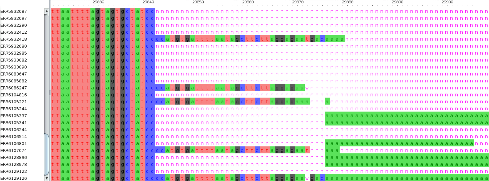

# Building phylogenetic trees

:::{.callout-tip}
#### Learning Objectives

- Understand the basics of how phylogeny trees are constructed using maximum likelihood methods.
- Describe what branch lengths represent in typical SARS-CoV-2 phylogenetic tree. 
- Recognise the limitations and challenges in building phylogenies for SARS-CoV-2.
- Use _MAFFT_ to produce a multiple sequence alignment.
- Use _IQ-Tree_ for phylogenetic tree inference.
- Use _TimeTree_ to obtain time-scaled phylogenetic trees using sample collection date metadata.
:::

:::{.callout-note}
#### Slides

This section has an accompanying <a href="https://drive.google.com/file/d/19MCiM8JhWgtSwvQdotfJRlyv7Z7CVJwz/view?usp=sharing" target="_blank">slide deck</a>.
:::

<!--
## Phylogenetics Basics

TODO: 

- brief intro to phylogenetics, based on Nicola's presentation. 
- Mention interpretation of branch length in particular SARS-CoV-2 has ~2 mutations per month (probably replication errors), leading to very short branch lengths and polytomies. 
- Note about bootstraping - should probably be avoided, since there are usually too few sites for meaningful results. 


- Multifurcations happen when several samples have the same sequence, so the branch lengths between them are zero, so they all collapse to a single node. This can happen for example if you have a local outbreak of a variant where every sample has the same variant.
- Recombination can cause problems in phylogenies. This is when two viral sequences recombine with each other, so now the new sequence has part of its genome closely-related to one parent and the other from the other parent. This can cause problems with phylogenetic trees. There are software that can detect recombination events. In particular the software RIPPLES can work with large sample sizes.

### Alignment

To build a phylogenetic tree we need to start with all our sequences aligned to each other. 
The alignment might result in _gaps_ in some sequences, where missing nucleotides in some sequences are represented with `-` character. 
The alignment is usually stored as a FASTA file, and all sequences have to be of the same length (because they are aligned to each other). 

Gaps (`-`) and ambiguous positions (`N`) are treated as missing data by the phylogenetic methods. 

Something to note is that phylogenetic inference assumes that the alignments we give are correct. 
However, errors in the consensus sequence or missing data can sometimes lead to poor alignments.
One thing to pay attention to is whether there are very long branches in our trees, suggesting a sample with an unusual high number of mutations. 
Inspecting these samples may reveal errors in the alignment, for example due to high proportion of missing data that leads to poor alignments, which may result in false variable positions. 

Other errors are harder to detect but work from Turakaia et al was able to build a collection of recurrent errors that affect phylogenies.


### Tree Inference

There are broadly three types of methods: 

- distance
- parsimony
- maximum likelihood

#### Distance Phylogenies

These methods rely on calculating the distance between each pair of sequences.
Popular methods of this kind are _neighbour-joining_ (NJ) or 

#### Maximum Parsimony

Infers a tree that requires the fewest number of mutations needed along each branch of the tree to explain the data. 

This method can be inaccurate when there are long branches in the tree (this problem is referred to as "long branch attaction"). 
However, for SARS-CoV-2 this is not a big problem, because the sequences tend to be very similar to each other. 

In fact, a recent tool called _UShER_ has been developed for SARS-CoV-2 analysis using a parsimony-based method. 
This tool was developed to be very efficient at working with millions of samples, which is harder with maximum likelihood methods. 

#### Maximum Likelihood

- Uses a probabilistic model for genome evolution.
- Model of evolution:
  - DNA substituion model
    - JC69 assumes only one mutation rate
    - HKY85 assumes different mutation rates (transitions have different rates)
    - GTR is another one
  - Rate heterogeneity:
    - Invariant sites - the model will assume that a certain proportion of the sites in the genome might never change.
    - Rate variation (Gamma models used) - the model will assume that different sites of the genome might evolve at different rates.
- Generally, more complex models give better results (but are more computationally demanding and require more data)
-  
-->

## SARS-CoV-2 Phylogeny


Building phylogenetic trees for SARS-CoV-2 is challenging due to the large number of sequences available, with [millions of genomes submited to GISAID](https://www.gisaid.org/index.php?id=208) to this day. 
This means that using maximum-likelihood inference tools to build a global SARS-CoV-2 phylogeny is both time-consuming and computationally demanding. 

However, several researchers have dedicated their time to identifying tools and models suitable for the phylogenetic analysis of this organism. 
For example, the [global phylogenies repository](https://github.com/roblanf/sarscov2phylo) from Rob Lanfear provide with several tips on building phylogenetic trees for this organism.
Their trees are regularly updated and available to download from the GISAID website (which requires an account). 

Global phylogenies are also available from the groups of Russell Corbett-Detig and Yatish Turakhia, who have developed [efficient methods and tools](https://doi.org/10.1093/molbev/msab264) for dealing with large phylogenies. 
These tools include _UShER_ and _matUtils_, introducing a new and efficient file format for storing phylogenetic trees, mutations and other annotations (such as lineages) called _mutation-annotated trees_ (MAT format). 
Their phylogenies are updated daily and are [publicly available for download](http://hgdownload.soe.ucsc.edu/goldenPath/wuhCor1/UShER_SARS-CoV-2/). 
(Note: Course materials covering these tools are still under development.)

Two popular tools used for phylogenetic inference via maximum-likelihood are **_FastTree_** and **_IQ-Tree_**.
Generally, when building a tree from a collection of samples you can include the Wuhan-Hu-1 reference sequence as an outgroup to root the tree. 
Optionally, you can also add a collection of sequences from around the world (and across time) to contextualise your samples in the global diversity. 

As an input, these programs need a _multiple sequence alignment_ FASTA file, which is where we start our analysis.

:::{.callout-note}
#### Data for this section

We will work from the course materials folder called `04-phylogeny`, which contains the following files: 

- `data/uk_consensus.fa` and `data/india_consensus.fa` are consensus sequences from the UK and India, respectively. These are the sequences previously assembled using the `nf-core/viralrecon` pipeline. 
- `sample_annotation.tsv` is a tab-separated values (TSV) file with information about each sample such as the date of collection and lineage/clade they were assiged to from our analysis. We will use this table to annotate our phylogenetic trees. This table can also be opened in a spreadsheet program such as Excel. 
- `resources/reference/sarscov2.fa` is the reference genome. 
:::


## Alignment {#sec-mafft}

The first step in building a phylogenetic tree is to produce a multiple sequence alignment from all our consensus sequences. 
This is the basis for building a phylogenetic tree from the positions that are variable across samples. 

A widely used multiple sequence alignment software is called **_MAFFT_**.
For SARS-CoV-2, a reference-based alignment approach is often used, which is suitable for closely-related genomes. 
MAFF provides this functionality, which is detailed in its [documentation](https://mafft.cbrc.jp/alignment/software/closelyrelatedviralgenomes.html).

We demonstrate the analysis using the UK samples in our course materials. 
First, start by creating a directory for the output:

```bash
mkdir -p results/mafft
```

Then, we run the command to generate a reference-based alignment:

```bash
mafft --6merpair --maxambiguous 0.2 --addfragments data/uk_consensus.fa resources/reference/sarscov2.fa > results/mafft/uk_alignment.fa
```

The meaning of the options used is: 

- `--6merpair` is a fast method for estimating the distances between sequences, based on the number of short 6bp sequences shared between each pair of sequences. This is less accurate than other options available (like `--localpair` and `--globalpair`), but runs much faster in whole genome data like we have.
- `--maxambiguous 0.2` automatically removes samples with more than 20% ambiguous 'N' bases (or any other value of our choice). This is a convenient way to remove samples with poor genome coverage from our analysis. 
- `--addfragments data/consensus_sequences.fa` is the FASTA file with the sequences we want to align.
- finally, at the end of the command we give the reference genome as the input sequence to align our sequences against. 

MAFFT provides several other methods for alignment, with tradeoffs between speed and accuracy. 
You can look at the full documentation using `mafft --man` (`mafft --help` will give a shorter description of the main options). 
For example, from its documentation we can see that the most precise alignment can be obtained with the options `--localpair --maxiterate 1000`. 
However, this is quite slow and may not be feasible for whole genome data of SARS-CoV-2.


### Visualising alignments 

We can visualise our alignment using the software [AliView](https://ormbunkar.se/aliview/), which is both lightweight and fast, making it ideal for large alignments. 
Visualising the alignment can be useful for example to identify regions with missing data (more about this below). 




:::{.callout-note}
#### Other Alignment Strategies

There are other commonly used alignment tools used for SARS-CoV-2 genomes:

- The [`minimap2`](https://lh3.github.io/minimap2/) software has been designed for aligning long sequences to a reference genome. It can therefore be used to align each consensus sequence to the Wuhan-Hu-1 genome. This is the tool internally used by _Pangolin_.
- _Nextclade_ uses an internal alignment algorithm where each consensus sequence is aligned with the reference genome. The alignment produced from this tool can also be used for phylogenetic inference. 

It is worth mentioning that when doing reference-based alignment, insertions relative to the reference genome are not considered. 
:::


## Tree Inference: IQ-Tree {#sec-iqtree}

_IQ-TREE_ supports [many substitution models](http://www.iqtree.org/doc/Substitution-Models), including models with _rate heterogeneity_ across sites. 

Let's start by creating an output directory for our results:

```bash
mkdir -p results/iqtree
```

And then run the program with default options (we set `--prefix` to ensure output files go to the directory we just created and are named "uk"):

```bash
iqtree2 -s results/mafft/uk_alignment.fa --prefix results/iqtree/uk
```

Without specifying any options, `iqtree2` uses [_ModelFinder_](https://www.nature.com/articles/nmeth.4285) to find the substituion model that maximizes the likelihood of the data, while at the same time taking into account the complexity of each model (using information criteria metrics commonly used to assess statistical models). 

From the information printed on the console after running the command, we can see that the chosen model for our alignment was "GTR+F+I", a [_generalised time reversible_ (GTR) substitution model](https://en.wikipedia.org/wiki/Substitution_model#Generalised_time_reversible). 
This model requires an estimate of each base frequency in the population of samples, which in this case is estimated by simply counting the frequencies of each base from the alignment (this is indicated by "+F" in the model name). 
Finally, the model includes rate heterogeneity across sites, allowing for a proportion of invariant sites (indicated by "+I" in the model name).
This makes sense, since we know that there are a lot of positions in the genome where there is no variation in our samples. 

We can look at the output folder (specified with `--prefix`) where we see several files with the following extension: 

- `.iqtree` - a text file containing a report of the IQ-Tree run, including a representation of the tree in text format.
- `.treefile` - the estimated tree in NEWICK format. We can use this file with other programs, such as _FigTree_, to visualise our tree. 
- `.log` - the log file containing the messages that were also printed on the screen. 
- `.bionj` - the initial tree estimated by neighbour joining (NEWICK format).
- `.mldist` - the maximum likelihood distances between every pair of sequences.
- `ckp.gz` - this is a "checkpoint" file, which IQ-Tree uses to resume a run in case it was interrupted (e.g. if you are estimating very large trees and your job fails half-way through).
- `.model.gz` - this is also a "checkpoint" file for the model testing step. 

The main files of interest are the report file (`.iqtree`) and the NEWICK tree file (`.treefile`).


:::{.callout-note}
#### Inference of very large trees

Although running _IQ-Tree_ with default options is fine for most applications, there will be some bottlenecks once the number of samples becomes too large. 
In particular, the _ModelFinder_ step may be very slow and so it's best to set a model of our choice based on other people's work. 
For example, [work by Rob Lanfear](https://github.com/roblanf/sarscov2phylo/blob/13-11-20/tree_estimation.md#which-model-is-best) suggests that models such as "GTR+G" and "GTR+I" are suitable for SARS-CoV-2.
We can specify the model used by `iqtree2` by adding the option `-m GTR+G`, for example. 

For very large trees (over 10k or 100k samples), using an alternative method to place samples in an existing phylogeny may be more adequate. 
[_UShER_](https://usher-wiki.readthedocs.io/en/latest/) is a popular tool that can be used to this end. 
It uses a parsimony-based method, which tends to perform well for SARS-CoV-2 phylogenies.

:::


## Visualising Trees {#sec-figtree}

There are many programs that can be used to visualise phylogenetic trees. 
In this course we will use _FigTree_, which has a simple graphical user interface.

To open the tree, go to <kbd><kbd>File</kbd> > <kbd>Open...</kbd></kbd> and browse to the folder with the IQ-Tree output files. 
Select the file with `.treefile` extension and click <kbd>Open</kbd>.
You will be presented with a visual representation of the tree. 

We can also import a "tab-separated values" (TSV) file with annotations to add to the tree. 
For example, we can use our results from _Pangolin_ and _Nextclade_, as well as other metadata to improve our visualisation (we have prepared a TSV with this information combined, which you could do using Excel or another spreadsheet software). 

- Go to <kbd><kbd>File</kbd> > <kbd>Import annotations...</kbd></kbd> and open the annotation file. 
- On the menu on the left, click <kbd>Tip Labels</kbd> and under "Display" choose one of the fields of our metadata table. For example, you can display the lineage assigned by _Pangolin_ ("pango_lineage" column of our annotation table). 

There are many ways to further configure the tree, including highlighting clades in the tree, and change the labels. 
See the figure below for an example.

![Annotated phylogenetic tree obtained with FigTree. We used the lineage of each sample as our tip labels and aligned the labels on the right (check the tickbox at the top of the left menu called "Align tip labels"). We identified two clades in the tree that corresponded to the Alpha and Delta variants, and used the "Highlight" tool to give them different colours. To do this, change the "Selection Mode" at the top to "Clade", then select the branch at the base of the clade you want to highlight, and press the "Highlight" button on the top to pick a colour.](images/phylogeny_figtree.svg)


<!-- 
From [here](https://github.com/roblanf/sarscov2phylo/issues/20#issuecomment-855319059):

```bash
iqtree2 -s aln.fasta -t NJ-R -n 0 -m GTR+R4 -nt 8 -blmin 0.00000000001
```

Although if we run with default options, it will use _ModelFinder Plus_ to identify best model (based on AIC):

```bash
iqtree -s aln.fasta -nt 8 -blmin 0.00000000001
```

This takes quite a while to run though. 

NOTE:
- In `iqtree2` the option `-nt` (number threads) is now `-T`. The default auto-detects so we could leave it out.
- Running `fasttree` results in a strange tree with a "laddering" effect. Running `iqtree` with `-blmin` set to a small number solves this somewhat.


### FastTree

From [here](https://github.com/roblanf/sarscov2phylo/commit/55cbb8ddaddaceb2ecd0577f105a3fd37f13d304), I think these are run with performance in mind:

```bash
fasttree -nt -gamma -nosupport \
  -sprlength 500 -nni 0 -spr 5 \
  -refresh 0.8 -topm 1.5 -close 0.75 -noml \
  "$INPUT_FASTA" > "$INPUT_FASTA"'1.multi.fasttree'
    
fasttree -nt -gamma -sprlength 200 -spr 5 -intree \
  "$INPUT_FASTA"'1.multi.fasttree' \
  "$INPUT_FASTA" > "$INPUT_FASTA"'multi.fasttree'
```

In this document there's a much simpler command, which is probably fine for the purpose of our course: 

```bash
fasttree -nt -nosupport input.fa > output.tree 2> output.log
```

**NOTE to self:** ran this with additional `-gtr` option and took 6 minutes. 

- `-nt` for nucleotide alignment (default is protein alignment).
- `-nosupport` to turn off support values (bootstrap) - it makes sense to turn this off, since we often have very few variable sites to bootstrap from.

We can visualise the tree we just produced with _FigTree_. 
We can also import the output from _Pangolin_ to annotate our tree by variant (**note:** unfortunately FigTree wants a TSV file, but pangolin exports CSV. I did this, but maybe there's a less confusing way to do this? `cat results/pangolin/run1_report.csv | sed 's|,|\t|g' > results/pangolin/run1_report.tsv`)


:::{.callout-exercise}

- Looking at the tree we just constructed, do you think the Delta variant emerged from the Alpha variant?
- Produce a new phylogenetic tree but this time using both the sequences we processed and a sample of other public sequences that represent the global diversity of SARS-CoV-2 genomes. 
  - First combine the two files into one (`cat`).
  - Produce a combined annotation file with sequence name and lineage.
  - Then run `fasttree` with the same settings we used before.
- Visualise this new tree. Does your conclusion change?

:::

Alignment: MAFFT is used [here](https://github.com/roblanf/sarscov2phylo/blob/master/scripts/global_profile_alignment.sh) `mafft --thread 1 --quiet --keeplength --add $seqfile "$REFERENCE_ALN" > $alfile` 

-->


## Time-scaled Phylogenies

The trees that we build from sequence data are scaled using the mutation rate estimated from the sequence alignments. 
This is useful if we want to know, for example, on average how many mutations separate different branches of the tree.

Another way to scale trees is to use time. 
For viral genome sequences, we usually have information about their date of collection, and this can be used to scale the phylogeny using the date information. 
The idea is to rescale the trees such that the x-axis of the tree represents a date rather than number of mutations.

Two programs that can be used to time-scale trees using date information are called [_TreeTime_](https://treetime.readthedocs.io/en/latest/index.html) and [_Chronumental_](https://www.biorxiv.org/content/10.1101/2021.10.27.465994v1). 
_Chronumental_ was developed for dealing with very large phylogenies (millions of samples), but lacks some of the functionalities provided by _TreeTime_ (such as estimating uncertainty in date estimates, reconstructing past sequences, re-rooting trees, among others). 
So, if you are working with less than ~50,000 sequences, we recommend using _TreeTime_, otherwise _Chronumental_ is a suitable alternative.

Because we are dealing with a small number of samples, we will show an example of using _TreeTime_ to scale our tree based on our dates:

```bash
treetime --tree results/iqtree/uk.treefile --dates sample_annotation.tsv --aln results/mafft/uk_alignment.fa --outdir results/treetime/uk
```

After running, this tool produces several output files in the specified folder. 
The main files of interest are: 

- `timetree.nexus` is the new date-scaled tree. [NEXUS](https://en.wikipedia.org/wiki/Nexus_file) is another tree file format, which can store more information about the tree compared to the simpler NEWICK format. This format is also supported by _FigTree_.
- `timetree.pdf` is a PDF file with the inferred tree, including a time scale on the x-axis. This can be useful for quick visualisation of the tree. 

We can visualise this tree in _FigTree_, by opening the file `timetree.nexus`.
The scale of this new tree now corresponds to years (instead of nucleotide substitution rates). 
We make make several adjustments to this tree, to make it look how we prefer. 
For example:

- Label the nodes of the tree with the inferred dates: from the left menu click <kbd>Node Labels</kbd> and under "Display" select "date".
- Import the metadata table (`sample_annotation.tsv` file) and display the results of _Nextclade_ or _Pangolin_ clades/lineages. 
- Adjust the scale of the tree to be more intuitive. For example, instead of having the unit of the scale in years, we can change it to months. On the left menu, click <kbd>Time Scale</kbd> and change "Scale factor" to 12 (twelve months in a year). Then click <kbd>Scale Bar</kbd> and change the "Scale range" to 1. The scale now represents 1 month of time, which may be easier to interpret in this case. 

Note that there is uncertainty in the estimates of the internal node dates from _TimeTree_ and these should be interpreted with some caution. 
The inference of the internal nodes will be better the more samples we have, and across a wider range of times. 
In our specific case we had samples all from a similar period of time, which makes our dating of internal nodes a little poorer than might be desired. 

More precise tree dating may be achieved by using public sequences across a range of times or by collecting more samples over time. 
Time-scaled trees of this sort can therefore be useful to infer if there is a recent spread of a new clade in the population. 


## Missing Data & Problematic Sites

So far, we have been using all of our assembled samples in the phylogenetic analysis. 
However, we know that some of these have poorer quality (for example the "IN01" sample from India had low genome coverage). 
Although, generally speaking, sequences with missing data are unlikely to substantially affect the phylogenetic results, their placement in the phylogeny will be more uncertain (since several variable sites may be missing data). 
Therefore, for phylogenetic analysis, it is best if we remove samples with low sequencing coverage, and instead focus on high-quality samples (e.g. with >80% coverage). 

A more serious issue affecting phylogenies is the presence of recurrent errors in certain positions of the genome. 
One of the regions with a higher prevalence of errors is the start and end of the consensus sequence, which also typically contains many missing data (see example in Figure 2).
Therefore, it is common to _mask_ the first and last few bases of the alignment, to avoid including spurious variable sites in the analysis. 

:::{.callout-note}
#### Sequence masking

The term **masking** is often used to refer to the process of converting sequence bases to the ambiguous character 'N'. 
You may come across this term in the documentation of certain tools, for example: 
"Positions with less than 20x depth of sequencing are masked."

Masks are not limited to depth of sequencing. For example, [reference genomes from ENSEMBL](https://ensemblgenomes.org/) are available with masked repeat or low-complexity sequences (e.g. around centromeres, transposon-rich regions, etc.). 

The term **soft masking** is also used to refer to cases where, instead of using the ambiguous character 'N', sequences are masked with a lowercase. 
For example:

```
>seq_with_soft_masking
ACAGACTGACGCTGTcatgtatgtcgacGATAGGCTGATGGCGAGTGACTCGAG
>seq_with_hard_masking
ACAGACTGACGCTGTNNNNNNNNNNNNNGATAGGCTGATGGCGAGTGACTCGAG
```
:::

Additionally, work by [Turakhia, de Maio, Thornlow, et al. (2020)](https://doi.org/10.1371/journal.pgen.1009175) has identified several sites that show an unexpected mutation pattern. 
This includes, for example, mutations that unexpectedly occur multiple times in different parts of the tree ([homoplasies](https://en.wikipedia.org/wiki/Homoplasy)) and often coincide with primer binding sites (from amplicon-based protocols) and can even be lab-specific (e.g. due to their protocols and data processing pipelines). 
The work from this team has led to the creation of a list of [problematic sites](https://virological.org/t/masking-strategies-for-sars-cov-2-alignments/480), which are recommended to be _masked_ before running the phylogenetic analysis. 

](https://journals.plos.org/plosgenetics/article/figure/image?size=inline&id=10.1371/journal.pgen.1009175.g001)

So, let's try to improve our alignment by masking the problematic sites, which are [provided as a VCF file](https://raw.githubusercontent.com/W-L/ProblematicSites_SARS-CoV2/master/problematic_sites_sarsCov2.vcf).
This file also includes the first and last positions of the genome as targets for masking (positions 1–55 and 29804–29903, relative to the Wuhan-Hu-1 reference genome MN908947.3). 
The authors also provide a [python script](https://github.com/W-L/ProblematicSites_SARS-CoV2/blob/master/src/mask_alignment_using_vcf.py) for masking a multiple sequence alignment. 
We have already downloaded these files to our course materials folder, so we can go ahead and use the script to mask our file:

```bash
python scripts/mask_alignment_using_vcf.py --mask -v resources/problematic_sites.vcf -i results/mafft/uk_alignment.fa -o results/mafft/uk_alignment_masked.fa
```

If we open the output file with AliView, we can confirm that the positions specified in the VCF file have now been masked with the missing 'N' character.

We could then use this masked alignment for our tree-inference, just as we did before. 


:::{.callout-note}
#### Using Python Scripts

Bioinformaticians often write custom scripts for particular tasks. 
In this example, the authors of the "problematic sites" wrote a _Python_ script that takes as input the FASTA file we want to mask as well as a VCF with the list of sites to be masked. 

Python scripts are usually run with the `python` program and often accept options in a similar way to other command-line tools, using the syntax `--option` (this is not always the case, but most professionally written scripts follow this convention). 
To see how to use the script we can use the option `--help`. 
For our case, we could run: 

```bash
python scripts/mask_alignment_using_vcf.py --help
```
:::


## Exercises

:::{.callout-exercise}
#### Building phylogenies

So far we have focused our analysis on the samples from the UK.
In this exercise you will be able to practice these steps on the samples from India. 
The steps are similar to what we have done so far, and you can consult the materials in the sections above to go through each exercise. 

In the following exercises, you can run the commands directly from the command line. 
But if you feel comfortable with `nano`, as a bonus, you can try to save the commands in a _shell script_. 

1. Using `mafft`, produce a multiple-sequence alignment from the India consensus sequences in the file `data/india_consensus.fa`. Save the output in a file named `results/mafft/india_alignment.fa`.
2. Using `iqtree2`, infer a phylogenetic tree from this alignment. Save the output with prefix `results/iqtree/india`.
    - What substitution model did _IQ-Tree_ infer as the most likely for the data?
3. Using _FigTree_, visualise the inferred tree:
    - Open the `.tree` output file.
    - Import the annotation table `sample_annotation.tsv`.
    - Make the tip labels display the Nextclade clade instead of the sample names.
    - Highlight any clusters of the tree containing WHO variants of concern.
4. Using `timetree`, re-scale the phylogeny using dates (the file `sample_annotation.tsv` can be used as input to `timetree` along with the previously-created phylogeny and alignments). Output the result to `results/treetime/india`
    - Open the `.nexus` output file in _FigTree_.
    - Make the node labels display the date inferred by `timetree`.
5. Two samples in the time-scaled tree appear at the root of the tree: IN05 and IN33. But we would have expected the reference sample (MN908947.3) to be the root of the tree, as it was collected in Dec 2019. 
    - Investigate what lineages these samples were assigned to. 
    - Go to https://cov-lineages.org/lineage_list.html and check when those lineages were detected. 
    - Is the collection date metadata for these samples compatible with the lineage information from the _Pangolin_ website? Can you hypothesise what may have happened with these samples?


:::{.callout-answer}

**Question 1**

We run our alignment using the following command:

```bash
mafft --6merpair --maxambiguous 0.2 --addfragments data/india_consensus.fa resources/reference/sarscov2.fa > results/mafft/india_alignment.fa
```

We could optionally visualise our alignment using _AliView_ to check that the alignment was successful. 

**Question 2**

We can fit a maximum-likelihood tree using the following command:

```bash
iqtree2 -s results/mafft/india_alignment.fa --prefix results/iqtree/india
```

This command prints a lot of output on the screen. 
We can see all this information (and more!) on the output file `results/iqtree/india.iqtree`, which contains a log of all the analysis done by the program.
We could, for example, use the `less` program to look inside this file. 
When we do this, we can see the following: 

```
ModelFinder
-----------

Best-fit model according to BIC: GTR+F+I
```

Which indicates that the substitution model used by _IQ-Tree_ was "GTR+F+I".
This is the same model that was determined for the UK samples, and an explanation of this model is given in the materials above. 

**Question 3**

Using _FigTree_:

- Go to <kbd><kbd>File</kbd> > <kbd>Open...</kbd></kbd> and browse to the folder with the _IQ-Tree_ output files. 
- Select the file with `india.treefile` and click <kbd>Open</kbd>.
- Go to <kbd><kbd>File</kbd> > <kbd>Import annotations...</kbd></kbd> and open the annotation file `sample_annotation.tsv`. 
- On the menu on the left, click <kbd>Tip Labels</kbd> and under "Display" choose the field "nextclade_clade". 

On this tree, there is a small group of samples classified as "20I (Alpha; V1)". 
These samples correspond to the _Alpha_ variant of concern. 
To highlight these:

- Change the "Selection Mode" at the top to "Clade". 
- Select the branch corresponding to the base of the group of samples classified as _Alpha_. This should highlight all those branches. 
- Click the "Highlight" button at the top and choose a colour. 

The final result should look similar to what is shown here.


**Question 4**

The command to time-scale the tree is:

```bash
treetime --tree results/iqtree/india.treefile --dates sample_annotation.tsv --aln results/mafft/india_alignment.fa --outdir results/treetime/india
```

Once complete, we can open the `india.nexus` tree with _FigTree_.
We can annotate the internal nodes of the tree with the dates inferred by `treetime` by clicking on the <kbd>Node Labels</kbd> menu on the left and selecting "Display" to be "date". 
This should result in a tree similar to the one shown here.


**Question 5**

To investigate this strange result, we open the `sample_annotation.tsv` file in our spreadsheet program.
We can see the following information for these two samples: 

```
name	date	       country	year	 month	pango_lineage	   nextclade_clade
IN05	2021-01-21	 India	  2021	 1      A.23.1        	 19B
IN33	2021-01-21	 India	  2021	 1      A.23.1	         19B
```

Both these samples were assigned to _Pango_ lineage "A.23.1". 
From the [cov-lineages.org](https://cov-lineages.org/lineage_list.html) website we can see that these were detected as early as 2020-06-08.

However, our samples' metadata indicate that these samples were collected in January 2021, that is 7 months after these samples were first detected globally. 

This contractiction explains the strange result in our time-scaled tree.
These samples will have mutations that are part of the older lineage "A", but were annotated to be from 2021. 
So `treetime` put them down at the root of the tree.

This discrepancy could indicate an issue with the metadata collection, which perhaps is wrong. 
For example, it could be that these samples were collected months before January 2021, but only sequenced then. 
And by mistake the date of sequencing was recorded as the date of collection. 

This is an example how important accurate metadata is for our analysis. 

:::
:::


## Summary

:::{.callout-tip}
#### Key Points

- Methods for phylogenetic inference include _parsimony_ and _maximum likelihood_. Maximum likelihood methods are preferred because they include more features of the evolutionary process. However, they are computationally more demanding than parsimony-based methods. 
- To build a phylogenetic tree we need a _multiple sequence alignment_ of the sequences we want to infer a tree from. 
- In SARS-CoV-2, alignments are usually done against the Wuhan-Hu-1 reference genome.
- We can use the software `mafft` to produce a multiple sequence alignment. The option `--addfragments` is used to produce an alignment against the reference genome. 
- The software `iqtree2` can be used for inferring trees from an alignment using maximum likelihood. This software supports a wide range of _substitution models_ and a method to identify the model that maximizes the likelihood of the data.
- Some of the substituion models that have been used to build global SARS-CoV-2 phylogenies are "GTR+G" and "GTR+I". 
- We can time-scale trees using sample collection date information. The program `treetime` can be used to achieve this. For very large sample sizes (>50,000 samples) the much faster program _Chronumental_ can be used instead. 
- Before building a phylogeny, we should be careful to _mask_ problematic sites that can lead to misleading placements of samples in the tree. The [SARS-CoV-2 Problematic Sites repository](https://github.com/W-L/ProblematicSites_SARS-CoV2) provides with an updated list of sites that should be masked.
:::
