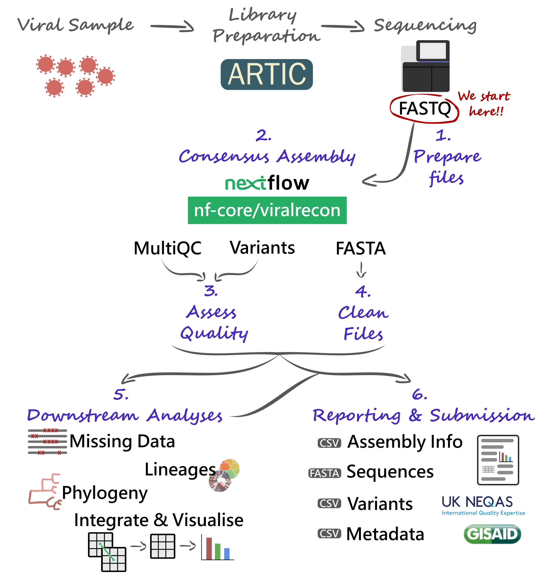
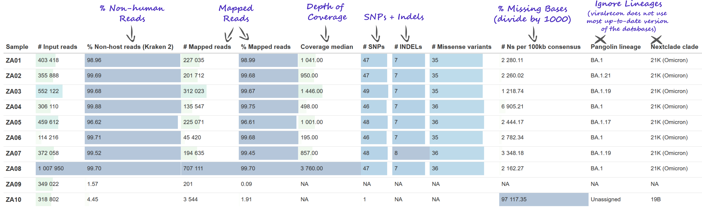
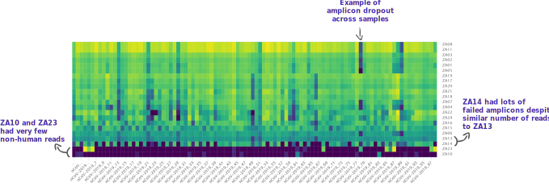
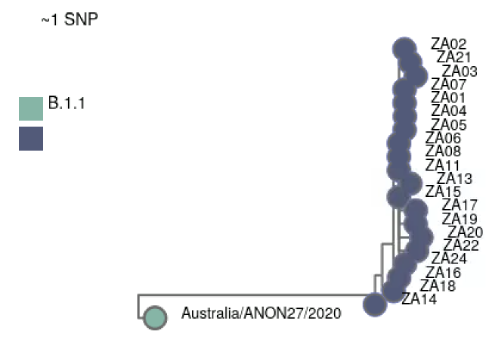

# South Africa (Illumina)

:::{.callout-tip}
#### Learning Objectives

This section demonstrates a start-to-finish analysis of a dataset sequenced on an _Illumina_ platform, using the concepts and tools covered in previous sections. 
You can download the data from these links (two versions available): 

- [South Africa Case Study - Full Data](https://www.dropbox.com/sh/6jnpv7ui2xm8f9h/AAC0MRuPfSsNmBlCNvI-wiKna?dl=1) -- this includes data for 24 samples, which gives a more realistic sample size, but can take a few hours to run on a small computer.
- [South Africa Case Study - Small Version](https://www.dropbox.com/sh/2u0svuq7rre8261/AACisGtF21x3Ou7Xrj_W4DaRa?dl=1) -- this includes data for a subset of 8 samples, which is more suitable for training purposes (but the results will look slightly different from the ones shown here).

By the end of this section, you should be able to:

- Prepare all the files necessary to run the consensus pipeline.
- Run the _viralrecon_ pipeline to generate FASTA consensus from raw FASTQ files. 
- Assess and collect several quality metrics for the consensus sequences. 
- Clean output files, in preparation for other downstream analysis.
- Assign sequences to lineages using _Nextclade_ and/or _Pangolin_. 
- Contextualise your sequences in other background data and cluster them based on phylogenetic analysis. 
- Integrate the metadata and results to generate useful visualisations of your data. 
- Report your analysis.
:::

We will analyse data from 24 samples collected in South Africa between Nov-Dec 2021. 
The samples were sequenced on an _Illumina MiSeq_ platform. 

The final product of our work (and main objective) is to produce a report of the analysis, which you can see here: <a href="https://docs.google.com/document/d/1yisycYBj-rmSGzTOzA5_ELfNYP1NKHHWj1rQoHqKGw8/edit?usp=sharing" target="_blank">South Africa Case Study Report</a>.

In summary, the report addresses the following: 

- What was the quality of the consensus sequences?
- What lineage/clade was each of our samples assigned to? 
- How many clusters of samples did we identify?
- How did the detected lineages change over the time of sampling?

We also produce several essential output files, which would usually be necessary to upload our data to public repositories: 

- Metadata (CSV)
- Consensus sequences (FASTA)
- Consensus sequence quality metrics (CSV)
- Variants (CSV)


## Pipeline Overview

Our analysis starts with **FASTQ files**, which will be used with the **`nf-core/viralrecon` _Nextflow_ pipeline**.
This will give us several **quality control** metrics essential for our downstream analysis and reporting. 

Critical files output by the pipeline will need to be further processed, including combining our **consensus FASTA files** and obtaining a list of **filtered SNP/indel variants**. 
Using these clean files, we can then proceed to downstream analysis, which includes assigning each sample to the most up-to-date **Pango lineage**, **Nextclade clade** and **WHO designation**. 
Finally, we can do more advanced analysis, including the idenfication of **sample clusters** based on phylogenetic analysis, or produce timeseries visualisations of mutations or variants of concern. 
With all this information together, we will have the necessary pieces to submit our results to **public repositories** and write **reports** to inform public health decisions. 




## Preparing Files

Before we start our work, it's always a good idea to setup our directory structure, so we keep our files organised as the analysis progresses. 
From the data we are starting with, we already have the following directories: 

- `data` → contains the sequencing data in a sub-directory called `reads`. 
- `resources` → files that were downloaded from public repositories. 
- `scripts` → _bash_ and _R_ scripts used to run the analysis. 

We create two additional directories: 

- `report` → files and documents that we report to our colleagues or upload to public repositories. 
- `results` → results of the analysis. 

You can create directories from the command line using the `mkdir` command: 

```bash
mkdir results
mkdir report
```


### Data

We start our analysis from FASTQ files generated by the _Illumina_ sequencer. 
As this is paired-end sequencing, we have two files per sample (with suffix `_1` and `_2`):

```bash
ls data/reads
```

```
SRR17051908_1.fastq.gz  SRR17051953_1.fastq.gz  SRR17461700_1.fastq.gz  SRR17712594_1.fastq.gz
SRR17051908_2.fastq.gz  SRR17051953_2.fastq.gz  SRR17461700_2.fastq.gz  SRR17712594_2.fastq.gz
SRR17051916_1.fastq.gz  SRR17054503_1.fastq.gz  SRR17461712_1.fastq.gz  SRR17712607_1.fastq.gz
SRR17051916_2.fastq.gz  SRR17054503_2.fastq.gz  SRR17461712_2.fastq.gz  SRR17712607_2.fastq.gz
SRR17051923_1.fastq.gz  SRR17088917_1.fastq.gz  SRR17701832_1.fastq.gz  SRR17712711_1.fastq.gz
SRR17051923_2.fastq.gz  SRR17088917_2.fastq.gz  SRR17701832_2.fastq.gz  SRR17712711_2.fastq.gz
SRR17051932_1.fastq.gz  SRR17088924_1.fastq.gz  SRR17701841_1.fastq.gz  SRR17712779_1.fastq.gz
SRR17051932_2.fastq.gz  SRR17088924_2.fastq.gz  SRR17701841_2.fastq.gz  SRR17712779_2.fastq.gz
SRR17051935_1.fastq.gz  SRR17088928_1.fastq.gz  SRR17701890_1.fastq.gz  SRR17712994_1.fastq.gz
SRR17051935_2.fastq.gz  SRR17088928_2.fastq.gz  SRR17701890_2.fastq.gz  SRR17712994_2.fastq.gz
SRR17051951_1.fastq.gz  SRR17088930_1.fastq.gz  SRR17712442_1.fastq.gz  SRR17712997_1.fastq.gz
SRR17051951_2.fastq.gz  SRR17088930_2.fastq.gz  SRR17712442_2.fastq.gz  SRR17712997_2.fastq.gz
```


### Metadata

Metadata for these samples is available in the file `sample_info.csv`. 
Here is some of the information we have available for these samples: 

- `sample` → the sample ID.
- `collection_date` → the date of collection for the sample in the format YYYY-MM-DD.
- `geo_loc_country` → the country of origin for this sample.
- `geo_loc_region` → the region within the country where the sample was collected.
- `latitude`/`longitude` → coordinates for sample location (in this case we're only given a single coordinate for the whole country - in a real setting you may want to collect a precise location).
- `sequencing_instrument` → the model for the sequencing instrument used (e.g. NovaSeq 6000, MinION, etc.).
- `sequencing_protocol_name` → the type of protocol used to prepare the samples (e.g. ARTIC).
- `amplicon_primer_scheme` → for amplicon protocols, what version of the primers was used (e.g. V3, V4.1)


## Consensus Assembly

The first step in the bioinformatic analysis is to run the `nf-core/viralrecon` pipeline. 
But first we need to prepare our input files. 

### Samplesheet

For _Illumina_ data, we need a **samplesheet CSV file** with three columns, indicating sample name (first column) and the respective FASTQ file paths for read 1 (second column) and read 2 (third column). 

Because our FASTQ file names are not very user-friendly, we used some command-line tricks to help us produce this table:

```bash
# list read 1 files and save output in a temporary file
ls data/reads/*_1.fastq.gz > read1_filenames.txt

# list read 2 files and save output in a temporary file
ls data/reads/*_2.fastq.gz > read2_filenames.txt

# initiate a file with column names
echo "fastq_1,fastq_2" > samplesheet.csv

# paste the two temporary files together, using comma as a delimiter
paste -d "," read1_filenames.txt read2_filenames.txt >> samplesheet.csv

# remove the two temporary files
rm read1_filenames.txt read2_filenames.txt
```

These commands resulted in creating a file called `samplesheet.csv`, which contains the following:

```bash
head samplesheet.csv
```

```
fastq_1,fastq_2
data/reads/SRR17051908_1.fastq.gz,data/reads/SRR17051908_2.fastq.gz
data/reads/SRR17051916_1.fastq.gz,data/reads/SRR17051916_2.fastq.gz
data/reads/SRR17051923_1.fastq.gz,data/reads/SRR17051923_2.fastq.gz
data/reads/SRR17051932_1.fastq.gz,data/reads/SRR17051932_2.fastq.gz
data/reads/SRR17051935_1.fastq.gz,data/reads/SRR17051935_2.fastq.gz
data/reads/SRR17051951_1.fastq.gz,data/reads/SRR17051951_2.fastq.gz
data/reads/SRR17051953_1.fastq.gz,data/reads/SRR17051953_2.fastq.gz
data/reads/SRR17054503_1.fastq.gz,data/reads/SRR17054503_2.fastq.gz
data/reads/SRR17088917_1.fastq.gz,data/reads/SRR17088917_2.fastq.gz
```

So, we programmatically created the last two columns of our file.
We then opened this CSV file in _Excel_ to add another column "sample" where we included our sample names and saved the file again as a CSV format. 
Here are the top few rows of the final file: 

```bash
head samplesheet.csv
```

```
sample,fastq_1,fastq_2
ZA01,data/reads/SRR17051908_1.fastq.gz,data/reads/SRR17051908_2.fastq.gz
ZA02,data/reads/SRR17051923_1.fastq.gz,data/reads/SRR17051923_2.fastq.gz
ZA03,data/reads/SRR17051916_1.fastq.gz,data/reads/SRR17051916_2.fastq.gz
ZA04,data/reads/SRR17051953_1.fastq.gz,data/reads/SRR17051953_2.fastq.gz
ZA05,data/reads/SRR17051951_1.fastq.gz,data/reads/SRR17051951_2.fastq.gz
ZA06,data/reads/SRR17051935_1.fastq.gz,data/reads/SRR17051935_2.fastq.gz
ZA07,data/reads/SRR17051932_1.fastq.gz,data/reads/SRR17051932_2.fastq.gz
ZA08,data/reads/SRR17054503_1.fastq.gz,data/reads/SRR17054503_2.fastq.gz
ZA09,data/reads/SRR17088930_1.fastq.gz,data/reads/SRR17088930_2.fastq.gz
```


### Running Viralrecon

Now we are ready to run the `nf-core/viralrecon` pipeline. 
We saved our command in a script (`scripts/01-run_viralrecon.sh`), which we created with the command line text editor `nano`. 
This ensures that our analysis is **reproducible** and **traceable** (we can go back to the script to see how the analysis was run). 

Here is the content of the script, which we ran using `bash scripts/01-run_viralrecon.sh`: 

```bash
#!/bin/bash 

nextflow run nf-core/viralrecon -profile singularity \
  --max_memory '15.GB' --max_cpus 8 \
  --input samplesheet.csv \
  --outdir results/viralrecon \
  --protocol amplicon \
  --genome 'MN908947.3' \
  --primer_set artic \
  --primer_set_version 3 \
  --skip_assembly \
  --platform illumina
```

After running the pipeline, we notice the following message: 

```
-[nf-core/viralrecon] 2 samples skipped since they failed Bowtie2 1000 mapped read threshold:
    201: ZA09
    176: ZA12
```

This indicates that two samples - ZA09 and ZA12 - had very few reads aligned to the SARS-CoV-2 genome. 
Could the reason be that they had very few reads to start with?
We can quickly investigate this hypothesis by counting the number of lines in the FASTQ files from these samples: 

```bash
# FASTQ file for ZA09
zcat data/reads/SRR17088930_1.fastq.gz | wc -l
```

```
698044
```

Since each sequence takes 4 lines in a FASTQ format, this indicates that this sample had 698044/4 = 124511 reads. 
That's certainly more than 1000 reads, so the reason the sample failed must be something else. 
We will investigate this further in the next section. 


## Consensus Quality

### General Metrics

We used the _MultiqQC_ report to assess the initial quality of our samples. 
The quality report can be found in `results/viralrecon/multiqc/multiqc_report.html`. 

We paid particular attention to:

- Number of reads mapped to the reference genome.
- Median depth of coverage.
- Percentage of the genome with missing bases ('N'). 
- Number of SNP + Indel variants.



We noted that:

- 2 samples - ZA09 and ZA12 - completely failed. 
  This was already noted after we ran the pipeline, above. 
  The reason seems to be because these samples have a very low percentage of non-human reads (less than 2%), indicating that the sequenced material was mostly human. 
  Because of this, there were not enough reads to assemble a genome. 
- 2 other samples - ZA10 and ZA23 - had > 90% missing bases, also indicating a very poor assembly. 
  The reason was the same as above, both samples had low % of non-human reads. 
- 1 samples - ZA14 - had ~39% missing bases. 
  In this case the reason was not a low number of mapped reads. 
  For example, sample ZA13 had a very similar median depth of coverage (121 vs 161 in ZA14) and even fewer mapped reads (24k vs 60k in ZA14).
  But ZA13 only had 2% missing bases. 
  However, upon inspection of the amplicon heatmap, we detected that several amplicons were not properly amplified in ZA14 compared to ZA13. 
  Therefore, the reason for high % missing bases in ZA14 was due to low amplification efficiency in this sample. 
- There was some systematic dropout for some amplicons, in particular `nCoV-2019_64` had very low amplification in several of the samples. 
  Of note was also `nCoV-2019_73`, and other neighbouring amplicons. 




Besides the _MultiQC_ report, the pipeline also outputs a CSV file with collected summary metrics (equivalent to the first table on the report): `results/viralrecon/multiqc/summary_variants_metrics_mqc.csv`.
We will use this file later to join this information with our metadata and lineage assignment using the _R_ software (detailed in "Integration & Visualisation" section, below). 


### Variants

We also looked at the table of variants obtained from the pipeline. 
This is output in `results/viralrecon/variants/ivar/variants_long_table.csv`. 
This table can be very useful to keep track of particular mutations that may be increasing over time. 
Later, we will tidy this table to attach to our reported results ("Integration & Visualisation" section). 

But for now, we will explore this table to address a few more quality-related questions. 
We opened this table in _Excel_ to answer the following: 

- Where there samples with a high number of intermediate allele frequencies? This could indicate mixed samples due to cross-contamination.  
- Where there samples with frameshift mutations? These mutations should be rare because they are highly disruptive to the functioning of the virus. So, their occurrence may be due to errors rather than a true mutation and it's good to make a note of this. 

By manual inspection of this table (and using the "filter" feature in _Excel_), we found 74 variants with alternative allele frequency less than 75%. 
These were spread across samples, all samples having less than 10 such low-frequency mutations, and most samples having less than 5. 
Sample ZA23 - which we had previously highlighted has having a high % missing bases (39%) - had 8 low-frequency mutations out of a total of 48 mutations in this sample (~16%), suggesting further quality issues in this sample.


## Clean FASTA

The pipeline outputs the consensus sequences in `results/viralrecon/variants/ivar/consensus/bcftools/*.consensus.fa` (one file for each sample). 
For downstream analysis, it is convenient to combine all these sequences into a single file, and also clean the sequence names (to remove some text -- " MN908947.3" --, which is added by the `bcftools` variant caller). 

We created a new script to clean our consensus FASTA files, which we ran with `bash scripts/02-clean_fasta.sh`: 

<!-- 
TODO: possibly we don't want to include the low coverage samples ZA23 
This might be convoluted, but works if we just want to use code:

```
cat sample_info.csv | grep -v "ZA09" | grep -v "ZA12" | grep -v "ZA10" | cut -d , -f 1 > ids.txt
cat results/viralrecon/medaka/*.consensus.fasta | sed 's| MN908947.3||' | seqkit grep -f ids.txt --by-name > report/consensus.fa
```
-->

```bash
# combine and clean FASTA files
cat results/viralrecon/variants/ivar/consensus/bcftools/*.consensus.fa | sed 's| MN908947.3||' > report/consensus.fa
```

This command does two things: 

- Combine all our FASTA consensus sequences into a single file (using `cat`).
- Clean the sequence names (using `sed`).

The output was saved as a new FASTA file: `report/consensus.fa`.

<!-- 
Another way is using `seqkit`: 
`cat results/viralrecon/medaka/*.consensus.fasta | seqkit replace -p "/ARTIC/medaka MN908947.3" -r ""` 
-->


## Downstream Analyses

Based on the clean consensus sequences, we then perform several downstream analysis. 


### Missing Intervals 

As a further quality check, we also generated a table of missing intervals (indicated by the `N` character in the FASTA sequences). 
We used the `seqkit` software to achieve this, by including the following command in a new shell script (`bash scripts/03-missing_intervals.sh`):

```bash
# create missing bases TSV file
seqkit locate -i -P -G -M -r -p "N+" report/consensus.fa > results/missing_intervals.tsv
```

This software outputs a tab-delimited table, which we saved as `results/missing_intervals.tsv`. 
The table looks like this: 

```
seqID	patternName	pattern	strand	start	end
ZA01	N+	N+	+	1	54
ZA01	N+	N+	+	22771	22926
ZA01	N+	N+	+	23603	23835
ZA01	N+	N+	+	26948	26948
ZA01	N+	N+	+	26968	27137
ZA01	N+	N+	+	29801	29867
ZA02	N+	N+	+	1	54
ZA02	N+	N+	+	22771	22921
ZA02	N+	N+	+	23603	23835

... MORE LINES OMITTED ...
```

We opened this file `missing_intervals.tsv` in _Excel_ and quickly calculated the length of each interval. 
We noted that two samples - _ZA10_ and _ZA23_ - both have a continuous interval of over 18kb missing bases, which is not surprising as we had already identified these samples has having >90% missing data. 
We make a note of these samples as being possibly problematic in downstream analysis steps. 


### Lineage Assignment

Although the _Viralrecon_ pipeline runs _Pangolin_ and _Nextclade_, it does not use the latest version of these programs (because lineages evolve so fast, the nomenclature constantly changes). 
An up-to-date run of both of these tools can be done using each of their web applications:

- [clades.nextstrain.org](https://clades.nextstrain.org/)
- [pangolin.cog-uk.io](https://pangolin.cog-uk.io/)

However, for **automation**, **reproducibility** and **traceability** purposes, we used the command line versions of these tools, and included their analysis in a script, which we ran with `bash scripts/04-lineages.sh`: 

```bash
#!/bin/bash

# get nextclade data
nextclade dataset get --name sars-cov-2 --output-dir resources/nextclade_background_data

# run nextclade
nextclade run --input-dataset resources/nextclade_background_data/ --output-all results/nextclade report/consensus.fa

# update pangolin data
pangolin --update-data

# run pangolin
pangolin --outdir results/pangolin/ --outfile switzerland_report.csv report/consensus.fa
```

Note that we first download the latest version of the _Nextclade_ background data using `nextclade dataset` and then use `nextclade run` using the up-to-date dataset. 

Similarly, With `pangolin` we first ran `pangolin --update-data`, to ensure we were using the latest lineages available. 
We can check the version of the data used with `pangolin --all-versions` (at the time we ran this we had `pangolin-data: 1.15.1`).

Both of these tools output CSV files, which can be open in _Excel_ for further examination.  
Opening the _pangolin_ results (`results/pangolin/switzerland_report.csv`), we noticed that the two problematic samples -- ZA10 and ZA23 -- failed the QC due to high fraction of missing data. 
The other samples all seemed to have been assigned to "Omicron" variant with a high support.  

Opening the _nextclade_ results (`results/nextclade/nextclade.tsv`), we noticed that the two problematic samples were classified as "recombinant"! 
We know from our quality control that we should not trust this assessment, and that most likely these are bad quality samples, not true recombinant lineages. 
Nextclade is more relaxed in assigning samples to lineages, so we should always check the QC status as well. 
We will notice that both of these samples were assigned QC status "bad", due to their high percentage of missing data (_nextclade_ uses a stringent threshold of 3000 sites, or ~10%, missing data).
Two other samples had "bad" QC status. Sample ZA14 due to high % of missing data, and sample ZA18 from a mixture of a high number of private mutations and the presence of a frameshift mutation in ORF1b. 

Like before, we will do further analysis (and visualisation) of these data using the software _R_, in the section "Integration & Visualisation", detailed below.


### Phylogeny

Although a tool such as _Nextclade_ can place our samples in a global phylogeny context, sometimes it may be convient to build our own phylogenies.
This requires three steps: 

- Producing a multiple sequence alignment from all consensus sequences.
- Tree inference.
- Tree visualisation and annotation.

We performed the first two steps with the following script, which we ran with `bash scripts/05-phylogeny.sh`: 

```bash
#!/bin/bash

# alignment
mkdir -p results/mafft
mafft --6merpair --maxambiguous 0.2 --addfragments report/consensus.fa resources/reference/sarscov2.fa > results/mafft/alignment.fa

# tree inference
mkdir -p results/iqtree
iqtree2 -s results/mafft/alignment.fa --prefix results/iqtree/consensus
```

The output of _iqtree_ includes a tree file, which can be visualised using FigTree (or online using [Microreact](https://microreact.org/upload)). 
The figure below shows our tree, which shows all our samples fall mostly clustering together. 
This makes sense, as all our samples were classified as "Omicron (BA.1-related)". 

It is worth noting that the samples ZA10, ZA14 and ZA23 are not included in this phylogeny, as they contained >20% missing data (we used that threshold with MAFFT alignment, option `--maxambiguous 0.2`). 
Also, note that sample ZA18, which Nextclade had identified as "bad" QC (due to excess private mutations) also appears slightly separated from the other samples in the tree (the sample in red on the tree). 
The sample still clusters well with the rest, suggesting we can probably trust that it is indeed an Omicron variant, however the excess of private mutations (which may be due to sequencing errors) is making it stand apart from the others in the phylogeny. 


### Clustering

We identified groups of similar sequences in our data using the software _civet_ (Cluster Investigation and Virus Epidemiology Tool). 
This software compares our samples with a background dataset of our choice, which givus us more context for our analysis. 
In this case we are using the [example background data](https://github.com/artic-network/civet/tree/master/quickstart_data/civet_background_data) that comes with _civet_. 
However, in a real-world analysis, it would have been ideal to choose local samples as background data. 
For example, we could download samples from Switzerland from around the time period of our sample collection, from GISAID following the instructions on the [_civet_ documentation](https://cov-lineages.org/resources/civet/walkthrough.html#background_dataset) (you need an account on GISAID to obtain these data). 

We already have our _civet_ data prepared in `resources/civet_background_data`, and we ran our analysis using the commands in the script `scripts/06-civet.sh`.
The code in the script is: 

```bash
#!/bin/bash

# run civet analysis
civet -i sample_info.csv \
  -f report/consensus.fa \
  -icol sample \
  -idate sample_collection_date \
  -d resources/civet_background_data/ \
  -o results/civet
```

The result of this analysis includes an interactive HTML report (in `results/civet/civet.html`).
We can see that our samples were grouped into a single catchment. 
This makes sense from our previous lineage/variant analysis: all our samples were classfied as Omicron VOC.
We can see that our samples seem to be more diverged from the Australian BA.1 sample present in the background data, with new SNPs in our samples creating a longer branch in the tree. 



_Civet_ also outputs a CSV file (`results/civet/master_metadata.csv`), which includes the catchment that each sample was assigned to. 
We will use this CSV file later to integrate this information with other parts of our analysis, in _R_, detailed in the "Integration & Visualisation" section. 


## Integration & Visualisation

At this point in our analysis, we have several tables with different pieces of information: 

- `sample_info.csv` → the original table with metadata for our samples. 
- `results/viralrecon/multiqc/medaka/summary_variants_metrics_mqc.csv` → quality metrics from the _MultiQC_ report generated by the _viralrecon_ pipeline.
- `results/nextclade/nextclade.tsv` → the results from _Nextclade_. 
- `results/pangolin/switzerland_report.csv` → the results from _Pangolin_.
- `results/civet/master_metadata.csv` → the results from the _civet_ analysis, namely the catchment (or cluster) that each of our samples was grouped into.

To consolidate our analysis, we **tidied and integrated** the information from across these different files, into a single table using the software _R_. 
The script used to do this is in `scripts/07-data_integration.R`. 
Because this is an _R_ script, we opened it in _RStudio_ to execute the code. 

The output of our script is a new tab-delimited table, which we saved in `report/consensus_metrics.tsv`, and contains the following columns: 

- `sample` → sample ID.
- `collection_date` → date of collection day.
- `collection_week` → date of collection week (useful for summarising/visualising counts per-week).
- `country` → country of origin.
- `latitude`/`longitude` → latitude and longitude of collection.
- `n_mapped_reads` → number of mapped reads.
- `median_depth` → median depth.
- `pct_missing` → percentage of missing data.
- `pct_coverage` → percentage of coverage.
- `n_variants` → number of SNP + indel variants detected. 
- `nextclade` → nextclade clade.
- `qc_status` → QC status as determined by _Nextclade_ ("bad", "mediocre", "good").
- `lineage` → _Pangolin_ lineage.
- `who_variant` → variant of concern designation.
- `catchment` → catchment group from _Civet_. 

This table, which aggregates information from many of the tools we used, was then used to produce different visualisations of our analysis. 
These visualisations were also done using the _R_ software (`scripts/08-visualisation.R`), and integrated into a report, shown below. 

<iframe src="https://docs.google.com/document/d/e/2PACX-1vSbIIVjqtDFnfEbw5tQzPY1z24FLWQHUaDvFV6_bNqVvwd1d6gEZQ1djJrMTEd5MmQOU8pwA5Q-MuRg/pub?embedded=true" width="100%" height="500"></iframe>


## Bonus: Full Workflow

Although we have ran each of the steps of our analysis individually (each in their own script), now that we have everything working, we could integrate all these steps into a single "master" script: 

```bash
#!/bin/bash

# make report directory
mkdir -p report

# run viralrecon
nextflow run nf-core/viralrecon -profile singularity \
  --max_memory '15.GB' --max_cpus 8 \
  --input samplesheet.csv \
  --outdir results/viralrecon \
  --protocol amplicon \
  --genome 'MN908947.3' \
  --primer_set artic \
  --primer_set_version 3 \
  --skip_assembly \
  --platform illumina

# combine and clean FASTA files
cat results/viralrecon/variants/ivar/consensus/bcftools/*.consensus.fa | sed 's| MN908947.3||' > report/consensus.fa

# create missing bases TSV file
seqkit locate -i -P -G -M -r -p "N+" report/consensus.fa > results/missing_intervals.tsv

# get nextclade data
nextclade dataset get --name sars-cov-2 --output-dir resources/nextclade_background_data

# run nextclade
nextclade run --input-dataset resources/nextclade_background_data/ --output-all results/nextclade report/consensus.fa

# update pangolin data
pangolin --update-data

# run pangolin
pangolin --outdir results/pangolin/ --outfile switzerland_report.csv report/consensus.fa

# alignment
mkdir -p results/mafft
mafft --6merpair --maxambiguous 0.2 --addfragments report/consensus.fa resources/reference/sarscov2.fa > results/mafft/alignment.fa

# tree inference
mkdir -p results/iqtree
iqtree2 -s results/mafft/alignment.fa --prefix results/iqtree/consensus

# data integration and cleaning
Rscript scripts/07-data_integration.R
```

Notice that we included the _R_ script that does the data cleaning here, using the `Rscript` program that allows to execute an _R_ script from the command-line. 

Having this "master" script, we could run all these steps from start-to-finish with a single command, which can be very useful if you want to fully automate your analysis across multiple runs.
