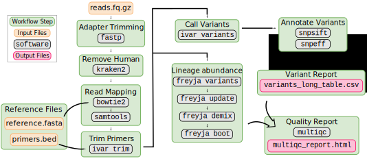
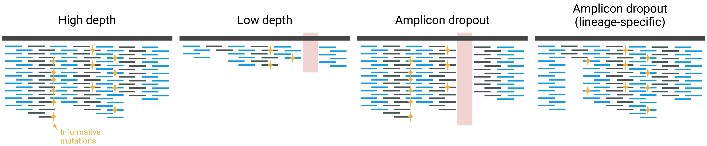

# Lineage Abundance

:::{.callout-tip}
#### Learning Objectives

- Summarise the bioinformatic steps involved in estimating lineage abundance from sequencing data.
- Apply the `nf-core/viralrecon` pipeline for wastewater analysis. 
- Evaluate sample quality with a particular focus on abundance estimation.
- Interpret the results from the Freyja software and its limitations.
- Prepare the abundance estimates for downstream analysis.
:::


## Bioinformatic analysis

The bioinformatic analysis of wastewater sequencing data broadly involves the following steps: 

- Filter the raw sequencing data to remove low-quality reads and trim Illumina adaptors. 
- Map the reads to the _Wuhan-Hu-1_ reference genome.
- Trim the primers from the aligned reads based on the primer location BED file.
- Identify changes relative to the reference sequence.
- Estimate the abundance of known SARS-CoV-2 lineages.


Most of these steps are in common with the [processing of clinical samples](../02-isolates/01-consensus.md). 
The main difference is the last step, where we use a specialised software to estimate the abundance of viral lineages based on the mutations found. 
There are different software packages designed to estimate lineage abundance from sequencing data and new ones are likely to be developed as the field evolves. 
See [Kayikcioglu et al. 2023](http://dx.doi.org/10.7717/peerj.14596) and [Sutcliffe et al. 2023](https://doi.org/10.1101/2023.12.20.572426) for an overview of the software packages available and their performance on synthetic data. 

The software that we will use, implemented in the `nf-core/viralrecon` pipeline is called **Freyja**. 
This tool takes advantage of the large number of known lineages of SARS-CoV-2, which it pulls from the [UShER global phylogeny](https://academic.oup.com/mbe/article/38/12/5819/6361626). 
This global phylogeny is updated daily, and so is the Freyja database. 
Freyja combines the known mutations for each lineage with the frequency of observed mutations estimated from our sequencing data to estimate the frequency of those lineages. 

## Wastewater pipeline {#sec-ww-viralrecon}

We will use the same workflow covered in the [consensus assembly of clinical isolates](../02-isolates/01-consensus.md): `nf-core/viralrecon`. 
The current version of this pipeline includes the Freyja tool for inference of lineage abundance. 

The command to process our samples is very similar to what we've seen before: 

```bash
nextflow run nf-core/viralrecon \
  -r dev -profile singularity \
  --platform illumina \
  --input YOUR_SAMPLESHEET_CSV \
  --outdir OUTPUT_DIRECTORY \
  --protocol amplicon \
  --genome 'MN908947.3' \
  --fasta PATH_TO_FASTA_FILE \
  --gff PATH_TO_GFF_FILE \
  --primer_bed PATH_TO_BED_FILE \
  --skip_assembly --skip_asciigenome \
  --skip_consensus
```

The key difference is: 

- `-r dev`: we are using the **development version** of the pipeline, which is not yet released as an official version. 
  This is because Freyja is currently (Feb 2024) only available in the development version. 
  Once a new version of the pipeline is released (>= 2.7), it should no longer be necessary to use the development version. 
- `--skip_consensus`: in this case we skip the generation of a consensus FASTA file. 
  Since wastewater samples are mixed, it doesn't make sense to generate a consensus FASTA file, as it would potentially include mutations from different lineages in the final consensus, creating artificial recombinant genomes.

In addition, there are [other options](https://nf-co.re/viralrecon/dev/parameters#skip_freyja) that can be specified with `viralrecon` to modify Freyja's default behaviour. 
We highlight two important ones below: `--freyja_depthcutoff` and `--freyja_repeats`.


:::{.callout-tip}
#### Samplesheet

To automatically create a samplesheet CSV file from the FASTQ files in a directory, we can use [this script](https://github.com/nf-core/rnaseq/blob/master/bin/fastq_dir_to_samplesheet.py) developed by the nf-core team. 
We have downloaded the script to a directory called `utilities` and produced the samplesheet using the following command: 

```bash
python utilities/fastq_dir_to_samplesheet.py -r1 '_1.fastq.gz' -r2 '_2.fastq.gz' data/reads/ samplesheet.csv
```

- `-r1` defines the suffix of read 1 files
- `-r2` defines the suffix of read 2 files
- Then we include the input directory with FASTQ files
- At the end the name of the output samplesheet file

This will generate a CSV file where the `sample` names are taken from the FASTQ filenames. 
If you want to use your own custom names, you can open this file in Excel and edit it the sample names to suit your needs.
:::

:::{.callout-note collapse=true}
#### Pipeline details

The processing of raw sequencing reads goes through several steps already covered in @sec-viralrecon. 
The main new step is the **lineage abundance** estimation done by Freyja. 
This software consists of 4 main commands: 

- `freyja variants` identifies mutations from the sequencing reads to obtain their frequencies and sequencing depth. 
- `freyja update` is used to update the lineage database, pulled from the UShER global phylogeny.
- `freyja demix` does the actual estimation of lineage abundances.
- `freyja boot` calculates confidence intervals for the abundance estimates using a bootstrap method (see section below). 


:::


### Depth threshold

The option `--freyja_depthcutoff` determines the minimum depth of sequencing for a site to be used in the Freyja analysis.
The default is '0', meaning Freyja uses all the sites in its analysis, as long as at least 1 read is mapped to the reference.
This may seem too low, however recall that Freyja will use all the mutations across the genome, so as long as the average depth of sequencing is high enough (e.g. >100x) and the genome is well covered (e.g. >80%), then even if some of the sites have low depth, the accuracy of the final estimates might still be good. 

Also, Freyja takes the depth of each site into account when it does it's calculation, giving more weight to sites with more reads than those with very few reads. 

The default threshold (`--freyja_depthcutoff 0`) usually leads to more lineages being reported in the output, although some of the low-frequency ones may be innacurate. 
We may increasing this threshold to be more strict (e.g. `--freyja_depthcutoff 5`), however this will lower our resolution and some minor lineages may not be captured. 

As a first step we recommend keeping the default threshold and only increase it if you notice many false positive lineages systematically being reported. 


### Confidence intervals

The option `--freyja_repeats` is used to configure the calculation of confidence intervals for the abundance estimations. 
Freyja can quantify the uncertainty of its lineage abundance estimates, related to the sequencing depth.
Our sequencing reads can be thought of as a sample from all the viral molecules present in our sequencing library.
Therefore, a site with 10x reads will provide lower accuracy than a site with 100x reads. 

The way Freyja quantify the uncertainty in lineage abundance due to sequencing depth is to use a method known as **bootstrap resampling**.
This method works by taking a sample of reads with replacement and re-calculating the lineage abundance. 
This process is repeated several times (e.g. 100 times) to generate a distribution of abundances, representing our uncertainty in the estimates due to the random sampling of reads in each position. 
Freyja then uses this distribution to calculate a 95% confidence for each lineage abundance.
Watch [this video](https://youtu.be/Xz0x-8-cgaQ?feature=shared) if you want to learn more about bootstrap resampling in general.

The `viralrecon` option `--freyja_repeats` determines the number of bootstrap repeats used to estimate confidence intervals for the abundance estimates. 
The default is 100 bootstrap replicates, which should be enough to get robust confidence intervals. 

However, this step is **very computationally demanding**, substantially increasing the time to run the analysis (it is, essentially, running the Freyja step 100 times for each sample). 
Therefore, it can sometimes be advantageous to "turn off" this option by setting `--freyja_repeats 1`. 
In that case, make sure to _ignore the confidence intervals that are output by the pipeline_.

:::{.callout-important}
#### Freyja confidence intervals

Note that the bootstrap confidence intervals generated by Freyja only account for the uncertainty related to sequencing depth. 
They do not take into account variation due to sampling at the wastewater treatment plant, and variation due to sample manipulation in the lab protocols. 
:::


## Output Files

After running the pipeline, we get several output files (see `viralrecon`'s [documentation](https://nf-co.re/viralrecon/)). 
These are very similar to what has been described for [clinical isolates](../02-isolates/02-qc.md). 
As a reminder, here are some files of interest:

- `multiqc/multiqc_report.html`: a MultiQC quality report, including information about average depth of coverage, fraction of the genome covered, number of mutations identified, etc. 
- `variants/bowtie2/`: directory with individual BAM files, which can be visualised with _IGV_ if we want to look at the reads mapped to the reference genome.
- `variants/ivar/variants_long_table.csv`: a CSV file with the aggregated results of all the mutations detected in each sample. 

The new directories of particular interest for wastewater analysis are:

- `variants/freyja/demix`: directory containing the output files from the `freyja demix` command, used to estimate lineage abundances.
- `variants/freyja/bootstrap`: directory containing the output files from the `freyja boot` command, used to get confidence intervals for the estimated lineage abundances.
- `variants/freyja/variants`: directory containing the output files from the `freyja variants` command, which includes all the variants (mutations) considered by Freyja in its lineage abundance calculations. These are somewhat redundant with the files in `variants/ivar/variants_long_table.csv`.


## Freyja `demix` output {#sec-demix}

The main step of the Freyja analysis is the command `freyja demix` (which `viralrecon` runs for us), where the mutations present in the sequencing reads are used to infer the abundance of individual lineages. 

These files are text-based, but in a non-standard format. 
Here is an example from one of our samples: 

```
            SRR18541029.variants.tsv
summarized  [('Omicron', 0.9074885644836951), ('Delta', 0.04843510729864781), ('Other', 0.03151409250566481)]
lineages    BA.1 BA.1.1.8 BA.1.20 AY.116 BA.1.8 B.1.1.529 XS BA.1.1.17 XP XD BA.1.1.5 BA.1.1.10 AY.39 AY.46.1 AY.3.1
abundances  0.42763980 0.33859152 0.04909740 0.04170587 0.03905280 0.02662011 0.02634620 0.00904814 0.00811069 0.00516789 0.00476190 0.00456621 0.00277376 0.00206299 0.00189249
resid       13.531715333760909
coverage    98.86633448149016
```

Here is the meaning of each line from this file:

1. The name of the file
2. The frequency of variants of concern, which is added up based on the frequency of individual lineages.
3. The name of each individual lineage detected in the sample.
4. The corresponding frequencies of each lineage from the previous line, in descending order.
5. The "residual" variation left from the statistical model used to estimate the frequencies; this value does not have an easy interpretation. 
6. The percentage of the genome covered at 10x depth. We can also obtain this information from the regular MultiQC report (see more about this in the QC section below).

We will later use a custom script to "tidy" these results into a more standard CSV format, aggregating the results from several samples and combining it with our metadata. 

:::{.callout-important}
#### Ambiguous lineage abundance

For similar lineages (i.e. with few distinguishing mutations) it can sometimes happen that Freyja cannot distinguish their abundance. 
This usually affects lower-frequency lineages, as there are fewer reads to cover them to start with. 

In those situations, Freyja will assign equal frequency to all of them. 
This is important to know, as it means that the frequency of those lineages is likely to be inaccurate. 

Generally, low-abundance lineages (< 1%) should be interpreted with caution, in particular for samples with low median depth of sequencing. 
:::


## Quality Control

As usual, the first thing to do after running our pipeline is to check the quality of our results. 
For wastewater samples, there are a few main diagnostics to pay attention to: 

- The average depth of sequencing of our samples, i.e. the average number of reads mapped to each position of the genome.
- Whether there was any amplicon dropout.
- The percentage of the genome covered at a certain depth of sequencing. 

In addition, general quality metrics should also be considered, which we also cover below. 

These metrics are all available from the MultiQC report generated by the pipeline saved in `multiqc/multiqc_report.html`.

### General metrics

One of the first sections of the MultiQC report is "**Variant calling metrics**", which contains a table with several metrics of interest, for example: 

```
Sample      # Input reads  % Non-host reads  # Trimmed reads (fastp)   % Mapped reads  # Mapped reads  # Trimmed reads (ivar)  Coverage median  % Coverage > 1x   % Coverage > 10x
Sample1     751204         NA                697880                    697880          100.00           697867                 1246.00           100.00           100.00
Sample2     377092         NA                331424                    331424          100.00           331404                 377.00            99.00            95.00
Sample3     174642         NA                134338                    134338          100.00           134282                 65.00             99.00            90.00
Sample4     14378          NA                12808                     12808           100.00           12800                  24.00             97.00            77.00
```

These columns give us: 

- The total number of reads that we started with.
- The percentage of those reads that matched the human genome.
- The number of reads that passed the quality filtering step, which includes adapter removal and quality trimming (using the `fastp` software).
- The number and percentage of mapped reads. This is a good indicator of whether the sample contains non-human contamination, as that would result in lower mapping rates to the SARS-CoV-2 reference genome.
- The number of reads that had the amplicon primer site trimmed (using `ivar` software). It is expected that most reads will start at the primer site, so this number should be similar to the number of mapped reads. However, depending on the type of library used, this number might be smaller.

These initial metrics are essential to analyse, as it informs us of whether our samples are free of contamination and generally aligned well to the SARS-CoV-2 reference genome. 

We should also assess the quality of our raw reads, by looking at the section "**FastQC (raw reads)**", as detailed in @sec-fastqc.


### Sequencing depth and coverage

The "Variant calling metrics" table has a few other metrics of particular interest for wastewater samples, namely:

-  **Coverage median:** the number of reads that maps to each position of the genome _on average_.
-  **% Coverage > 10x:** the fraction of the genome that is covered with at least 10 reads. 

These two metrics together give us an idea of how much of the genome we have effectively sequenced and how deeply we have sequenced it. 
As mentioned earlier, the sequencing depth is critical for the estimation of lineage abundance. 
The more we sequence a sample, the more accurate are _Freyja_'s abundance estimates, as well as our ability to detect low-abundance lineages.

The two metrics on this table are useful summaries, however we can get an even more detailed insights from looking at the plot show in the section "**Mosdepth** > **Cumulative coverage distribution**" (see figure below).


There is no defined rule for which depth and/or coverage thresholds to use to keep or remove a sample from downstream analysis. 
Take "Sample4" in our example above: it only has a median depth of 24x with 77% of the genome covered at 10x, and a very sharp curve in the cumulative coverage plot. 
Should we remove this sample from further analysis?
On the one hand, this sample may give less accurate information compared to other samples. 
On the other hand, if a high-frequency variant is present, we may still be able to detect it and it may therefore be a useful data point for our analysis. 


### Amplicon dropout

Another consideration to take is whether there was any PCR amplicon dropout (detailed in @sec-amplicon-coverage).
In particular, if you sistematically failed to amplify the _S_ (_Spike_) gene, where many lineage-distinguishing mutations occur, this may lead to poorer lineage abundance estimation, as we are missing data in those regions of the genome. 

Again, there is no rule about whether or not to exclude a sample from analysis based on amplicon dropout, but it is important to look at the **Amplicon Coverage Heatmap** of the _MultiQC_ report and make a note of any samples that may be particularly problematic. 

A sistematic amplicon dropout may indicate that improvements are needed during the lab protocols or that new primer panels are required. 

In some cases, amplicon dropout is lineage-specific, for example due to mutations in the primer sites.
These cases will be very difficult to detect in wastewater samples, since they usually contain mixed lineages. 
If a lineage is characterised by several mutations across different amplicons, this may not cause an issue, as _Freyja_ will still be able to calculate its frequency from the other mutations. 
However, in some situations it may lead to a bias that we cannot easily control for. 

The figure below illustrates this issue, as well as the issue of low depth of sequencing discussed earlier.



In summary, although it is not always easy to decide whether to keep or remove a sample from analysis, evaluating the sequencing depth and genome coverage is a good indicator for which samples may be more or less accurate. 
We may decide to keep them in our analysis, knowing that we need to interpret their results more carefully. 
Finally, for surveillance purposes, you may want to discuss as a team which thresholds you want to use to exclude samples from reporting and consistently apply those across the teams performing the data analysis.


<!-- ## Limitations

- If a lineage is unknown then not much can be done about it...
- Normalisation across sites is not trivial
- Lineages with few mutations different are a problem:
  - Can use outbreak.info/compare-lineages to compare lineages. This is based on amino acid differences (not nucleotide)
  - Can use the usher barcodes on Freyja website. Here's a code snippet:
    
```r
usher <- read_csv("https://github.com/andersen-lab/Freyja/raw/main/freyja/data/usher_barcodes.csv")
usher <- usher |> 
  column_to_rownames("...1") |> 
  as.matrix()

colnames(usher)[(colSums(usher[c("JN.1", "BA.2.86.1"), ]) == 1)]
``` 
-->


## Exercises

:::{.callout-exercise}
#### Run `viralrecon` for wastewater samples

TODO - add exercise preamble

1. Use the script `utilites/fastq_dir_to_samplesheet.py` to generate a samplesheet from the reads in `data/reads` directory. See the tip box in @sec-ww-viralrecon.
2. Open the _shell script_ called `scripts/01-run_viralrecon.sh`, which contains part of the command to run your samples through the viralrecon pipeline. Fix the script where the word "FIXME" appears:
  - Use as input the samplesheet generated in the previous step. 
  - Output the results to the directory `results/viralrecon`.

You will notice the `viralrecon` command includes direct path to the reference genome, gene annotation and primer file. 
This is because these samples were processed with the SWIFT primers, which are proprietary. 
Furthermore, we use the option `--ivar_trim_offset 5`, which is recommended in the [viralrecon documentation](https://nf-co.re/viralrecon/2.6.0/docs/usage#swift-primer-sets) for these primers.  
Note that the primer BED we are using here is not the official file from the company, they are approximate coordinates used only for training purposes. 

:::{.callout-answer}

TODO - finish the answer

```bash
nextflow run nf-core/viralrecon \
  -r dev -profile singularity \
  --platform illumina \
  --input samplesheet.csv \
  --outdir results/viralrecon \
  --protocol amplicon \
  --fasta 'resources/reference/sarscov2_genome.fasta' \
  --gff 'resources/reference/sarscov2_annotation.gff' \
  --primer_bed 'resources/primers/swift_v2.bed' \
  --ivar_trim_offset 5 \
  --freyja_repeats 100 \
  --skip_assembly --skip_asciigenome \
  --skip_consensus
```

:::
:::

:::{.callout-exercise}
#### Cleaning Freyja Output

To make our downstream analysis easier, we provide a script that can be used to compile all the Freyja outputs into "tidy" CSV files. 

The script works by taking as input the directory with the `viralrecon` results, and it automatically reads all the _Freyja_ files to generate two CSV files: `lineage_abundances.csv` and `vocs_abundances.csv`. 
These files contain, respectively, the abundances of individual lineages and the abundances aggregated by variants of concern (equivalent to the output from `freyja demix` detailed in @sec-demix).
Additionally, it contains the confidence intervals for each estimate calculated by `freyja boot`.
Finally, you can optionally provide a metadata CSV file, which will be joined with the abundances for easier downstream analysis and interpretation.

Here is an example of the `vocs_abundance.csv` file from the script:

```
sample       name     abundance              boot_lo               boot_up               date        country        city       latitude   longitude
SRR18541074  Delta    0.9640087907444956     0.9596984293917038    0.9682214940819226    2021-12-01  United States  San Diego  32.719875  -117.170082
SRR18541074  Omicron  0.019682409750709555   0.013233836060878133  0.02276906228234253   2021-12-01  United States  San Diego  32.719875  -117.170082
SRR18541074  Other    0.0012202492036713667  0.0                   0.008722550206162935  2021-12-01  United States  San Diego  32.719875  -117.170082
SRR18541043  Omicron  0.8762933605967606     0.8732252984148029    0.8812933627570921    2021-12-26  United States  San Diego  32.719875  -117.170082
```

The first 5 columns come from _Freyja_: 

- `sample` is the sample name
- `name` is the lineage or variant name
- `abundance` is the abundance estimate
- `boot_lo` is the lower bound of the bootstrap 95% confidence interval
- `boot_up` is the upper bound of the confidence interval

The remaining columns are part of our metadata, which in this case includes date of collection and location information.

Your task for this exercise is to run the script on the preprocessed results in `preprocessed/viralrecon`.
To see how you should run the script, look at its help: 

```bash
python utilities/tidy_freyja_viralrecon.py --help
```

Use 70% as the minimum coverage to keep a sample in the output, and save the files in a directory called `results/tidyfreyja`.

Once you run the script, open the resulting files in _Excel_ and answer the following questions: 

- Are there any lineages that are present at >75% frequency in any of the samples?
- How about variants of concern?
- If you sort the table by date, can you see a pattern in which variants of concern are present across time?

:::{.callout-answer}

We can use the following command to run the script (use use `\` to split the command across multiple lines for readability):

```bash
python utilities/tidy_freyja_viralrecon.py \
  --viralrecon_results preprocessed/viralrecon/ \
  --outdir results/tidyfreyja \
  --metadata sample_info.csv \
  --mincov 70
```

This generates two files in the folder `results/tidyfreyja`.

We open both files in _Excel_ to answer the questions: 

- Are there any lineages that are present at >75% frequency in any of the samples?
  - Only three samples have lineages with >75% frequency. Those lineages are AY.103, AY.100 and AY.116.
- How about variants of concern?
  - There are several samples with variants of concern (VOCs) at >75% frequency. There are two VOCs: delta and omicron.
- If you sort the table by date, can you see a pattern in which variants of concern are present across time?
  - There is a noticeable pattern of the Delta variant being replaced by Omicron around Dec 2021.
:::
:::


## Summary

:::{.callout-tip}
#### Key Points

- The main bioinformatic steps for lineage abundance estimation from sequencing data are: quality filtering of raw reads, mapping to the reference genome, trimming PCR primers, identifying mutations and their frequency and estimating lineage abundance. 
- The development version of `viralrecon` can perform lineage abundance using the _Freyja_ software. 
  - For wastewater data, we usually skip the generation of a consensus genome, as it would not necessarily be reflective of the genomes present in the sample. 
- _Freyja_ combines mutation frequencies and their sequencing depth with known lineage mutations, to infer their frequencies in the sample.
  - Higher sequencing depth gives more accurate estimates.
  - Low-frequency lineages are harder to detect and their frequency estimates less accurate.
  - Very similar lineages may be artificially assigned the same frequency, if some of their distinctive mutations are missing from our data.
- Sequencing depth, genome coverage and amplicon dropout are important metrics to assess the quality of wastewater samples, as they may affect the accuracy of lineage abundance estimation.
- Lineage abundance estimation relies on previously known lineages, and therefore new lineages are not directly reported. 
:::
