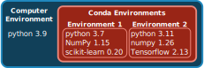

# Managing Bioinformatics Software

:::{.callout-tip}
#### Learning objectives

- List some of the reasons why Linux is an essential operating system for bioinformatic analysis.
- Distinguish between software containers and software environments.
- Use package managers to install software globally and locally.
- Recognise the advantage of using software containers for bioinformatic pipelines.
:::

## Why Linux?

Most computer users either use _Windows_ or _macOS_ as their operating system. 
However, in bioinformatics the **_Linux_** operating system is the most popular. 

There are different reasons to prefer Linux, for example:

- Most bioinformatics software is only available for this operating system.
- Generally more secure.
- Free and open source.
- The operating system of choice on high performance compute (HPC) cluster environments. 
- It has flexible built-in command line tools to manipulate large data (`cat`, `grep`, `sed`, and the `|` pipe for chaining commands).

Because Linux is an open source project, there are many different types of Linux operating systems available. 
Generally, we recommend using Ubuntu, as it's a well-supported and widely used distribution. 

The first step for running bioinformatics software therefore is to ensure that you have access to Ubuntu Linux on your machine.
We give instructions for this in @sec-install-linux.


## Package Managers

Once you have Linux available, there is the question of how to install software, especially when using the command line. 
Most modern Linux operating systems have a default **package manager** available. 
A package manager allows the user to install (or remove, or upgrade) software with a single command. 
The package manager takes care of automatically downloading and installing the software we want, as well as any dependencies it requires.

.](https://itsfoss.com/content/images/wordpress/2020/10/linux-package-manager-explanation.png)


### Ubuntu `apt`

On Ubuntu, the default package manager is called `apt`. 
This software can be used to do system-wide updates, upgrades and installation of software packages. 
There are several commands available: 

- `apt update` updates the database of available packages, to check the latest versions available. This command doesn't actually install anything.
- `apt upgrade` upgrades all the packages to their latest version. This command upgrades existing packages, and installs new ones if required as dependencies.
- `apt install` is used to install a single software of your choice. 

For example, let's say we wanted to install the latest version of `java` (Java is used for many applications, including IGV, which we introduced earlier).
We could run the following commands:

```bash
sudo apt update               # make sure the package database is up-to-date
sudo apt upgrade              # upgrade existing software to their latest version
sudo apt install default-jre  # install java
```

The **`sudo`** command at the beginning indicates that we want to run the `apt` command with administrator privilege, which will require you to input your password. 
This is necessary, because the `apt` command does a system installation of the software, so it can only be done if the user trying to do the installation has those permissions.
With the `install` command, we give the name of the software we want to install. In this case, `default-jre` will install the default Java runtime environment. 

The `apt` package manager is extremely useful to install core system software, however most bioinformatics software are not available from `apt`. 
Also, as it requires administrator (`sudo`) permissions, it is not always possible to install software with `apt` (for example, if you are using a HPC cluster).
This is why we turn to alternative package managers such as _Conda_.


### Debian Packages

Sometimes, software is not available through the `apt` repositories, but instead distributed as a file.
Ubuntu uses the _Debian_ package format. 
To install _Debian_ packages, you can use the `dpkg` command. 

For example, the [RStudio](https://posit.co/download/rstudio-desktop/) application for Linus is distributed as a `.deb` file.
After you download it, you can install it as follows:

```bash
sudo dpkg -i rstudio-2023.12.0-369-amd64.deb
```

As with `apt` this is a system installation and so requires admin privileges (`sudo`). 


### Conda/Mamba Package Manager

Often you may want to use software packages that are not available on the `apt` repositories.
A popular alternative in bioinformatics is to use the **package manager _Mamba_**, which is a successor to another package manager called _Conda_.

_Conda_ and _Mamba_ are package managers commonly used in data science, scientific computing, and bioinformatics. 
_Conda_, originally developed by [Anaconda](https://anaconda.org/), is a package manager and environment manager that simplifies the creation, distribution, and management of software environments containing different packages and dependencies. 
It is known for its cross-platform compatibility and ease of use. 
**_Mamba_** is a more recent and high-performance alternative to _Conda_. 
While it maintains compatibility with Conda's package and environment management capabilities, _Mamba_ is designed for faster dependency resolution and installation, making it a better choice nowadays. 

One of the strengths of using _Mamba_ to manage your software is that you can have different versions of your software installed alongside each other, organised in **environments**. 
Organising software packages into environments is extremely useful, as it allows to have a _reproducible_ set of software versions that you can use and resuse in your projects. 

For example, imagine you are working on two projects with different software requirements:

- Project A: requires Python 3.7, NumPy 1.15, and scikit-learn 0.20, among other libraries.
- Project B: requires Python 3.9, the latest version of NumPy, and TensorFlow 2.0.

If you don't use environments, you would need to install and maintain these packages globally on your system. 
This can lead to several issues:

- Version conflicts: different projects may require different versions of the same library. For example, Project A might not be compatible with the latest NumPy, while Project B needs it.
- Dependency chaos: as your projects grow, you might install numerous packages, and they could interfere with each other, causing unexpected errors or instability.
- Difficulty collaborating: sharing your code with colleagues or collaborators becomes complex because they may have different versions of packages installed, leading to compatibility issues.



**Environments allow you to create isolated, self-contained environments for each project**, addressing these issues:

- Isolation: you can create a separate environment for each project using tools like _Conda_/_Mamba_. This ensures that the dependencies for one project don't affect another.
- Version control: you can specify the exact versions of libraries and packages required for each project within its environment. This eliminates version conflicts and ensures reproducibility.
- Ease of collaboration: sharing your code and environment file (e.g., requirements.txt for Python) makes it easy for collaborators to replicate your environment and run your project without worrying about conflicts.
- Simplified maintenance: if you need to update a library for one project, it won't impact others. You can manage environments separately, making maintenance more straightforward.

Another advantage of using _Mamba_ is that the **software is installed locally** (by default in your home directory), without the need for admin (`sudo`) permissions. 

You can search for available packages from the [anaconda.org](https://anaconda.org/) website. 
Packages are organised into "channels", which represent communities that main the software installation recipes for each software. 
The most popular channels for bioinformatics and data analysis are "_bioconda_" and "conda-forge". 
There are three main commands to use with _Mamba_:

- `mamba create -n ENVIRONMENT-NAME`: this command creates a new software environment, which can be named as you want. Usually people name their environments to either match the name of the main package they are installating there (e.g. an environment called `pangolin` if it's to install the _Pangolin_ software). Or, if you are installing several packages in the same environment, then you can name it as a topic (e.g. an environment called `rnaseq` if it contains several packages for RNA-seq data analysis).
- `mamba install -n ENVIRONMENT-NAME  NAME-OF-PACKAGE`: this command installs the desired package in the specified environment. 
- `mamba activate ENVIRONMENT-NAME`: this command "activates" the environment, which means the software installed there becomes available from the terminal. 

Let's see a concrete example. 
If we wanted to install packages for phylogenetic analysis, we could do: 


```bash
# create an environment named "phylo"
mamba create -n phylo
 
# install some software in that environment
mamba install -n phylo  iqtree mafft
```

If we run the command: 

```bash
mamba env list
```

We will get a list of environments we created, and "phylo" should be listed there. 
If we want to use the software we installed in that environment, then we can activate it: 

```bash
mamba activate phylo
```

And usually this changes your terminal to have the word `(phylo)` at the start of your prompt. 


## Software Containers

Software containerization is a way to package software and its dependencies in a single file. 
A software container can be thought of as a very small virtual machine, with everything needed to run that software stored inside that file. 
For this reason, software containerization solutions, such as [_Docker_](https://www.docker.com/) and [_Singularity_](https://docs.sylabs.io/guides/latest/user-guide/), are widely used in bioinformatics.

Software containers ensure reproducibility, allowing the same analysis to run on different systems. 
They can run on a local computer or on a high-performance computing cluster, producing the same result.
The software within a container is isolated from other software, addressing the issue of incompatible dependencies between tools (similarly to _Mamba_ environments).

As we already saw, analysis pipelines can be very complex, using many tools, each with their own dependencies. 
Therefore, worflow managers such as _Nextflow_ use software containers to run their analysis (both _Singularity_ and _Docker_ are supported). 
This is what we've been doing throughout these materials, when running the `nf-core/viralrecon` pipeline, where we used the option `-profile singularity`. 
With this option, _Nextflow_ will download the necessary software containers to run each step of the pipeline, which are available in public repositories online. 

To use Singularity and Docker containers, the respective programs have to be installed, which we detail in our [software setup page](03-software_setup.md#software-image-containers).


:::{.callout-note}
#### Package managers or containers?

As we've seen, the _Mamba_ package manager and the containerisation solutions such as _Docker_ and _Singularity_ are trying to achieve similar things: enabling the reproducible instalation of software and its dependencies in an isolated environment. 
So, why use one or the other? 

_Mamba_ is more user-friendly, allowing you to easily install packages of your choice. 
However, _Mamba_ often works less well for more complex environments and can become extremely inneficient for environments with too many packages and conflicting versions. 
The recommendation is to keep your _Mamba_ environments relatively small and atomic (e.g. an environment for each software package or for small sets of related packages).

_Singularity_ and _Docker_, on the other hand, allow for more complex environments. 
However, to create your own container requires more advanced knowledge and a steep learning curve. 
Fortunately, there are many existing containers available for bioinformatics, which _Nextflow_ uses in its pipelines.
:::


## Summary

:::{.callout-tip}
#### Key Points


- Linux is used in bioinformatics due to its open-source nature, powerful command-line interface, and compatibility with bioinformatics tools.
- Package managers such as `apt` enable global software installations on Linux systems, simplifying the process of obtaining and managing software at the system level.
- Local package managers such as `mamba` allow users to install and manage software within user-specific environments, avoiding conflicts with system-level packages.
- Software containers, such as Docker and Singularity, encapsulate entire environments in a file and can be used to manage more complex software enviroments.
- Bioinformatics workflow managers such as _Nextflow_ can make use of software containers to run complex bioinformatic pipelines.
:::